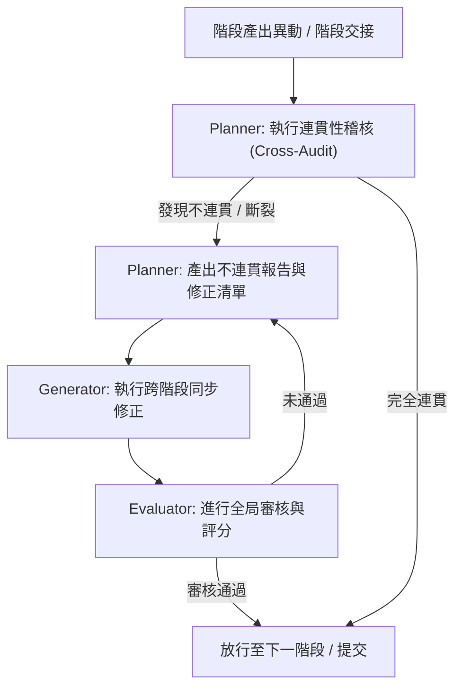

# 專案開發規則與防線規範 (AGENTS.md)

本文件定義了本專案在 SSDLC 開發生命週期中，各 AI 代理（Planner、Generator、Evaluator）必須嚴格遵守的全局行為準則，特別是「全局連貫性檢核與修正大工程」、「版本管控與組態管理」以及「活系統規格書同步」的執行規範，以防止規格脫節與需求追溯遺漏。

---

## 一、 全局連貫性工程 (Global Alignment Engineering) 規範

為了避免傳輸過程中的副產物與贅餘功能需求在開發過程中因增刪而造成功能脫鉤，系統在每個 SSDLC 階段的產出物提交前，必須觸發「全局連貫性大循環」進行交叉驗證與修正：

### 1. Planner（全局規劃與稽核代理）— 職責
*   **連貫性稽核 (Consistency Audit)**：橫向與縱向檢查所有已存在階段的 `inputs/` 與 `outputs/` 資料夾內容。
    *   **檢核 A（規格對應設計）**：確認 `01_planning_and_analysis` 的 `requirements.yaml` 與 `02_system_design` 的 `openapi.yaml`、`db_schema.sql`、`ui_model.json` 及各類 UML 圖表是否 100% 對應。
    *   **檢核 B（設計對應實作）**：確認 `02_system_design` 的 API 與資料表定義，在 `03_implementation_and_coding` 的程式碼與單元測試中完全實作。
    *   **檢核 C（需求與輸入追溯）**：比對根目錄的 `traceability_matrix.md`（需求追溯矩陣），確保所有在各階段 `inputs` 內新增的 `REQ_*.md` 與 `BUG_*.md` 均被正確實現與驗證。
    *   **檢核 D（活規格書狀態）**：確認根目錄的 `system_specification.md`（系統規格說明書）內含之 Gherkin 可執行規格，與實際執行的 BDD Feature 完全一致。
*   **修正規劃**：若發現任何一處斷裂或不連貫，必須立即終止當前流程，並產出「不連貫報告與修正任務清單（Inconsistency & Remediation Tasks）」，明確指出需修正的檔案與欄位。

### 2. Generator（執行與同步修正代理）— 職責
*   **執行修正**：嚴格依據 Planner 產出之修正任務清單，直接對相關階段的產出物進行同步修改（例如：若資料表欄位變更，需同步更新 `requirements.yaml`、`data_dictionary.md`、`db_schema.sql` 與 `openapi.yaml`），確保所有階段的交付物一致。

### 3. Evaluator（全局評估與審核代理）— 職責
*   **全局審核**：針對 Generator 修正後的結果進行最終核對。
*   **評分與准駁**：重新檢查所有連貫性檢核項，只有在「連貫性得分為 100%」且無任何規格脫節時，才允許批准並放行至下一個 SSDLC 階段。

---

## 二、 活系統規格書 (Living Specification) 同步規範

為了將系統需求與自動化測試完美結合，專案使用 `system_specification.md` 作為活文件（Living Documentation）：
1.  **規格即測試**：此文件必須包含 Gherkin 語法（Given/When/Then）的 `gherkin` 程式碼區塊。
2.  **狀態回寫**：每次執行測試治具（Harness）後，治具程式必須自動解析測試結果，將各功能模組的測試狀態（如：`[已通過]`、`[未通過]`）寫回 `system_specification.md`。
3.  **上線防線**：Evaluator 將會拒絕合併任何在 `system_specification.md` 中仍包含 `[未通過]` 狀態之 Scenario 的 PR。

---

## 三、 版本管控與組態管理 (Configuration Management) 規範

為了確保系統型態的完整度，防止任何未經授權的修改或版本漂移：

### 1. 全產物 Git 版本管理
*   **分支規定**：所有開發工作必須在非 `main` 分支（如 `dev` 或 feature 分支）上進行。禁止直接推送（Push）至 `main`。
*   **提交規範**：每次提交時，必須確保當前階段的 `traceability_matrix.md` 狀態為最新，且通過自動化測試治具（Harness）的驗證。

### 2. 組態基準 (Configuration Baseline) 稽核
*   **組態基線標記**：在各階段交接或發布時，必須對當前程式碼與文件建立 `git tag` 基線（格式為 `baseline-vX.Y.Z`）。
*   **組態項目完整性比對**：
    *   在部署上線前，治具必須重新比對實體產物與 `outputs/build_manifest.json` 記錄的 SHA-256 雜湊值。
    *   若雜湊值不符，表示發布檔案在建置後曾被外部篡改，治具將強制拒絕發布並警示。

---

## 四、 代理基本行為守則 (Harness Rules)

### 1. Planner (規劃代理)
*   **规划优先**：任何需求变更或 Bug 修复，必须先由 Planner 更新 YAML 规格书并产出任务清单，严禁直接动手写程式码。
*   **业务边界**：规划时必须明确定义「系统不做什么」，以防止 AI 生成冗余程式码。

### 2. Generator (执行代理)
*   **只执行，不思考**：严格依照任务清单与 YAML 规格进行开发，禁止擅自修改系统架构，完成后必须自动呼叫编译与验证指令。
*   **最小变更原则**：仅修改与任务相关的程式码，禁止在未授权情况下重构无关模块。

### 3. Evaluator (审查代理)
*   **只审查，不改稿**：客观且挑剔地逐条对照 YAML 规格与编译质量。评分未达标者一律退回。

---

## 五、 上下文管理與防錯紀律

1.  **強制重置上下文**：在每個模組或階段任務完成後，必須立即重置對話上下文，防止長對話累積認知幻覺。
2.  **重置後重新讀取**：重置上下文後，必須強制重新讀取本 `AGENTS.md` 規則檔案，確保 AI 隨時遵循專案紀律。
3.  **基準與安全網**：在進行任何程式碼或規格變更前，必須先建立基準 (Baseline)，若驗證失敗且無法立即修復，必須在 5 分鐘內完全還原至基準 (Baseline) 狀態。

---

## 六、 引導式專案初始化與階段 Skill 配置規範 (Guided Initialization & Skill Selection)

當啟動新專案或開始新階段任務時，AI 必須嚴格執行以下引導步驟，嚴禁直接動手：

### 1. 步驟一：引導使用者建立專案資料夾
1.  **路徑詢問**：主動提示使用者當前工作目錄路徑，並引導使用者輸入欲於此工作目錄下建立之專案子目錄名稱（相對路徑，例如：`my_new_project`）。
2.  **目錄結構生成**：
    *   AI 必須讀取 [template_skill.md](file:///d:/00AI協作/SSDLC_Skill/template_skill.md) 中定義之標準專案目錄結構。
    *   在使用者指定之工作目錄相對子路徑下，自動建立完整的 SSDLC 目錄結構，包括：
        *   `.agents/` 與 `.vscode/`。
        *   `01_planning_and_analysis` 至 `06_maintenance` 各階段的 `inputs/` 與 `outputs/`。
        *   必要之基礎檔案（`traceability_matrix.md`、`system_specification.md`、`memory.md`、`AGENTS.md` 等），並在空的資料夾中加入 `.gitkeep`。

### 2. 步驟二：引導各開發階段 Skill 的複選配置
1.  **階段配置詢問**：
    *   AI 必須依據 SSDLC 6 個開發階段，循序向使用者進行各階段的引導配置。
    *   在每一個開發階段的對話中，AI 必須掃描當前平台或專案中該階段所有可用的 Skill。
    *   AI 必須在該階段的對話提示中，完整列出這些 Skill（包含 **Skill 名稱** 與 **Skill 用途**），供使用者進行複選。
2.  **Skill 自動部署與整合**：
    *   當使用者在某一開發階段完成勾選後，AI 必須將所選的 Skill 部署（複製或引用）至目標專案目錄的該對應階段（如：`[階段]/[Skill 名稱]/`）。
    *   **動態生成階段 SKILL.md**：AI 必須將該階段勾選的所有 Skill 內容與規範，動態整合並寫入至該階段目錄下的 `SKILL.md` 中（例如：`[目標專案]/[階段]/SKILL.md`）。若選擇了多個 Skill，須將其 instructions 與規範合併，以利後續 AI 代理在該階段直接讀取該 `SKILL.md` 進行互動，免去重複動態載入的步驟。
    *   若某階段使用者未選擇任何 Skill，則預設載入該階段的原生/預設 Skill 範本。
