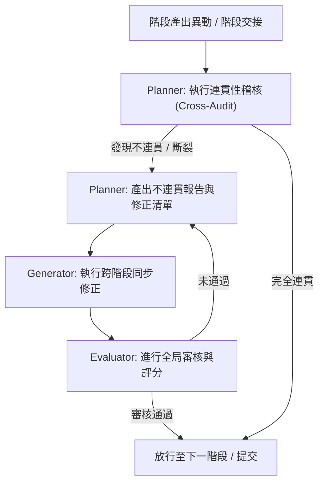

# 專案開發規則與防線規範 (AGENTS.md)

👉 **最高指導框架原則**：本專案在自動化開發與 Harness 駕馭工程中的最高原則規範，已統一收錄於 docs 目錄下的 [CORE_RULES.md](file:///d:/00AI協作/SSDLC_Skill/docs/CORE_RULES.md)。本文件（AGENTS.md）內的所有子規章與實作內容，皆基於此指導守則進行發展，且絕不得與其衝突。

本文件定義了本專案在 SSDLC 開發生命週期中，各 AI 代理（Planner、Generator、Evaluator）必須嚴格遵守的全局行為準則，特別是「全局連貫性檢核與修正大工程」、「版本管控與組態管理」、「活系統規格書同步」以及「Windows Server + IIS 部署環境適配」的執行規範，以防止規格脫節與需求追溯遺漏。

---

## 一、 全局連貫性工程 (Global Alignment Engineering) 規範

本系統採用「外層全域 Agent + 內層階段性局部駕馭工程 PDCA 迴圈」之雙層解耦架構。系統在每個 SSDLC 階段的產出物提交前，必須觸發「全局連貫性大循環」進行交叉驗證與修正：

### 1. 外層：全域主控 Global Agent（唯一頂層）
*   **全域掌控與追溯**：負責安全軟體開發生命週期安全軟體開發生命週期六階段（通稱 SSDLC）的全域掌控、需求追溯、版本同步與 IIS 站台規格同步。
*   **階段切換與 Baseline 鎖定**：每階段驗證穩定後，封存其穩定可執行的 Baseline。前一階段產生 Baseline，方可切換權限進入下一階段。

### 2. 內層：安全軟體開發生命週期六階段（通稱 SSDLC）局部 PDCA（各階段獨立運作）
*   軟體開發生命週期切割為安全軟體開發生命週期安全軟體開發生命週期六階段（通稱 SSDLC），每一階段獨立執行一套 Plan -> Generator -> Evaluator 的 PDCA 閉環。
*   **Plan 階段 (PDCA-P)**：承接上階段交付物與 Baseline，定義目標與交付物，執行 Skill 複選，並進行 Windows/IIS 環境靜態黑白名單衝突檢核。如果選取了互斥 Skill，直接判定為 B 類根源錯誤，不進入執行以節省 Token。
*   **Generator 階段 (PDCA-D)**：作為唯一執行層，遵循「只執行、不判斷、不檢查、不修改」之鐵律。執行完成後自動儲存 Windows 本地絕對路徑快照至各該階段的 `snapshots/` 目錄，回溯時直接載入快照以降低 Token 消耗。
*   **Evaluator 階段 (PDCA-C & PDCA-A)**：負責成果規格檢核與 Windows/IIS 流程軌跡完整性檢核。補充 IIS 站台日誌、進程日誌與 Windows 事件日誌雙軌驗證機制。

---

## 二、 活系統規格書 (Living Specification) 同步規範

為了將系統需求與自動化測試完美結合，專案使用 `system_specification.md` 作為活文件（Living Documentation）：
1.  **規格即測試**：此文件必須包含 Gherkin 語法（Given/When/Then）的 `gherkin` 程式碼區塊。
2.  **狀態回寫**：每次執行測試治具（Harness）後，治具程式必須自動解析測試結果，將各功能模組的測試狀態（如：`[已通過]`、`[未通過]`）寫回 `system_specification.md`。
3.  **上線防線**：Evaluator 將會拒絕合併任何在 `system_specification.md` 中仍包含 `[未通過]` 狀態之 Scenario 的 PR。

---

## 三、 版本管控與組態管理 (Configuration Management) 規範

為了確保系統型態的完整度，防止任何未經授權的修改或版本防線漂移：

### 1. 全產物 Git 版本管理與 Windows 快照機制
*   **分支規定**：所有開發工作必須在非 `main` 分支上進行。禁止直接推送至 `main`。
*   **本地快照管理**：全面停用 Docker 容器機制。各階段的快照與執行軌跡（包含配置參數、快照、錯誤日誌與版本差異等）應存放在各階段的 `snapshots/` 與 `logs/` 目錄下。快照儲存與版本管控改用 Windows 本地檔案系統的時間戳快照機制（本機保留最近 5 筆快照，並自動清理舊資料防止儲存膨脹），並與本地 Git 倉庫進行比對。階段結束後必須自動向上回傳全域 Agent。
*   **提交規範**：每次提交時，必須確保當前階段的 `traceability_matrix.md` 狀態為最新，且通過自動化測試治具的驗證。

### 2. 組態基準與 Windows 權限稽核
*   **組態基線標記**：在各階段交接或發布時，必須對當前程式碼與文件建立 `git tag` 基線（格式為 `baseline-vX.Y.Z`）。
*   **發布前雜湊比對**：比對實體產物與 `outputs/build_manifest.json` 記錄的 SHA-256 雜湊值。若不符則強制拒絕發布。
*   **Windows 與 IIS 權限管控**：適配 Windows 原生 NTFS 檔案讀寫權限與 IIS 匿名存取 (IUSR) 安全網，並於 Plan 階段前置檢核路徑編碼與檔案鎖定狀態，防止 403/404 異常。

---

## 四、 代理基本行為守則 (Harness Rules)

### 1. Planner (規劃代理)
*   **規劃優先**：任何需求變更或 Bug 修復，必須先由 Planner 更新 YAML 規格書並產出任務清單，嚴禁直接動手寫原始碼。
*   **業務邊界**：規劃時必須明確定義「系統不做什麼」，以防止 AI 生成冗餘程式碼。

### 2. Generator (執行代理)
*   **只執行，不思考**：嚴格依照任務清單與 YAML 規格進行開發，禁止擅自修改系統架構，完成後必須自動呼叫編譯與驗證指令。
*   **最小變更原則**：僅修改與任務相關的程式碼，禁止在未授權情況下重構無關模組。

### 3. Evaluator (審查代理)
*   **只審查，不改稿**：客觀且挑剔地逐條對照 YAML 規格與編譯品質。評分未達標者一律退回。

---

## 五、 上下文管理與防錯紀律（含 A/B 類錯誤分級重試）

1.  **強制重置上下文**：在每個模組或階段任務完成後，必須立即重置對話上下文，防止長對話累積認知幻覺。
2.  **重置後重新讀取**：重置上下文後，必須強制重新讀取本 `AGENTS.md` 規則檔案，確保 AI 隨時遵循專案紀律。
3.  **基準與安全網**：在進行任何程式碼或規格變更前，必須先建立基準 (Baseline)，若驗證失敗且無法立即修復，必須在 5 分鐘內完全還原至基準 (Baseline) 狀態。
4.  **錯誤二分類機制與分級重試**：
    *   **A 類錯誤（執行層臨時錯誤）**：
        *   包括：參數錯誤、IIS 逾時、Windows 進程中斷、權限異常、網路連線中斷、DOM 找不到元素、執行短暫衝突等。
        *   **重試規則**：允許局部重試最多 3 次。回溯點僅退回 Generator，不重跑 Plan。重試採用指數退避，新錯誤重置計數器。滿 3 次失敗則升級為 B 類錯誤處理。
    *   **B 類錯誤（規劃層根源錯誤）**：
        *   包括：Skill 互斥、需求矛盾、設計缺陷、架構問題等。
        *   **重試規則**：直接跳過局部重試，立即升級全域迭代（重跑該階段完整 PDCA）。全域自動迭代上限為 2 輪，滿 2 輪仍失敗則自動暫停、移交人工處理。
5.  **IIS 專屬部署與環境衝突檢核**：
    *   在 Plan 階段執行靜態衝突檢查。
    *   **Docker 與 IIS 互斥規則**：`Docker 部署環境` 與 `IIS 部署操作` 為互斥關係，禁止同時選用，否則直接判定為 B 類錯誤攔截，避免環境配置衝突。
    *   **IIS 專屬部署規則**：為防止 IIS 原生回收機制中斷長任務，必須設定應用程式集為進程駐留、關閉自動回收，並啟用 IIS 站台日誌與 Windows 系統事件日誌雙軌記錄，以支援問題追溯。
6.  **階段結果自動回傳與快照日誌清理**：
    *   每一輪局部 PDCA 完成後，該階段之完整檢核結果（包含 Skill 配置參數、執行快照、錯誤日誌、版本差異、人機對話紀錄與驗證報告等，存放在 `snapshots/` 與 `logs/` 目錄）必須自動上傳至全域主控 Agent。
    *   全域 Agent 接收並同步更新需求追溯鏈、規格文件、對話紀錄與新版 Baseline 穩定版本。
    *   系統必須嚴格執行物理目錄中快照最近 5 筆的保留規則，並自動清理舊資料，以防範儲存空間膨脹。

---

## 六、 引導式專案初始化與階段 Skill 配置規範 (AI 代理對話指令協議)

為極簡化專案配置流程，AI 代理在與使用者對話時，必須主動辨識並執行以下對話指令：

### 0. 指令參照查詢指令：`@help`
*   **指令定義**：立即顯示指令集參照表的完整內容，方便使用者快速查閱所有可用指令與語法。
*   **AI 代理執行規範**：
    1.  AI 代理必須讀取 [commands_reference.md](file:///d:/00AI協作/SSDLC_Skill/docs/commands_reference.md) 的完整內容。
    2.  將內容以結構化方式呈現於對話中，包含所有指令的語法、參數與用途說明。

### 1\. 階段查詢指令：`@stages`
*   **指令定義**：查詢 SSDLC 各開發階段之代碼與中文名稱對照。
*   **AI 代理執行規範**：
    1.  必須立即輸出以下對照表：
        *   `01` : 規劃與需求分析 (planning_and_analysis)
        *   `02` : 系統設計 (system_design)
        *   `03` : 開發與編碼 (implementation_and_coding)
        *   `04` : 測試驗證 (testing)
        *   `05` : 部署發布 (deployment)
        *   `06` : 維護監控 (maintenance)
    2.  說明如何使用 `@[階段代碼]` 進行進一步查詢，以及使用 `@[階段代碼]/[快捷編號]` 進行導入。

### 2. 階段 Skill 查詢指令：`@[階段雙位數代碼]`
*   **指令定義**：查詢指定階段的可用 Skill 清單與用途說明（例如：`@01`）。
*   **AI 代理執行規範**：
    1.  自動掃描全域或專案 Skill 庫中，歸屬於該開發階段的所有可用 Skill。
    2.  **快捷編號分配**：AI 代理必須按字母/數字順序對掃描出的所有可用 Skill 進行排序，並為其分配雙位數快捷編號（由 `01` 開始，如 `01`, `02`, `03` ...）。
    3.  **富資訊解析**：AI 必須動態讀取這些可用 Skill 之 `SKILL.md` 檔案，解析其 YAML Frontmatter 中的 `description`（用途描述）欄位。
    4.  條列式輸出各 Skill 的「快捷編號 — 實體名稱 — 用途描述」與「導入指令範例」。
    5.  提供對應的導入指令範例，提示使用者進行導入。

### 3. 直接與聯合導入 Skill 指令：`@[階段雙位數代碼]/[快捷編號]` 或 `@[階段雙位數代碼]/[快捷編號_1],[快捷編號_2]`
*   **指令定義**：將指定的單個或多個 Skill（以逗號 `,` 聯合參數組合）部署至當前專案對應的階段目錄，並合併規範與登錄追溯。
*   **AI 代理執行規範**：
    0.  **專案初始化防呆 (Project Init Guard)**：執行前，AI 必須檢查當前工作目錄是否為已初始化之 SSDLC 專案（根目錄須具備 `traceability_matrix.md`、`system_specification.md` 及 SSDLC 階段目錄結構）。若非已初始化專案，必須中止導入，並提示使用者：「當前目錄尚未初始化為 SSDLC 專案，請先執行 `@init [路徑]` 建立專案工作目錄後再導入 Skill。」
    1.  **安全網防禦**：執行前，AI 必須呼叫 Git 檢查工作區狀態...。若有未提交之變更，必須自動建立暫存 Git tag（格式為 `temp-baseline-YYYYMMDD-HHMMSS`）作為 Baseline。
    2.  **快捷編號與逗號 (,) 防呆提醒與錯誤處理**：
        *   若使用者輸入非雙位數快捷編號（例如輸入了完整的 Skill 資料夾名稱），AI 代理必須友善提示，例如：「請使用快捷編號進行導入，例如使用 `@01/01` 代替 `@01/skill_categorizer`」。
        *   若指令中包含逗號 `,`，AI 代理必須將其視為聯合導入，並依逗號拆分所有快捷編號。
        *   若其中有任何一個快捷編號在該階段不存在，AI 代理必須明確在對話中指出：「未找到編號為 [未找到的快捷編號] 的 Skill，請確保逗號兩側皆為有效的快捷編號。正確語法範例為：`@[階段]/[快捷編號1],[快捷編號2]`」，並列出該開發階段所有可用的快捷編號與實體名稱對照清單，中止導入流程，防止因輸入錯誤而導入失敗。
    3.  **快捷編號還原**：AI 代理在部署前，必須在內部自動將快捷編號還原為對應的實體 Skill 資料夾名稱。
    4.  **檔案部署**：將所指定的單個或多個 Skill 資料夾內的所有檔案與子目錄，複製到目標專案對應開發階段 的目錄下。
    5.  **SKILL.md 動態合併**：
        *   依序讀取所選之各 Skill 的 `SKILL.md` 內容。
        *   將其 instructions 與規範分別以 `## [Skill 實體名稱] 規範` 為標題封裝，動態追加合併至該開發階段目錄下的 `SKILL.md` 中，並加上導入註記。
        *   同步更新 `.agents/skills/[階段]/SKILL.md`，加入該 Skill 的用途描述與快捷編號對照。
        *   若某階段尚未有 `SKILL.md`，則依據 `TEMPLATE_SKILL.md` 範本初始化後再行合併。
    6.  **衝突處理**：動態合併時若出現重疊或矛盾的 instructions，以全局規章 `.agents/AGENTS.md` 為最高準則；若無法自動判定，必須列出衝突點由使用者手動裁決，嚴禁自行腦補。
    7.  **重複導入防護**：若目標目錄已存在同名 Skill，AI 必須提示使用者進行「覆蓋（Overwrite）」或「放棄（Abort）」。
    8.  **組態追溯**：在 `traceability_matrix.md` 中一次性登錄此次（或此批）Skill 導入的快捷編號、實體名稱、時間與版本。

### 4. 專案初始化指令：`@init [相對路徑]`
*   **指令定義**：自動建立指定路徑之標準專案目錄結構與基礎檔案，並引導後續階段 Skill 配置。
*   **AI 代理執行規範**：
    1.  讀取 [TEMPLATE_SKILL.md](file:///d:/00AI協作/SSDLC_Skill/docs/TEMPLATE_SKILL.md) 中定義之標準專案目錄結構。
    2.  於指定路徑下建立完整的 SSDLC 目錄結構與 `.gitkeep`。
    3.  自動生成基礎控制檔案：`traceability_matrix.md`、`system_specification.md`、`memory.md`，以及在根目錄建立引導檔 `AGENTS.md`（指向實體規章 `.agents/AGENTS.md`）。
    4.  **初始化後的引導配置**：目錄與基礎檔案建立完畢後，AI 代理必須主動詢問使用者是否要立即配置各開發階段的 Skill。若使用者同意，則依序對 01 至 06 階段自動列出可用 Skill 與其雙位數快捷編號清單供使用者選取（亦可隨時輸入 `跳過` 該階段），並調用直接/聯合導入邏輯完成配置；若使用者選擇跳過，則結束配置，保持初始化狀態。

### 5. 自然語言與語音喚出協議
*   **語意觸發規範**：AI 代理在與使用者對話時，必須主動識別使用者的自然語言或語音口語輸入：
    1.  當辨識到類似「讀取指令集」、「查詢可用指令」、「我想看指令參照表」、「有什麼對話指令可以用」或「叫出指令對照表」等語意時，AI 代理必須自動使用檔案讀取工具，讀取並在對話中呈現 [commands_reference.md](file:///d:/00AI協作/SSDLC_Skill/docs/commands_reference.md) 的完整內容，以利使用者對照查閱。
    2.  當辨識到類似「幫我執行駕馭工程框架優化檢查」、「Harness Optimization Skill」、「執行架構優化」或「進行全案關聯性檢查」等語意時，AI 代理必須**先顯示警告提示**，確認使用者為框架建造者且位於框架根目錄後，方自動讀取並執行 docs 目錄下的 [Harness_Optimization_SKILL.md](file:///d:/00AI協作/SSDLC_Skill/docs/Harness_Optimization_SKILL.md) 內容，進行地毯式之檔案關聯性、格式與排版優化。

### 6. 專案基線快照指令：`@baseline`
*   **指令定義**：建立可獨立執行的完整專案快照至 `baseline/` 目錄。
*   **口語觸發**：「建立基線」、「新建 Baseline」、「儲存專案快照」。
*   **AI 代理執行規範**：
    1.  計算下一個版本號（baseline-v1, v2, v3...）。
    2.  複製完整可執行專案（app.py + templates/ + requirements.txt + run.bat + employee.db）至 `baseline/baseline-v{N}/`。
    3.  產生 MANIFEST.md 版本資訊檔（含建立時間、Git tag、測試狀態、需求追溯）。
    4.  保留最近 3 份 baseline，自動清理最舊版本。
    5.  寫入 memory.md 紀錄。

