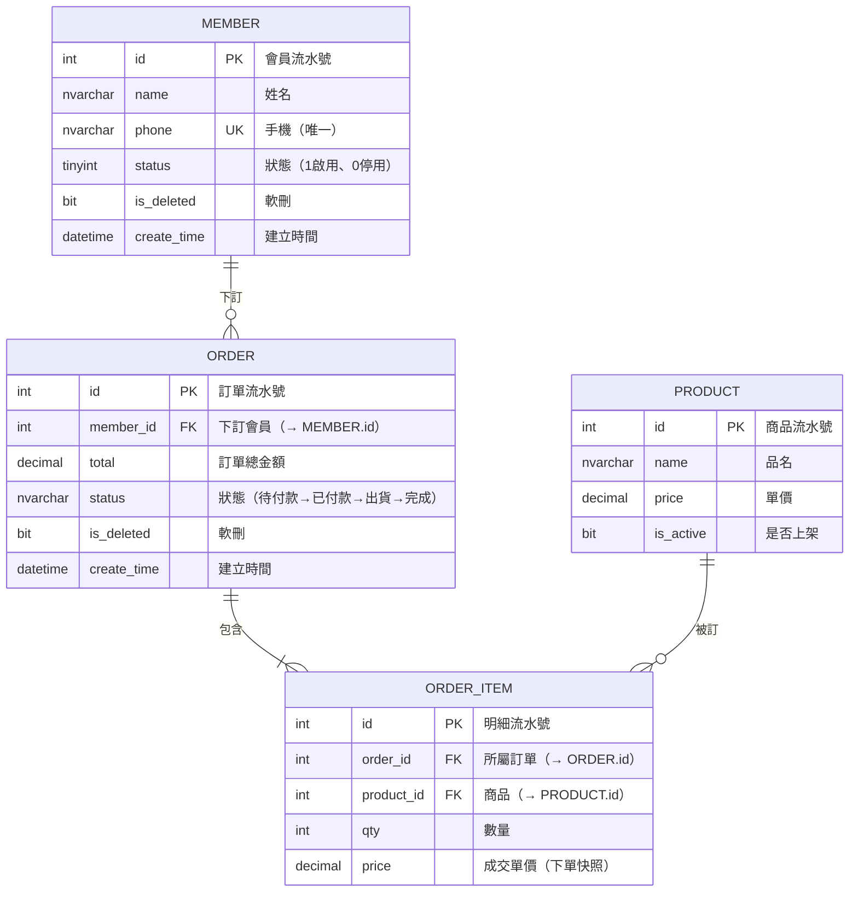
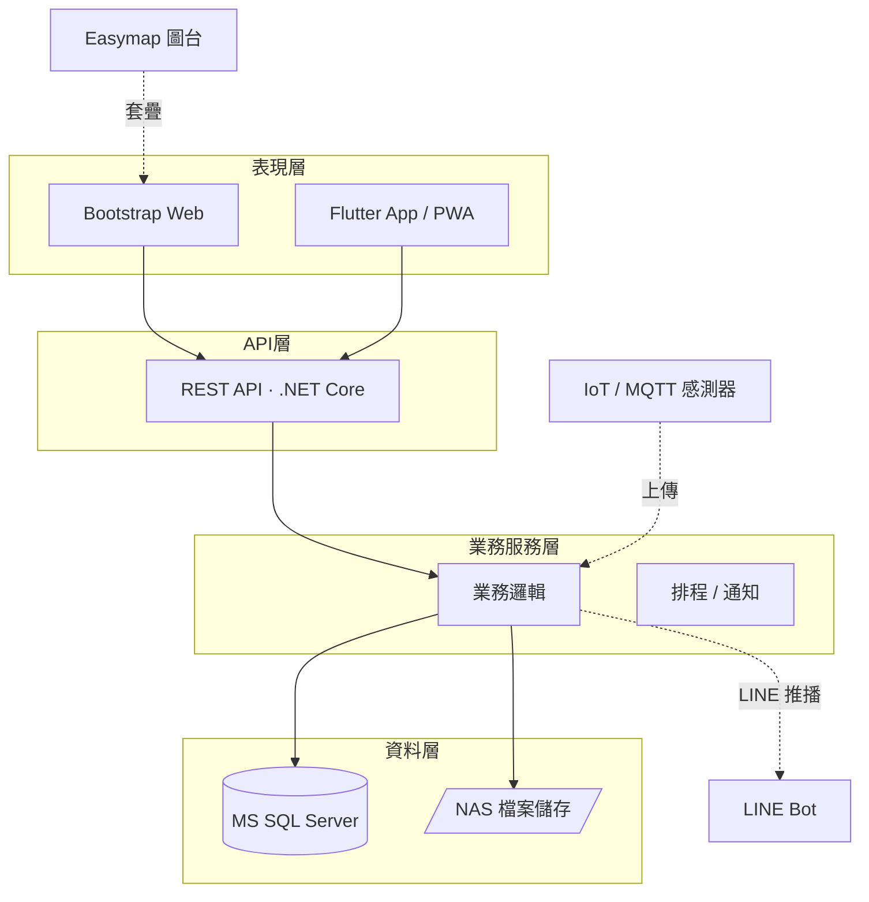
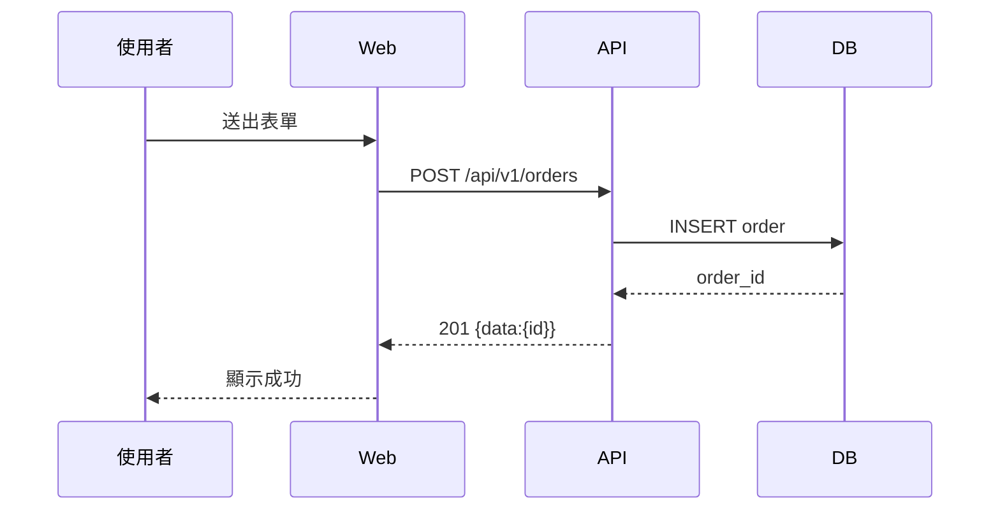
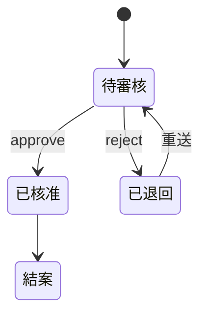

# mermaid 範本（可直接套改）

> 這些是給 Claude 產圖時的骨架，改實體/欄位名即用。mermaid 在 HTML 用 mermaid.js 渲染（見 scripts/render_sa.py）。

---

## ① ER Model — `erDiagram`

> 🚩 **完整 ER 鐵則（最常被偷懶，務必做到）**：ER 不是只畫關鍵欄位的縮圖，而是**工程師照著就能建表的完整藍圖**。每個實體一律：
> 1. **列出全部欄位**（不是只列 id + 一兩個關鍵欄）；
> 2. **每個欄位都帶中文說明**（mermaid 第三段引號註解）——含 id、時間戳也要寫，例如 `int id PK "會員流水號"`；
> 3. **標明鍵別 PK / FK / UK**（唯一鍵用 UK；FK 在說明內註明 `（→ 目標表.欄位）`）；
> 4. 列舉型欄位在說明標可能值，例如 `"狀態（待付款→已付款→出貨）"`。
> 缺說明欄、只列關鍵欄、FK 沒標指向 = 不合格，要補到完整。

**基數符號**（左右各一端）：
| 寫法 | 意義 |
|---|---|
| `\|\|--\|\|` | 一對一 |
| `\|\|--o{` | 一對零或多 |
| `\|\|--\|{` | 一對一或多 |
| `}o--o{` | 多對多（**實作要拆關聯表**） |

- 欄位列格式：`型別 欄位名 PK/FK/UK "中文說明"`（型別寫概念型別如 int/nvarchar/datetime/decimal/bit/tinyint；精確長度放資料字典）。
- **每一欄都要有 `"說明"`**（見上方鐵則）；FK 說明內標 `（→ 目標表.欄位）`。
- M:N 不要直接連，拆成關聯表（如上 ORDER_ITEM）。
- 採扁平化設計時，JSON 欄位（如 `result_json`/`progress_json`）在說明標明「（JSON）」與內容大意。

---

## ② 系統架構 — `flowchart TD`

- 用 `subgraph` 分層；實線 `-->` 主資料流；虛線 `-. 說明 .->` 外部介接/旁路。
- DB 用 `[(...)]`、檔案用 `[/.../]`、外部系統用一般 `[...]`。
- 標單點風險可加註解節點或在文件文字說明。

---

## ③ 循序圖 — `sequenceDiagram`（選配，講關鍵流程用）

---

## ④ 狀態圖 — `stateDiagram-v2`（選配，有狀態流轉的實體用）

---

## mermaid 注意事項（踩雷預防）

- **中文 label 用引號**：`A["中文 含 (括號)"]`，避免特殊字元（`()[]{}`、冒號、逗號）破壞語法。
- erDiagram 的關聯說明也用引號：`MEMBER ||--o{ ORDER : "下訂"`。
- ⚠ **erDiagram 屬性註解（第三段引號）不要放半形 `/`**（mermaid 10.x 會解析失敗）；分隔用頓號 `、` 或全形 `／`，括號用全形 `（）`。例：`"類別（消防、機電）"`、`"狀態（待付款→完成）"`。
- 關聯說明若用程式產生、標籤是單一 token，可先不加引號再用 regex 補上 `: "label"`；但**已加引號的別再被二次加引號**。
- 一個 mermaid 區塊一張圖；多張圖分多個 `
`。
- flowchart 方向：`TD`（上到下）給架構、`LR`（左到右）給流程。
- 別在 label 裡放未跳脫的 `"`；需要換行用 ` `。
