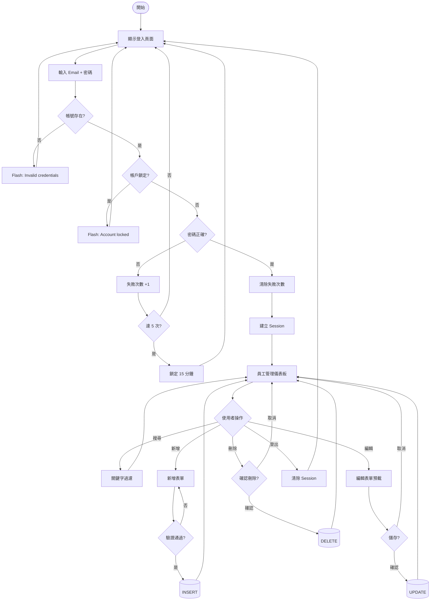

# 活動圖 (Activity Diagram)

> Phase 02: System Design | 2026-06-28

```mermaid
%%{init: {"flowchart": {"nodeSpacing": 60, "rankSpacing": 70, "padding": 20}, "themeVariables": {"fontSize": "17px", "fontFamily": "Inter, Noto Sans TC, sans-serif"}}}%%
flowchart TD
    START([開始]) --> LOGIN_PAGE[顯示登入頁面]
    LOGIN_PAGE --> INPUT[輸入 Email + 密碼]
    INPUT --> CHECK_USER{帳號存在?}
    CHECK_USER -->|否| FLASH1[Flash: Invalid credentials]
    FLASH1 --> LOGIN_PAGE
    CHECK_USER -->|是| CHECK_LOCK{帳戶鎖定?}
    CHECK_LOCK -->|是| FLASH2[Flash: Account locked]
    FLASH2 --> LOGIN_PAGE
    CHECK_LOCK -->|否| CHECK_PWD{密碼正確?}
    CHECK_PWD -->|否| INC_ATTEMPT[失敗次數 +1]
    INC_ATTEMPT --> CHECK_ATTEMPTS{達 5 次?}
    CHECK_ATTEMPTS -->|是| SET_LOCK[鎖定 15 分鐘]
    SET_LOCK --> LOGIN_PAGE
    CHECK_ATTEMPTS -->|否| LOGIN_PAGE
    CHECK_PWD -->|是| RESET_ATTEMPTS[清除失敗次數]
    RESET_ATTEMPTS --> SET_SESSION[建立 Session]
    SET_SESSION --> DASHBOARD[員工管理儀表板]

    DASHBOARD --> CHOICE{使用者操作}
    CHOICE -->|搜尋| SEARCH[關鍵字過濾]
    SEARCH --> DASHBOARD
    CHOICE -->|新增| ADD_FORM[新增表單]
    ADD_FORM --> VALIDATE{驗證通過?}
    VALIDATE -->|否| ADD_FORM
    VALIDATE -->|是| INSERT[(INSERT)]
    INSERT --> DASHBOARD
    CHOICE -->|編輯| EDIT_FORM[編輯表單預載]
    EDIT_FORM --> EDIT_SAVE{儲存?}
    EDIT_SAVE -->|取消| DASHBOARD
    EDIT_SAVE -->|確認| UPDATE[(UPDATE)]
    UPDATE --> DASHBOARD
    CHOICE -->|刪除| CONFIRM_DEL{確認刪除?}
    CONFIRM_DEL -->|取消| DASHBOARD
    CONFIRM_DEL -->|確認| DELETE_RECORD[(DELETE)]
    DELETE_RECORD --> DASHBOARD
    CHOICE -->|登出| LOGOUT[清除 Session]
    LOGOUT --> LOGIN_PAGE
```
