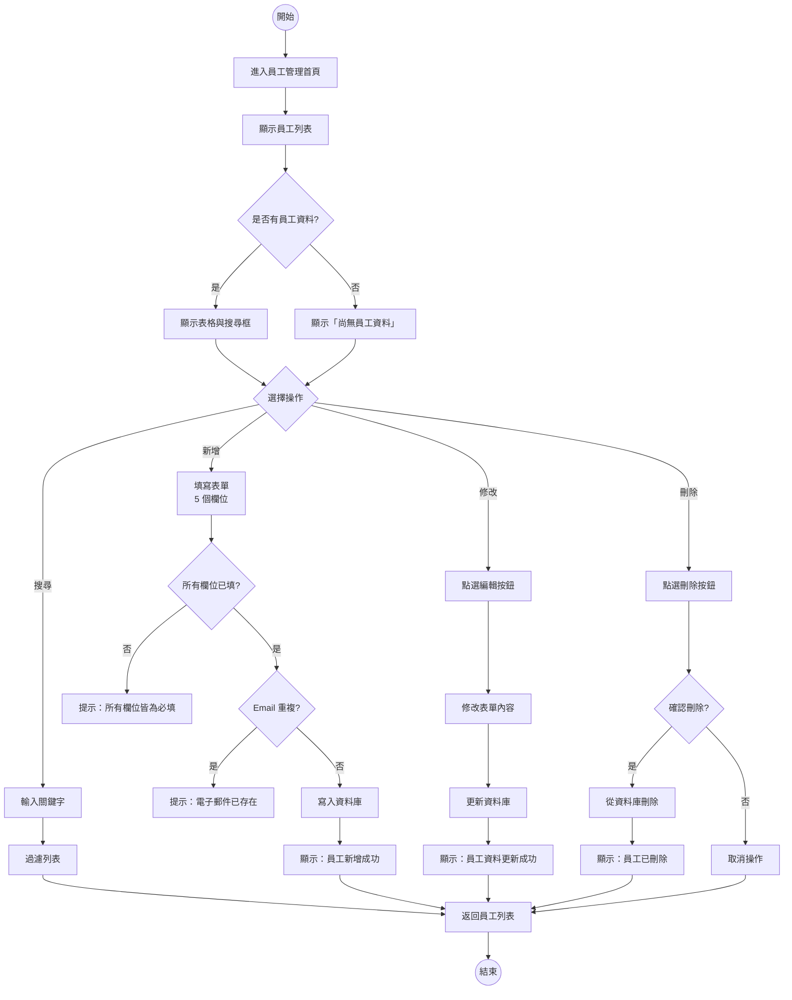

# 員工管理系統 — 活動圖 (Activity Diagram)

```mermaid
flowchart TD
    START((開始)) --> ENTER[進入員工管理首頁]
    ENTER --> LIST[顯示員工列表]
    LIST --> CHECK{是否有員工資料?}
    CHECK -->|是| TABLE[顯示表格與搜尋框]
    CHECK -->|否| EMPTY[顯示「尚無員工資料」]
    TABLE --> CHOICE{選擇操作}
    EMPTY --> CHOICE

    CHOICE -->|搜尋| SEARCH[輸入關鍵字]
    SEARCH --> FILTER[過濾列表]
    FILTER --> RETURN[返回員工列表]

    CHOICE -->|新增| ADDFORM[填寫表單<br/>5 個欄位]
    ADDFORM --> VALIDATE{所有欄位已填?}
    VALIDATE -->|否| ERR_REQUIRED[提示：所有欄位皆為必填]
    VALIDATE -->|是| DUPCHECK{Email 重複?}
    DUPCHECK -->|是| ERR_DUP[提示：電子郵件已存在]
    DUPCHECK -->|否| INSERT[寫入資料庫]
    INSERT --> OK_ADD[顯示：員工新增成功]
    OK_ADD --> RETURN

    CHOICE -->|修改| EDITCLICK[點選編輯按鈕]
    EDITCLICK --> EDITFORM[修改表單內容]
    EDITFORM --> UPDATE[更新資料庫]
    UPDATE --> OK_EDIT[顯示：員工資料更新成功]
    OK_EDIT --> RETURN

    CHOICE -->|刪除| DELCLICK[點選刪除按鈕]
    DELCLICK --> CONFIRM{確認刪除?}
    CONFIRM -->|是| DELETE[從資料庫刪除]
    DELETE --> OK_DEL[顯示：員工已刪除]
    CONFIRM -->|否| CANCEL[取消操作]
    OK_DEL --> RETURN
    CANCEL --> RETURN

    RETURN --> END((結束))
```

## 說明
- 完整覆蓋 CRUD 四種操作流程
- 含兩個驗證決策點（必填檢查、Email 唯一性）
- 刪除操作含確認對話框
