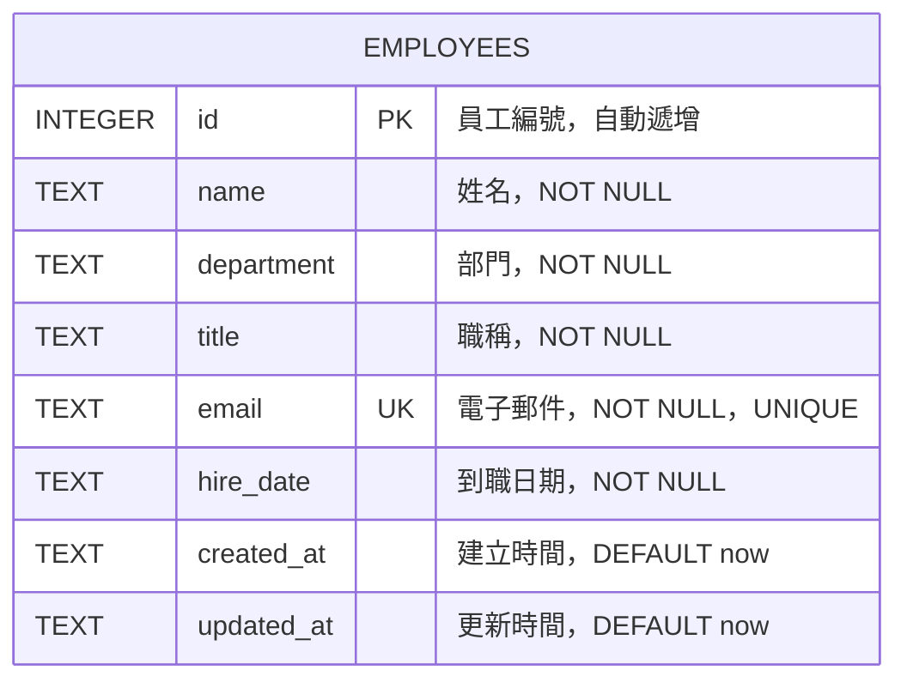

# 員工資料庫 ER 圖 (Entity-Relationship Diagram)

```mermaid
erDiagram
    EMPLOYEES {
        INTEGER id PK "員工編號，自動遞增"
        TEXT name "姓名，NOT NULL"
        TEXT department "部門，NOT NULL"
        TEXT title "職稱，NOT NULL"
        TEXT email UK "電子郵件，NOT NULL，UNIQUE"
        TEXT hire_date "到職日期，NOT NULL"
        TEXT created_at "建立時間，DEFAULT now"
        TEXT updated_at "更新時間，DEFAULT now"
    }
```

## 說明
- 單一實體（employees），無外部關聯
- PK：id（自動遞增）
- UK：email（唯一約束，防止重複）
- 所有業務欄位皆 NOT NULL
