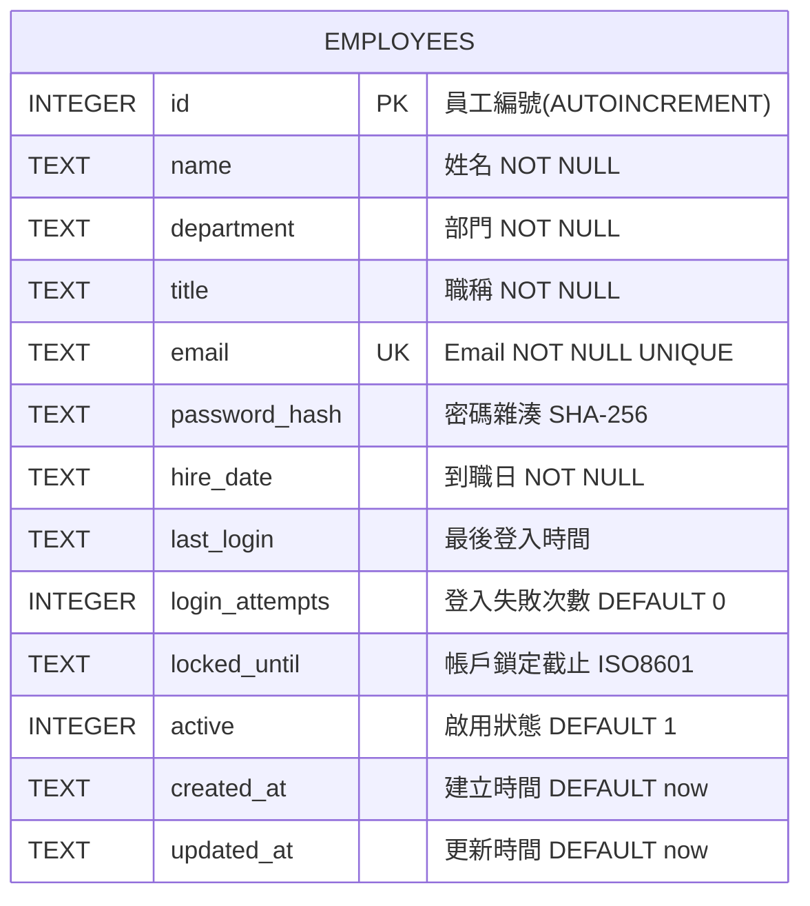

# 實體關聯圖 (ER Diagram) — Enhanced

> Phase 02: System Design | 2026-06-28 | Security-General Baseline

## 單一實體：employees

## 索引策略

| 索引名稱 | 欄位 | 用途 |
|:---|:---|:---|
| idx_employees_email | email | 登入查詢、唯一性檢查 |
| idx_employees_department | department | 部門篩選加速 |
| idx_employees_active | active | 快速過濾在職員工 |

## 設計考量

- **單一實體**：內部小工具無需正規化到多表，簡化開發與維護
- **安全欄位內嵌**：password_hash、login_attempts、locked_until 直接放在 employees 表中，簡化 JOIN
- **軟刪除支援**：active 欄位保留未來軟刪除擴充空間
- **審計追蹤**：created_at / updated_at 自動填入，last_login 記錄最後活動
