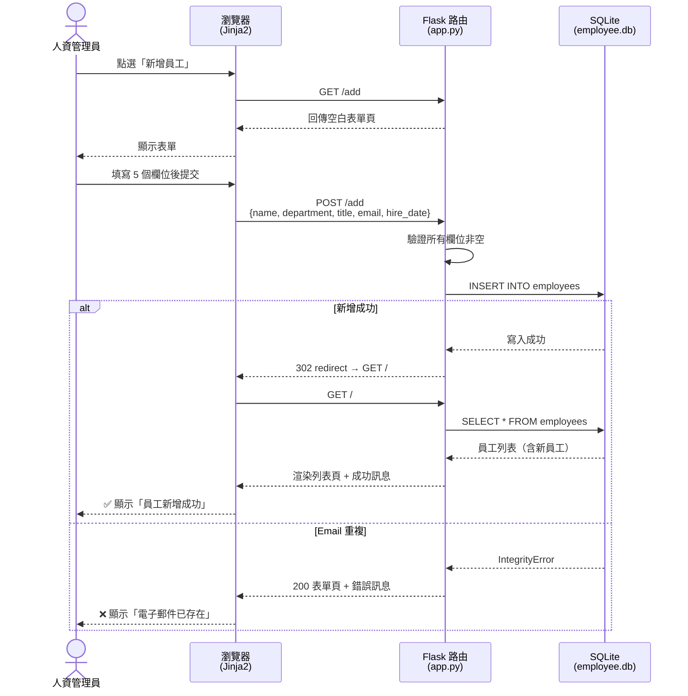

# 員工管理系統 — 循序圖 (Sequence Diagram)

## 場景：新增員工的完整 MVC 互動流程

```mermaid
sequenceDiagram
    actor HR as 人資管理員
    participant B as 瀏覽器<br/>(Jinja2)
    participant F as Flask 路由<br/>(app.py)
    participant D as SQLite<br/>(employee.db)

    HR->>B: 點選「新增員工」
    B->>F: GET /add
    F-->>B: 回傳空白表單頁
    B-->>HR: 顯示表單

    HR->>B: 填寫 5 個欄位後提交
    B->>F: POST /add<br/>{name, department, title, email, hire_date}

    F->>F: 驗證所有欄位非空
    F->>D: INSERT INTO employees

    alt 新增成功
        D-->>F: 寫入成功
        F-->>B: 302 redirect → GET /
        B->>F: GET /
        F->>D: SELECT * FROM employees
        D-->>F: 員工列表（含新員工）
        F-->>B: 渲染列表頁 + 成功訊息
        B-->>HR: ✅ 顯示「員工新增成功」
    else Email 重複
        D-->>F: IntegrityError
        F-->>B: 200 表單頁 + 錯誤訊息
        B-->>HR: ❌ 顯示「電子郵件已存在」
    end
```

## 說明
- 完整展示 MVC 三層互動（瀏覽器 → Flask → SQLite）
- 含 alt 區塊處理成功與 Email 重複兩種路徑
- POST/Redirect/GET 模式防止重複提交
