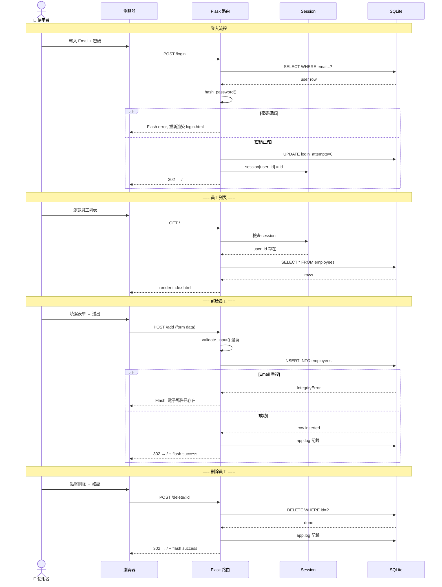

# 循序圖 (Sequence Diagram)

> Phase 02: System Design | 2026-06-28

```mermaid
%%{init: {"sequence": {"width": 220, "actorMargin": 120, "messageMargin": 50, "boxMargin": 15}, "themeVariables": {"fontSize": "17px"}}}%%
sequenceDiagram
    actor U as 👤 使用者
    participant B as 瀏覽器
    participant F as Flask 路由
    participant S as Session
    participant D as SQLite

    Note over U,D: === 登入流程 ===
    U->>B: 輸入 Email + 密碼
    B->>F: POST /login
    F->>D: SELECT WHERE email=?
    D-->>F: user row
    F->>F: hash_password()
    alt 密碼錯誤
        F-->>B: Flash error, 重新渲染 login.html
    else 密碼正確
        F->>D: UPDATE login_attempts=0
        F->>S: session[user_id] = id
        F-->>B: 302 → /
    end

    Note over U,D: === 員工列表 ===
    U->>B: 瀏覽員工列表
    B->>F: GET /
    F->>S: 檢查 session
    S-->>F: user_id 存在
    F->>D: SELECT * FROM employees
    D-->>F: rows
    F-->>B: render index.html

    Note over U,D: === 新增員工 ===
    U->>B: 填寫表單 → 送出
    B->>F: POST /add (form data)
    F->>F: validate_input() 過濾
    F->>D: INSERT INTO employees
    alt Email 重複
        D-->>F: IntegrityError
        F-->>B: Flash: 電子郵件已存在
    else 成功
        D-->>F: row inserted
        F->>D: app.log 記錄
        F-->>B: 302 → / + flash success
    end

    Note over U,D: === 刪除員工 ===
    U->>B: 點擊刪除 → 確認
    B->>F: POST /delete/:id
    F->>D: DELETE WHERE id=?
    D-->>F: done
    F->>D: app.log 記錄
    F-->>B: 302 → / + flash success
```
