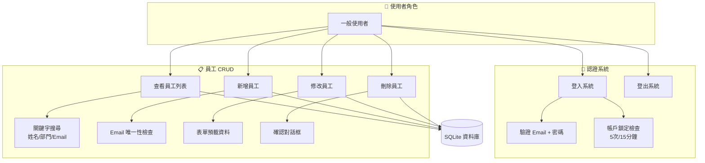

# 使用案例圖 (Use Case Diagram) — Enhanced

> Phase 02: System Design | 2026-06-28

## 使用案例說明

| 案例 | 前置條件 | 主要流程 | 後置條件 |
|:---|:---|:---|:---|
| 登入 | 無 | Email+密碼 → 驗證 → Session | 已認證 Session |
| 查詢列表 | 已登入 | GET / → 顯示全部 | 列表頁面 |
| 搜尋 | 已登入 | ?q=關鍵字 → 過濾 | 篩選結果 |
| 新增 | 已登入 | 填表 → 驗證 → INSERT | 新員工記錄 |
| 修改 | 已登入 | 點編輯 → 改資料 → UPDATE | 更新記錄 |
| 刪除 | 已登入 | 點刪除 → 確認 → DELETE | 記錄移除 |
