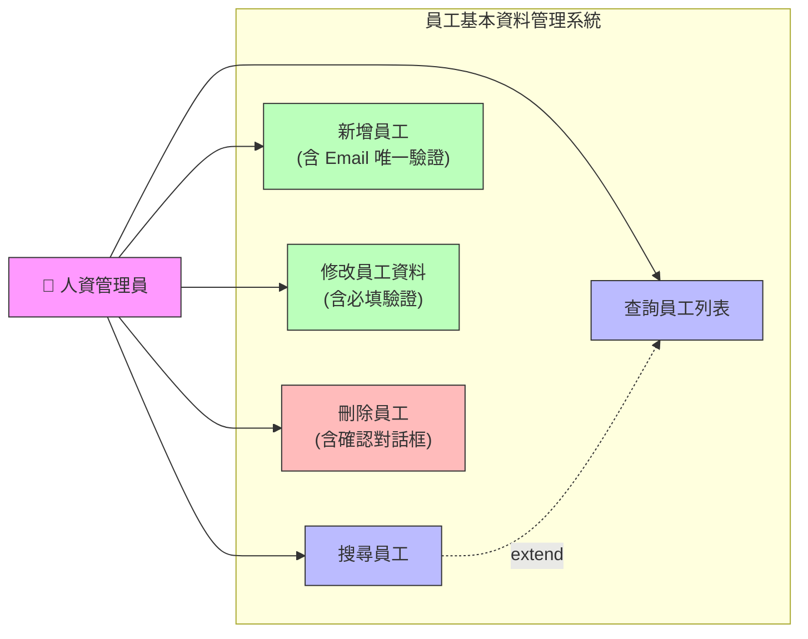

# 員工管理系統 — 用例圖 (Use Case Diagram)

## 說明
- 唯一 Actor：人資管理員
- 五個核心用例，搜尋為列表查詢的擴展（extend）
- 三個用例附註邊界條件

---

## 🔑 RBAC 角色權限矩陣

| 角色 | 查詢 | 搜尋 | 新增 | 修改 | 刪除 |
|------|:--:|:--:|:--:|:--:|:--:|
| HR 管理員 | ✅ | ✅ | ✅ | ✅ | ✅ |
| HR 檢視者 | ✅ | ✅ | ❌ | ❌ | ❌ |

- 最小權限原則：檢視者僅有讀取權限
- 所有權限檢查於伺服器端完成