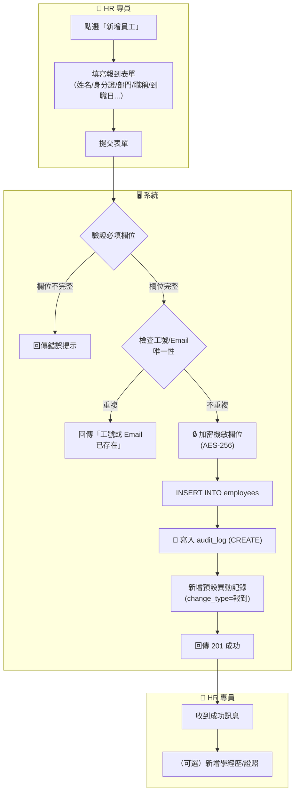
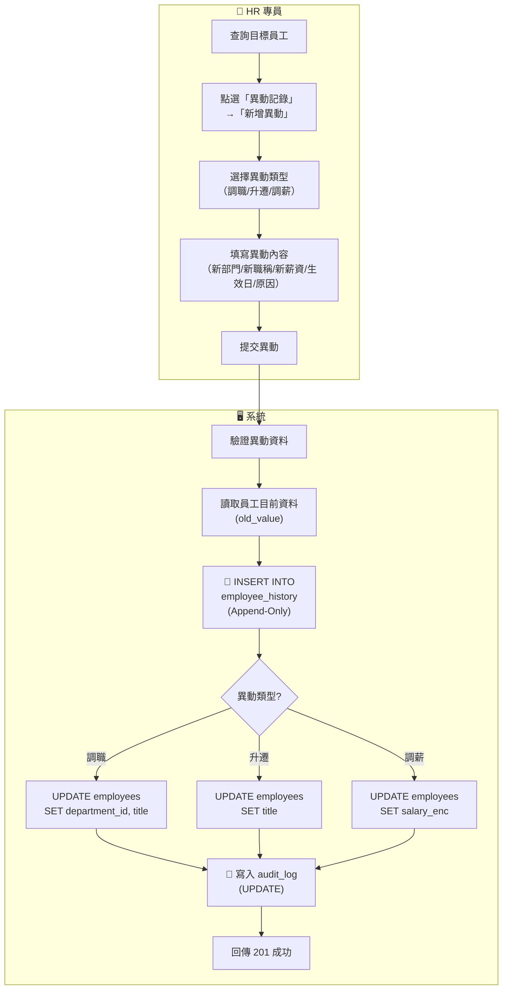
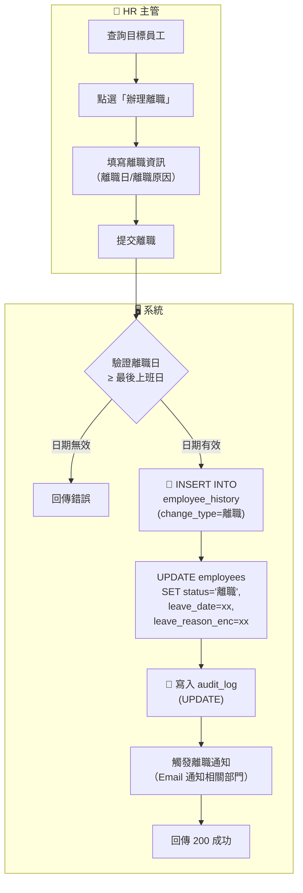
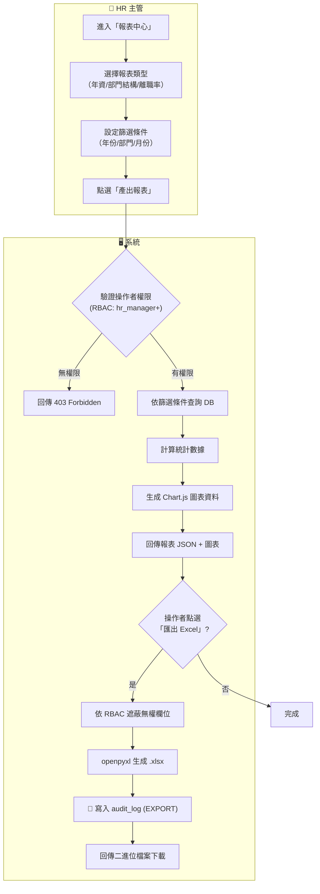
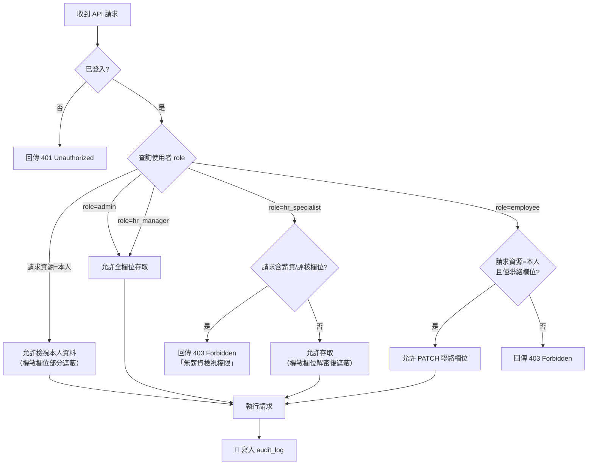
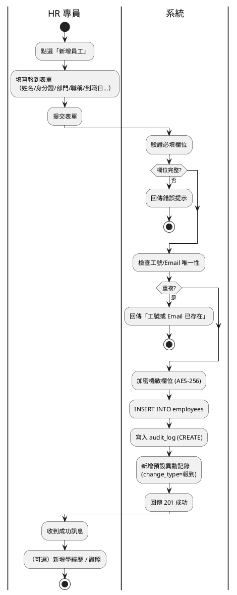
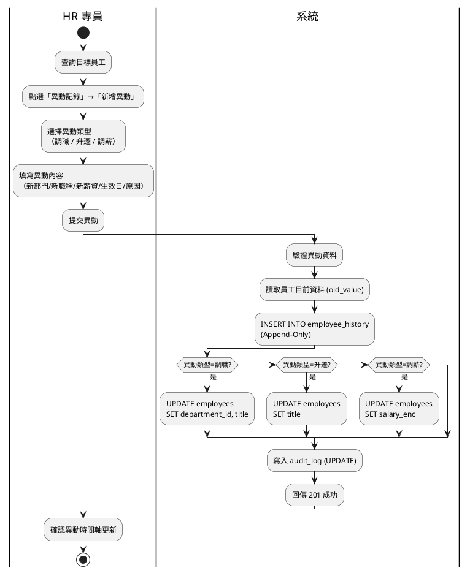
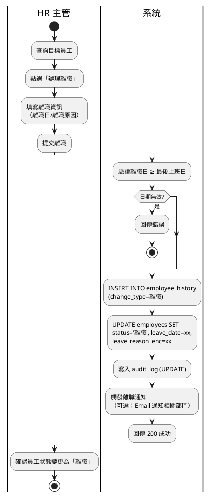
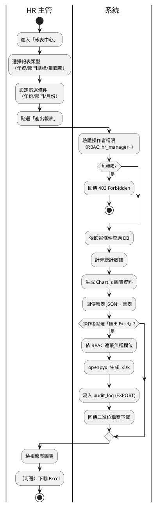
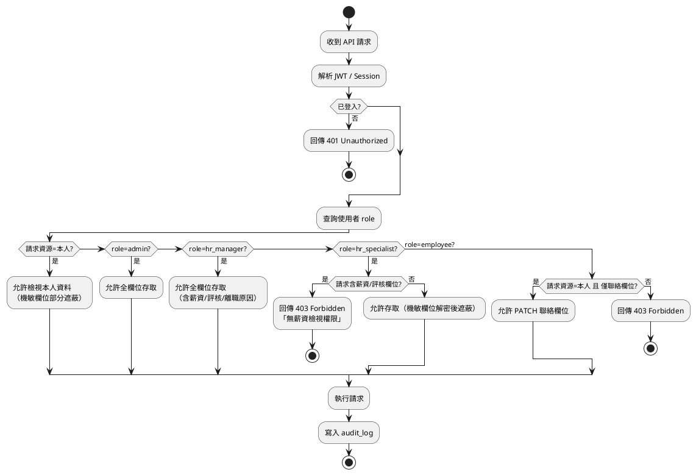

# 活動圖 (Activity Diagram)

> 生成日期：2026-06-29 | Phase 02 系統設計
> 工具：Mermaid + PlantUML

---

## 一、新進員工報到流程

### Mermaid

---

## 二、員工調職 / 升遷流程

### Mermaid

---

## 三、離職處理流程

### Mermaid

---

## 四、人事報表產出流程

### Mermaid

---

## 五、RBAC 欄位級授權檢查

### Mermaid

---

## PlantUML 原始碼（完整流程）

### 一、新進員工報到流程

---

## 二、員工調職 / 升遷流程

---

## 三、離職處理流程

---

## 四、人事報表產出流程

---

## 五、RBAC 欄位級授權檢查（通用）

