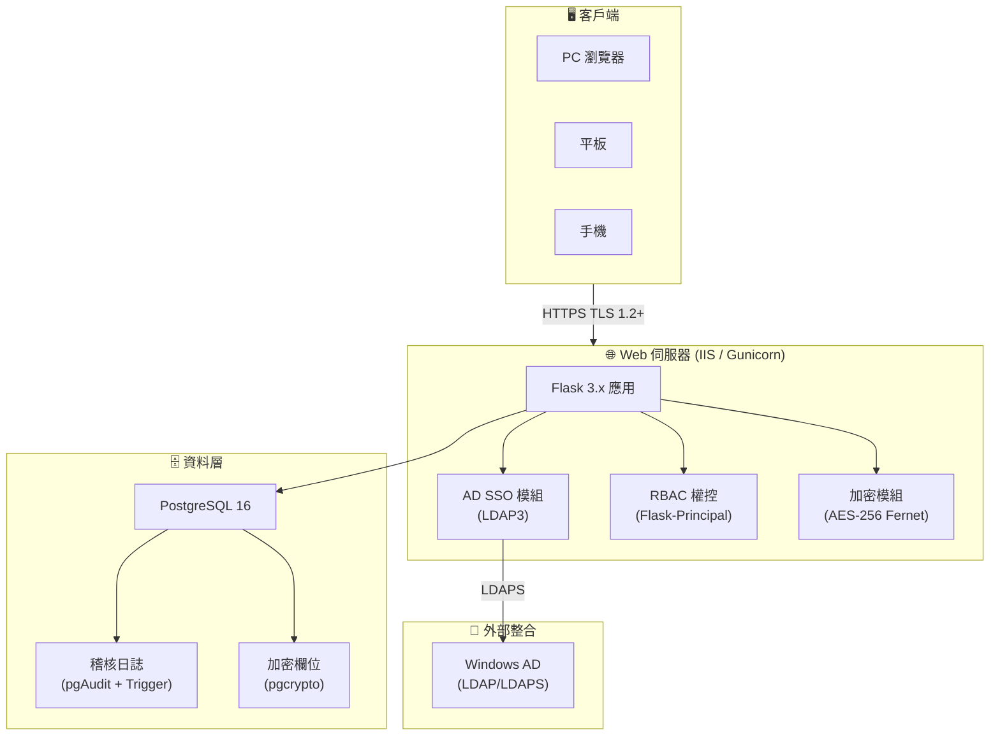

# 設計簡報 (Design Brief)

> Phase 02 Input | 2026-06-29
> 來源：`01_planning_and_analysis/outputs/formal_requirements.md`

---

## 一、設計範圍

基於 Phase 01 的 **7 項功能需求** 與 **8 項非功能需求**，為「員工基本資料管理系統」設計完整的多層次 Web 應用架構，涵蓋：
- 6 張資料表的關聯式資料庫設計（PostgreSQL）
- 19 支 RESTful API 端點（含 RBAC 欄位級權控）
- 4 組 UML 圖表（用例 / 活動 / 時序 / ER）
- RWD 響應式 UI 雛形（Bootstrap 5 + Chart.js）

---

## 二、核心設計決策

| 決策點 | 選擇 | 理由 |
|:---|:---|:---|
| 後端框架 | Python 3.12+ / Flask 3.x | 輕量靈活，與既有 demo 技術棧一致，支援 Blueprint 模組化 |
| 資料庫 | **PostgreSQL 16** | 支援 pgcrypto 欄位級加密、Audit Trigger、Row-Level Security；適合企業級個資保護需求 |
| 前端 | Bootstrap 5 + Jinja2 SSR + Chart.js | RWD 響應式，伺服器端渲染簡化部署，Chart.js 滿足報表圖表需求 |
| 認證 | **Windows AD SSO (LDAP)** + 本機備援 | flask-ldap3-login 整合 AD；備援 Email+密碼（bcrypt）機制 |
| 權控 | Flask-Principal + 自訂 Decorator | 三層 RBAC：employee / hr_specialist / hr_manager；欄位級 ACL |
| 加密 | AES-256 (cryptography.Fernet) | 機敏欄位（身分證/薪資/銀行帳號）DB 層加密；TLS 1.2+ 全站 HTTPS |
| 稽核 | pgAudit + 自訂 Audit Trigger | 不可竄改 Append-Only 稽核日誌，記錄 CRUD + 檢視行為 |
| 匯出 | openpyxl | 標準 .xlsx 匯出，依角色權限自動遮蔽無權欄位 |
| 測試 | pytest (API) + Playwright (UI E2E) | 雙軌測試，覆蓋 RBAC 權限邊界 |
| 安全基準 | 台灣《個人資料保護法》+ 普級資安防護基準 | 個資法合規 + 7 構面普級基準 |

---

## 三、技術架構總覽

---

## 四、設計約束

| 約束 | 說明 |
|:---|:---|
| 資料庫 | PostgreSQL 16，不採用 SQLite（需 pgcrypto / Audit Trigger） |
| 部署平台 | Windows Server + IIS（反向代理至 Gunicorn）或 Linux + Gunicorn + Nginx |
| 網路 | 企業內網部署，全站強制 HTTPS |
| AD 相依 | 依賴企業 Windows AD 網域控制站；需 base DN / bind account |
| 附件儲存 | 檔案伺服器 / NAS 路徑（非 DB BLOB，待 IT 確認） |
| 前端 | 伺服器端渲染 (SSR)，不採用前後端分離 SPA |
| Python | 3.12+ |

---

## 五、模組劃分

| 模組 | 職責 | 對應 REQ |
|:---|:---|:---|
| `auth` | AD SSO 登入、Session 管理、帳戶鎖定 | REQ-005, NFR-004, NFR-007 |
| `employees` | 員工主檔 CRUD、列表搜尋、分頁 | REQ-001 |
| `lifecycle` | 員工異動歷史紀錄（Append-Only） | REQ-002 |
| `profiles` | 學經歷、證照管理、附件上傳 | REQ-003 |
| `ess` | 員工自助服務（個人資料修改） | REQ-004 |
| `rbac` | 三層角色權限控管、欄位級 ACL | REQ-005 |
| `reports` | 人事報表生成、統計圖表、Excel 匯出 | REQ-006, REQ-007 |
| `audit` | 稽核軌跡記錄、日誌查詢（管理者） | NFR-003 |
| `crypto` | AES-256 加密/解密服務 | NFR-002 |
