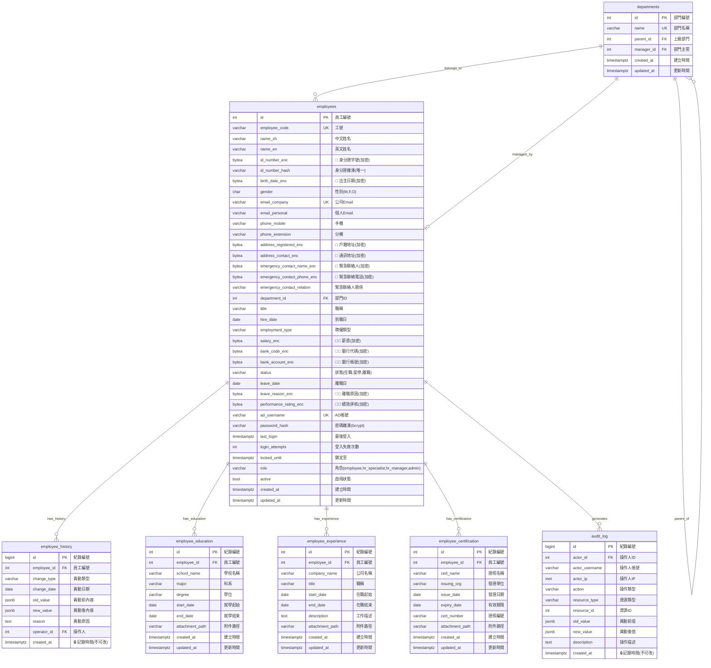

# ER 圖 (Entity Relationship Diagram)

> 生成日期：2026-06-29 | Phase 02 系統設計
> 對應 DDL：`db_schema.sql`

---

## 完整 ER 圖

---

## 機敏等級圖例

| 標記 | 等級 | 欄位 | 誰可讀 |
|:---|:---|:---|:---|
| 🔴🔴 | 極機敏 | 薪資、銀行帳號、離職原因、績效評核 | 僅 HR 主管 / admin |
| 🔴 | 機敏 | 身分證字號、出生日期、地址、手機、緊急聯絡人 | HR 專員 / HR 主管 / admin |
| （無標記） | 一般 | 姓名、Email、部門、職稱、到職日 | 全體員工（依 RBAC） |
| 🔒 | 不可竄改 | employee_history, audit_log | Append-Only，禁止 UPDATE/DELETE |

---

## 資料關聯摘要

| 父表 | 子表 | 關係 | 級聯 |
|:---|:---|:---|:---|
| departments | employees (department_id) | 1:N | 不級聯（部門不可隨意刪除） |
| employees | departments (manager_id) | 1:1 | SET NULL |
| departments | departments (parent_id) | 自參照 | 不級聯 |
| employees | employee_history | 1:N | CASCADE（員工刪除時歷史保留？→ CASCADE） |
| employees | employee_education | 1:N | CASCADE |
| employees | employee_experience | 1:N | CASCADE |
| employees | employee_certification | 1:N | CASCADE |
| employees | audit_log | 1:N | SET NULL（保留日誌） |
