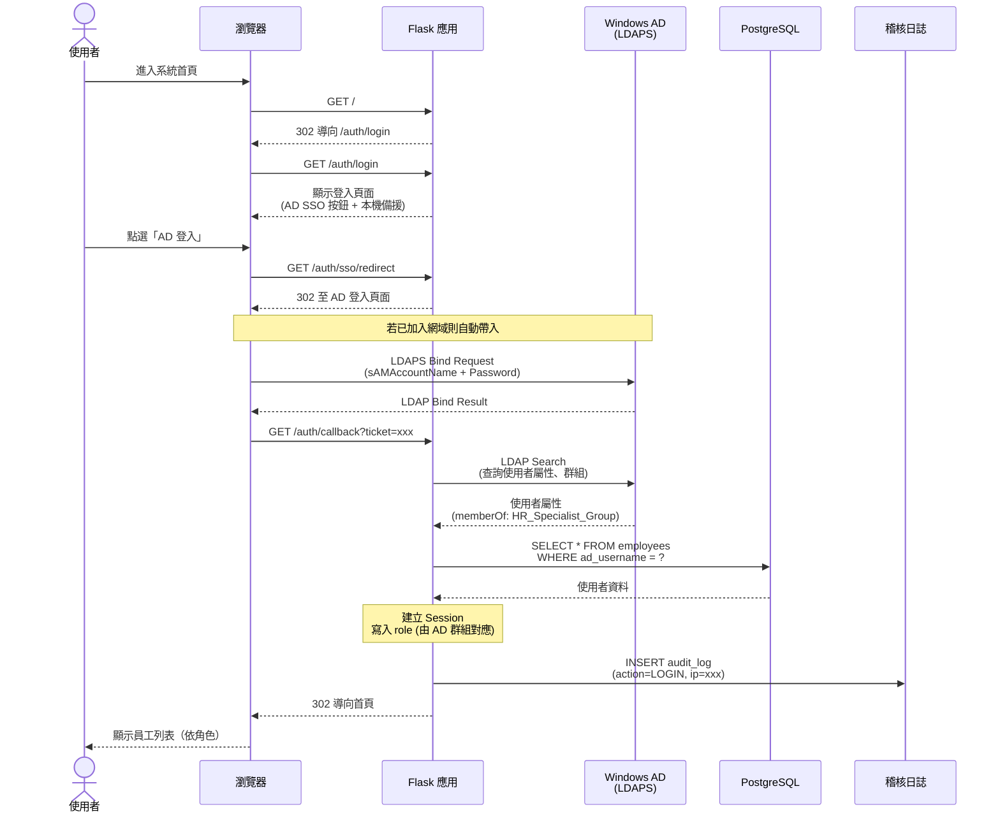
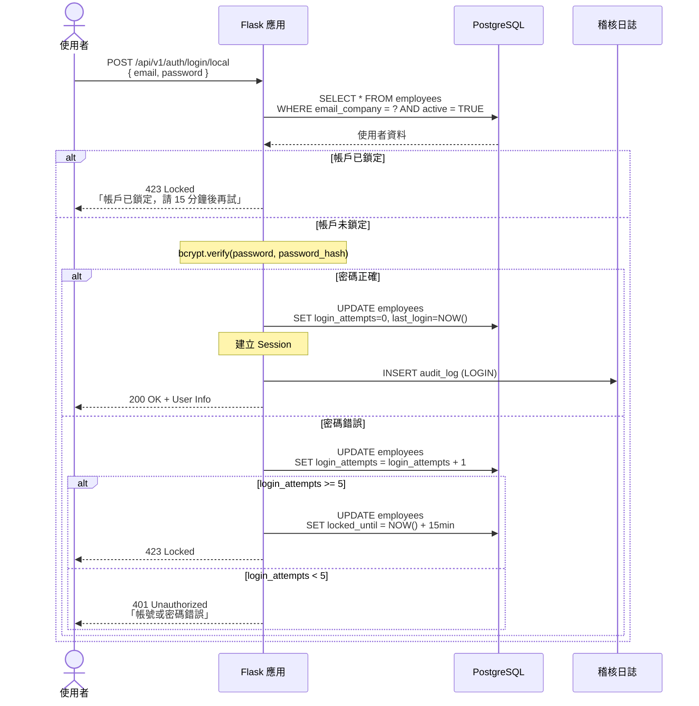
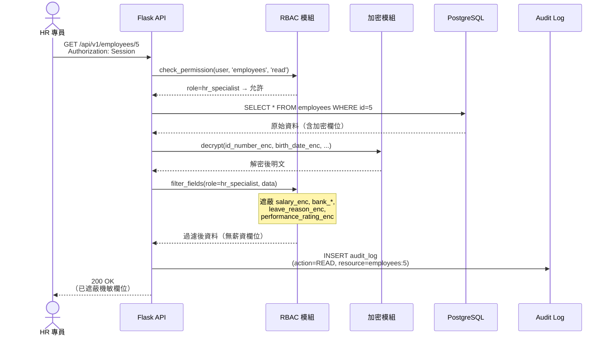
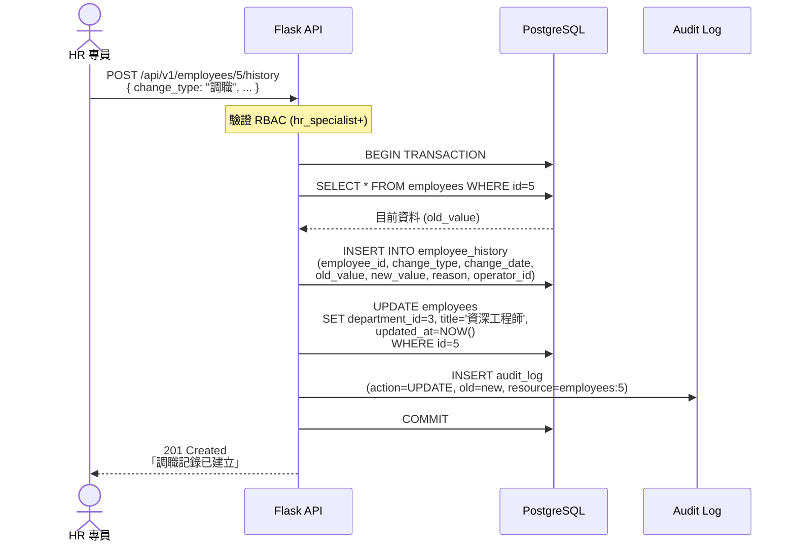
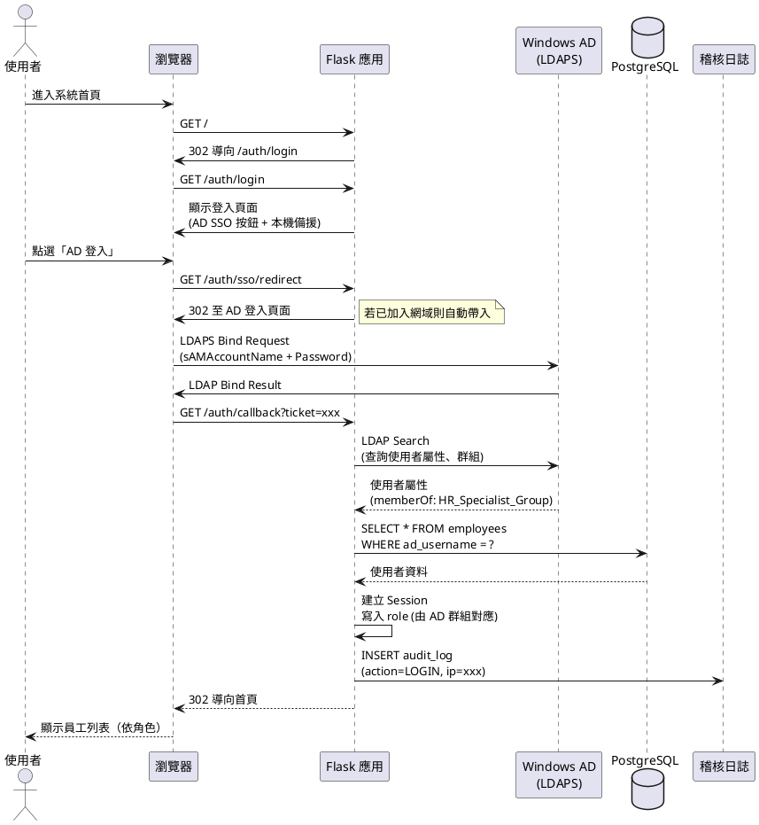
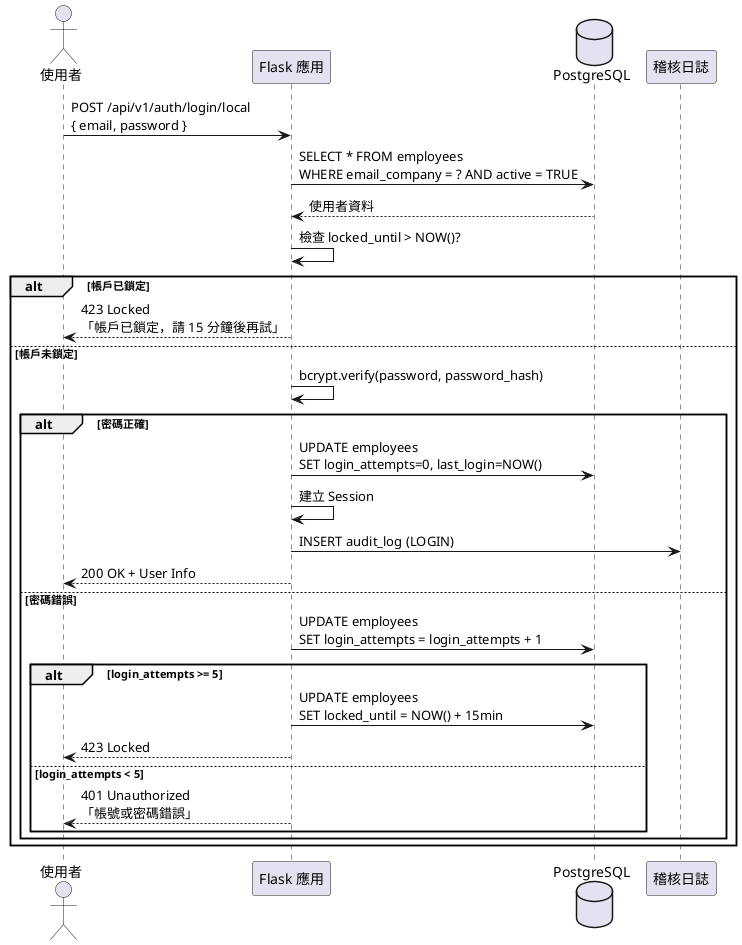
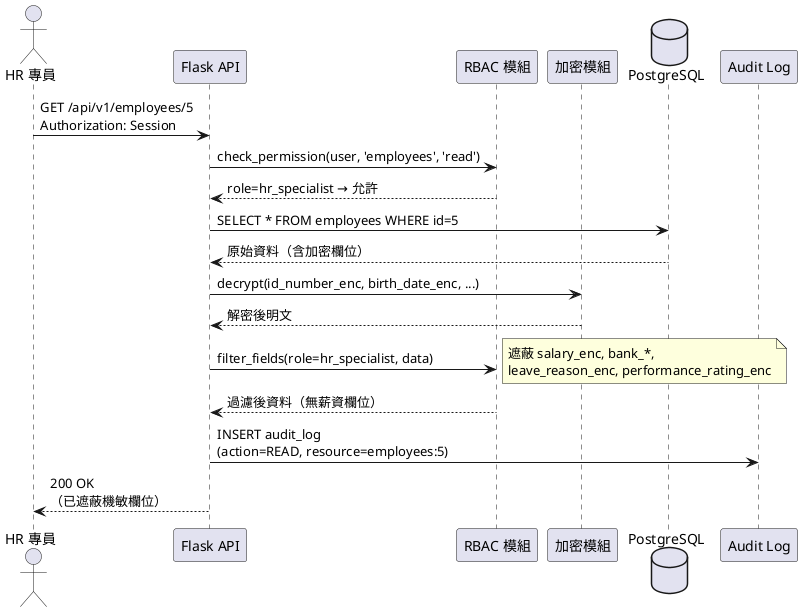
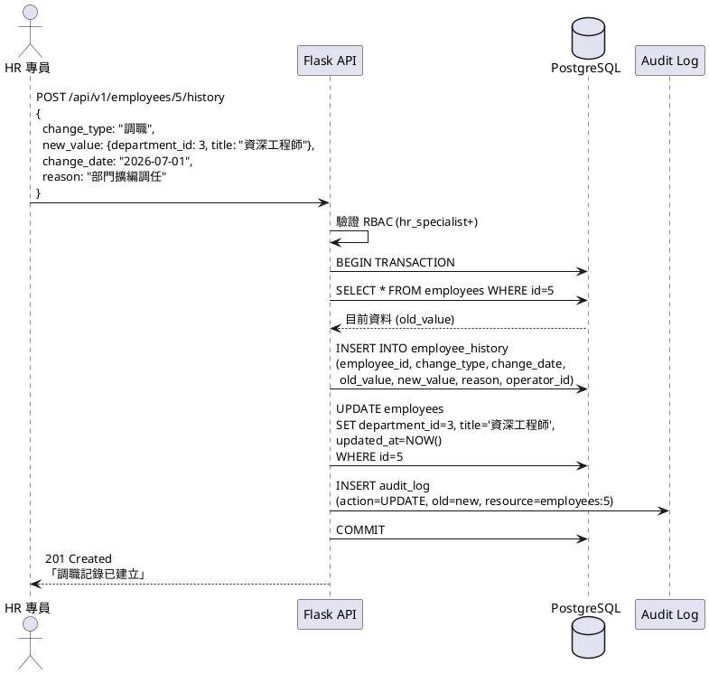

# 時序圖 (Sequence Diagram)

> 生成日期：2026-06-29 | Phase 02 系統設計
> 工具：Mermaid + PlantUML

---

## 一、AD SSO 單一登入流程

### Mermaid

---

## 二、本機備援登入（AD 無法連線時）

### Mermaid

---

## 三、RBAC 查詢員工（欄位級遮蔽）

### Mermaid

---

## 四、員工調職完整流程（含異動記錄）

### Mermaid

---

## PlantUML 原始碼（完整流程）

### 一、AD SSO 單一登入流程

---

## 二、本機備援登入（AD 無法連線時）

---

## 三、RBAC 查詢員工（欄位級遮蔽）

---

## 四、員工調職完整流程（含異動記錄）

