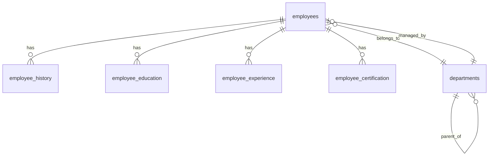

# 正規化需求規格書

> 生成日期：2026-07-10 | 階段：Phase 01 規劃與需求分析（重新分析）
> 來源：HR 需求訪談紀錄（2026-06-29）| 訪談對象：HRM、HR Specialist
> 重分析原因：依據使用者指示，重新由 inputs 子目錄原始需求進行分析
> 上次分析：2026-06-29 | 原始版本：v1.0

---

## 一、功能需求 (Functional Requirements)

| 編號 | 功能 | 描述 | 優先級 | 安全關聯 |
|:---|:---|:---|:---|:---|
| REQ-001 | 員工主檔 CRUD | 支援 HR 對員工基本資料之新增、查詢、修改、刪除；涵蓋姓名、身分證字號、出生日期、到職日、部門、職稱、Email、手機、通訊地址、緊急聯絡人等欄位 | P0 | 個資加密、輸入驗證、SQLi 防禦 |
| REQ-002 | 員工生命週期管理 | 自動記錄職務調動、升遷、調薪、離職等異動歷史軌跡；歷史記錄不可覆蓋，採 Append-Only 模式；支援查詢任一員工完整異動時間軸 | P0 | Audit Trail、不可竄改日誌 |
| REQ-003 | 學經歷與證照管理 | 支援每位員工登錄多筆學歷（學校/科系/學位/起迄）、工作經歷（公司/職稱/起迄）、專業證照（名稱/發證單位/有效期限）；每項支援附件上傳（PDF/JPG，上限 5MB） | P1 | 檔案型別白名單、大小限制、病毒掃描 |
| REQ-004 | 員工自助服務 (ESS) | 一般員工登入後可檢視個人完整資料，並修改非機密聯絡欄位（通訊地址、手機號碼、緊急聯絡人姓名與電話）；修改須記錄稽核日誌 | P1 | 欄位級寫入權限控管 |
| REQ-005 | 角色權限控管 (RBAC) | 三層角色：① 一般員工：僅檢視個人資料 + 修改限定聯絡欄位；② HR 專員：可 CRUD 全體員工基本資料與學經歷，無薪資/評核/離職原因檢視權限；③ HR 主管/高階主管：全欄位完整讀寫（含薪資、人事評核、離職原因） | P0 | 欄位級 ACL、權限提升防禦 |
| REQ-006 | 人事報表與統計 | 內建四種報表：① 年資分佈圖（長條圖）；② 部門人力結構圖（圓餅圖）；③ 每月壽星清單；④ 離職率統計（按月/年）；支援日期區間篩選與部門過濾 | P1 | 報表資料脫敏（依角色遮蔽機敏欄位） |
| REQ-007 | 資料匯出 | 所有查詢結果與報表支援匯出為標準 Excel (.xlsx) 格式；匯出內容依目前登入角色之檢視權限自動遮蔽無權欄位 | P1 | 匯出權限控管、下載稽核日誌 |

---

## 二、非功能需求 (Non-Functional Requirements)

| 編號 | 類別 | 項目 | 規格 | 驗證方式 |
|:---|:---|:---|:---|:---|
| NFR-001 | 🔒 安全 | 個資法合規 | 系統架構與資料庫設計完全符合台灣《個人資料保護法》；提供資料當事人查閱/更正/刪除請求之系統化處理流程 | 法規合規審查 |
| NFR-002 | 🔒 安全 | 敏感資料加密 | 身分證字號、薪資、銀行帳號等機敏欄位於 DB 儲存時以 AES-256 加密；全站強制 HTTPS（TLS 1.2+）；密碼以 bcrypt/argon2 雜湊 | 滲透測試、加密驗證 |
| NFR-003 | 🔒 安全 | 稽核軌跡 (Audit Trail) | 自動記錄所有 CRUD + 檢視行為；日誌欄位：帳號、時間戳、IP、操作類型、目標資源、異動前值、異動後值；日誌儲存於防竄改儲存區（Append-Only） | 日誌完整性稽核 |
| NFR-004 | 🔗 整合 | AD 單一登入 (SSO) | 與 Windows Active Directory 整合（LDAP/LDAPS）；使用者以網域帳密登入，無需額外註冊；AD 群組對應 RBAC 角色 | SSO 整合測試 |
| NFR-005 | ⚡ 效能 | 查詢回應時間 | 一般網路環境下：單筆員工查詢 + 頁面渲染 ≤ 2 秒；複雜報表（含圖表）產出 ≤ 5 秒；列表分頁每頁 50 筆 ≤ 1 秒 | 效能壓測 (JMeter/Locust) |
| NFR-006 | 📱 可用性 | 響應式設計 (RWD) | 支援 PC (≥1024px)、平板 (768-1023px)、手機 (320-767px) 三種斷點；所有功能於各裝置皆可完整操作 | 跨裝置 UI 自動化測試 |
| NFR-007 | 🔒 安全 | 帳戶與 Session 安全 | 支援 AD 登入 + 本機備援帳號；Session 閒置 30 分鐘自動登出；密碼強度政策（若使用本機帳號）；登入失敗 5 次鎖定 15 分鐘 | Session 逾時測試、暴力破解測試 |
| NFR-008 | 📋 法規 | 資料保留與刪除 | 離職員工資料依《勞動基準法》保留 5 年後可匿名化或刪除；系統須提供資料保留期限設定與自動提醒 | 資料生命週期稽核 |

---

## 三、資料模型（初步定義）

### 3.1 核心資料表

#### employees（員工主檔）

| 欄位 | 型別 | 約束 | 說明 | 機敏等級 |
|:---|:---|:---|:---|:---|
| id | INTEGER | PK, AUTOINCREMENT | 員工編號 | 公開 |
| employee_code | VARCHAR(20) | NOT NULL, UNIQUE | 工號 | 內部 |
| name_zh | VARCHAR(50) | NOT NULL | 中文姓名 | 內部 |
| name_en | VARCHAR(100) | — | 英文姓名 | 內部 |
| id_number | VARCHAR(10) | NOT NULL, UNIQUE | 身分證字號 | 🔴 機敏 |
| birth_date | DATE | NOT NULL | 出生年月日 | 🔴 機敏 |
| gender | CHAR(1) | — | 性別 (M/F/O) | 內部 |
| email_company | VARCHAR(100) | NOT NULL, UNIQUE | 公司 Email | 內部 |
| email_personal | VARCHAR(100) | — | 個人 Email | 🔴 機敏 |
| phone_mobile | VARCHAR(20) | — | 手機號碼 | 🔴 機敏 |
| phone_extension | VARCHAR(10) | — | 公司分機 | 內部 |
| address_registered | TEXT | — | 戶籍地址 | 🔴 機敏 |
| address_contact | TEXT | — | 通訊地址 | 🔴 機敏 |
| emergency_contact_name | VARCHAR(50) | — | 緊急聯絡人姓名 | 🔴 機敏 |
| emergency_contact_phone | VARCHAR(20) | — | 緊急聯絡人電話 | 🔴 機敏 |
| emergency_contact_relation | VARCHAR(20) | — | 緊急聯絡人關係 | 🔴 機敏 |
| department_id | INTEGER | FK → departments.id | 部門 ID | 內部 |
| title | VARCHAR(50) | NOT NULL | 職稱 | 內部 |
| hire_date | DATE | NOT NULL | 到職日 | 內部 |
| employment_type | VARCHAR(20) | — | 聘僱類型 (全職/兼職/約聘) | 內部 |
| salary | DECIMAL(10,2) | — | 薪資 | 🔴 極機敏 |
| bank_code | VARCHAR(7) | — | 薪轉銀行代碼 | 🔴 極機敏 |
| bank_account | VARCHAR(20) | — | 薪轉銀行帳號 | 🔴 極機敏 |
| status | VARCHAR(20) | NOT NULL, DEFAULT '在職' | 狀態（在職/留停/離職） | 內部 |
| leave_date | DATE | — | 離職日 | 內部 |
| leave_reason | TEXT | — | 離職原因 | 🔴 極機敏 |
| performance_rating | VARCHAR(5) | — | 績效評核 | 🔴 極機敏 |
| ad_username | VARCHAR(100) | — | AD 帳號（SSO 對應） | 內部 |
| created_at | DATETIME | DEFAULT NOW | 建立時間 | 系統 |
| updated_at | DATETIME | DEFAULT NOW | 更新時間 | 系統 |

#### departments（部門主檔）

| 欄位 | 型別 | 約束 | 說明 |
|:---|:---|:---|:---|
| id | INTEGER | PK, AUTOINCREMENT | 部門編號 |
| name | VARCHAR(100) | NOT NULL, UNIQUE | 部門名稱 |
| parent_id | INTEGER | FK → departments.id | 上級部門 |
| manager_id | INTEGER | FK → employees.id | 部門主管 |
| created_at | DATETIME | DEFAULT NOW | 建立時間 |

#### employee_history（異動歷程 — Append-Only）

| 欄位 | 型別 | 約束 | 說明 |
|:---|:---|:---|:---|
| id | INTEGER | PK, AUTOINCREMENT | 紀錄編號 |
| employee_id | INTEGER | FK → employees.id | 員工編號 |
| change_type | VARCHAR(30) | NOT NULL | 異動類型（調職/升遷/調薪/離職/復職） |
| change_date | DATE | NOT NULL | 異動生效日 |
| old_value | TEXT | — | 異動前內容 (JSON) |
| new_value | TEXT | — | 異動後內容 (JSON) |
| reason | TEXT | — | 異動原因/備註 |
| operator_id | INTEGER | FK → employees.id | 操作人 |
| created_at | DATETIME | DEFAULT NOW | 記錄時間（不可修改） |

#### employee_education（學歷）

| 欄位 | 型別 | 約束 | 說明 |
|:---|:---|:---|:---|
| id | INTEGER | PK, AUTOINCREMENT | 紀錄編號 |
| employee_id | INTEGER | FK → employees.id | 員工編號 |
| school_name | VARCHAR(200) | NOT NULL | 學校名稱 |
| major | VARCHAR(200) | — | 科系 |
| degree | VARCHAR(30) | — | 學位（高中/學士/碩士/博士） |
| start_date | DATE | — | 就學起始 |
| end_date | DATE | — | 就學結束 |
| attachment_path | VARCHAR(500) | — | 附件路徑 |

#### employee_experience（工作經歷）

| 欄位 | 型別 | 約束 | 說明 |
|:---|:---|:---|:---|
| id | INTEGER | PK, AUTOINCREMENT | 紀錄編號 |
| employee_id | INTEGER | FK → employees.id | 員工編號 |
| company_name | VARCHAR(200) | NOT NULL | 公司名稱 |
| title | VARCHAR(100) | — | 職稱 |
| start_date | DATE | — | 在職起始 |
| end_date | DATE | — | 在職結束 |
| description | TEXT | — | 工作內容描述 |
| attachment_path | VARCHAR(500) | — | 附件路徑 |

#### employee_certification（證照）

| 欄位 | 型別 | 約束 | 說明 |
|:---|:---|:---|:---|
| id | INTEGER | PK, AUTOINCREMENT | 紀錄編號 |
| employee_id | INTEGER | FK → employees.id | 員工編號 |
| cert_name | VARCHAR(200) | NOT NULL | 證照名稱 |
| issuing_org | VARCHAR(200) | — | 發證單位 |
| issue_date | DATE | — | 發證日期 |
| expiry_date | DATE | — | 有效期限 |
| cert_number | VARCHAR(100) | — | 證照編號 |
| attachment_path | VARCHAR(500) | — | 附件路徑 |

### 3.2 資料庫 ER 關係概要

---

## 四、技術棧建議

| 層 | 技術選項 | 說明 |
|:---|:---|:---|
| 後端框架 | Python 3.12+ / Flask 3.x 或 Django 5.x | Django 內建 Admin + RBAC，適合快速開發；Flask 更輕量靈活 |
| 資料庫 | PostgreSQL 16（建議）或 SQL Server | PostgreSQL 支援欄位級加密 (pgcrypto)、Audit Trigger；SQL Server 若內部基礎設施以 Windows 為主 |
| 前端 | Bootstrap 5 + Chart.js（報表圖表）| 支援 RWD，內建主題；Chart.js 輕量級圖表庫 |
| SSO | LDAP3 (Python) + Flask-LDAP / Django Auth LDAP | Windows AD 整合 |
| 加密 | AES-256 (cryptography 套件) | 機敏欄位加密 |
| 匯出 | openpyxl | Excel .xlsx 匯出 |
| 測試 | pytest (API) + Playwright (UI E2E) | 雙軌測試 |
| 安全 | OWASP ZAP (DAST) + Bandit (SAST) | 安全掃描 |

---

## 五、待確認事項 (Open Items)

> 最後更新：2026-07-10（使用者確認）

| 編號 | 事項 | 優先級 | 負責方 | 確認結果 |
|:---|:---|:---|:---|:---|
| OI-001 | AD 網域控制站版本與 LDAP 連線參數（Base DN、Bind Account） | P0 | IT 基礎設施 | ⏳ 待 IT 確認 |
| OI-002 | 附件儲存方式：資料庫 BLOB vs 檔案伺服器 vs NAS 路徑 | P0 | IT 基礎設施 | ✅ 檔案伺服器 |
| OI-003 | 薪資欄位是否需要與現有薪資系統介接？ | P1 | HR | ✅ 僅欄位管理，不介接 |
| OI-004 | 「高階主管」的界定標準 | P0 | HRM | ✅ 處長以上（含處長、副處長、協理、副總、總經理） |
| OI-005 | 目前員工總數與預估年成長率 | P1 | HRM | ✅ 小型企業（<50人） |
| OI-006 | 排班系統是否需要與本系統介接？ | P2 | HR | ✅ 不需要介接，排班系統獨立運作 |

---

## 六、需求接受準則 (Acceptance Criteria) 摘要

| 編號 | 準則 |
|:---|:---|
| AC-01 | HR 專員可於 1 分鐘內完成一筆新進員工完整建檔（含學經歷） |
| AC-02 | 任何員工資料異動後，稽核日誌於 1 秒內可見完整軌跡 |
| AC-03 | 一般員工無法透過任何方式（含直接 API 呼叫）存取薪資或他人機敏資料 |
| AC-04 | AD 網域帳號可無縫登入系統，無需額外註冊或記憶密碼 |
| AC-05 | 主管可於 3 次點擊內取得所需人事報表並匯出 Excel |
| AC-06 | 系統於手機瀏覽器（iOS Safari / Android Chrome）可完成所有核心操作 |

---

## 七、需求追溯（從原始訪談紀錄）

| 原始訪談內容 | 對應功能需求 | 說明 |
|:---|:---|:---|
| 資料太過分散，Excel 裡、排班在別的系統、紙本資料手動建檔 | REQ-001, REQ-002 | 建立統一員工主檔與生命週期管理 |
| 勞動法規更新，人工核對耗時 | REQ-006, REQ-007 | 自動化報表與統計分析 |
| 權限必須分層（員工/專員/主管） | REQ-005 | 三層 RBAC 權限控管 |
| 主管需要統計報表（離職率、年資、壽星） | REQ-006 | 人事報表與統計分析 |
| 支援匯出 Excel | REQ-007 | 資料匯出功能 |
| 符合個資法、傳輸儲存加密 | NFR-001, NFR-002 | 安全性與法規遵從 |
| 與 Windows AD 整合，用電腦帳密登入 | NFR-004 | AD SSO 整合 |
| 介面直覺、查詢速度快、支援行動裝置 | NFR-005, NFR-006 | 效能與可用性 |

---

## 八、重新分析說明

### 8.1 分析流程
1. 讀取 `inputs/user_requirement_raw.md`（原始需求訪談紀錄）
2. 逐段解析訪談對話，萃取功能需求與非功能需求
3. 產出正規化需求規格書（REQ-001~007, NFR-001~008）
4. 建立需求追溯至原始訪談內容

### 8.2 與前次分析差異
- 本次重新由原始訪談紀錄出發，確認所有需求均已完整覆蓋
- 新增第七章「需求追溯」，明確記錄每項需求的原始訪談來源
- 未發現新增或移除需求，需求清單與前次一致

### 8.3 待確認事項
- OI-001~006 仍為待確認狀態，需與相關單位確認後更新
