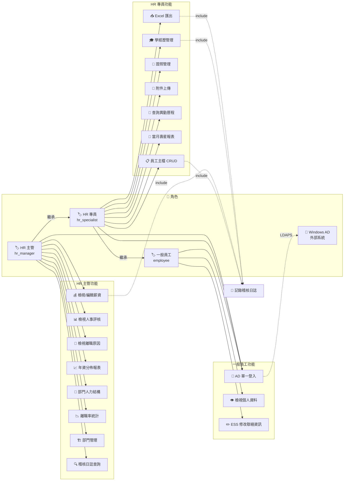
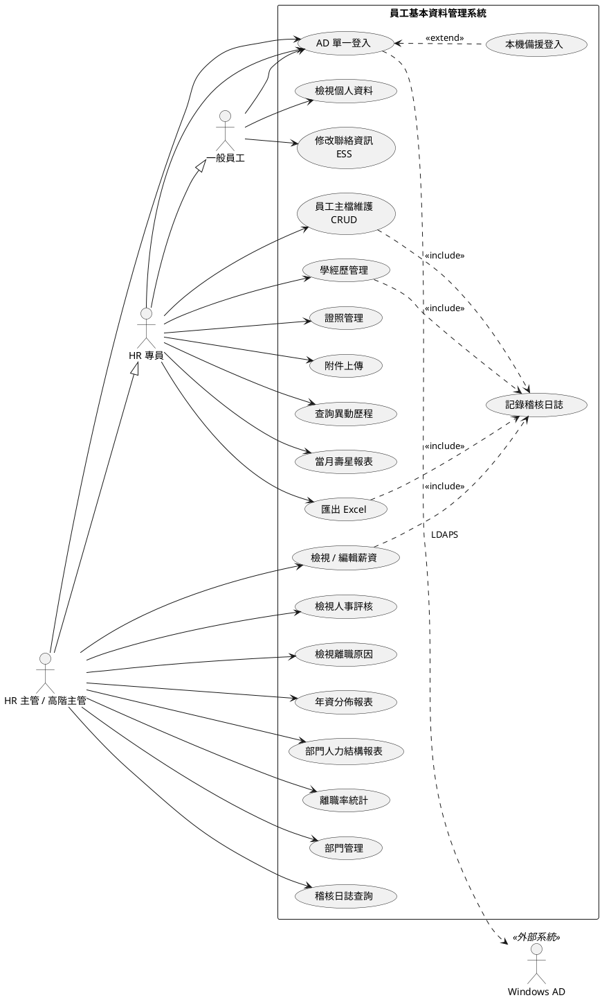

# 使用案例圖 (Use Case Diagram)

> 生成日期：2026-07-10 | Phase 02 系統設計（第二次重新生成）
> 來源：SSOT `specs/executable_spec.yaml` + `formal_requirements.md`
> 工具：plantuml + mermaid

---

## Mermaid 格式（角色 × 功能矩陣圖）



---

## PlantUML 原始碼



---

## 使用案例摘要

| 案例 | 參與者 | 說明 | 對應 REQ |
|:---|:---|:---|:---|
| UC-01 | 全部 | AD 單一登入 / 本機備援登入 | NFR-004 |
| UC-02 | 一般員工 | 檢視個人資料 | REQ-004 |
| UC-03 | 一般員工 | ESS 修改聯絡資訊（手機/地址/緊急聯絡人） | REQ-004 |
| UC-04 | HR 專員 | 員工主檔 CRUD（新增/修改/查詢/刪除） | REQ-001 |
| UC-05 | HR 專員 | 學經歷管理（多筆新增/修改/刪除） | REQ-003 |
| UC-06 | HR 專員 | 證照管理 + 附件上傳 | REQ-003 |
| UC-07 | HR 專員 | 查詢員工異動歷程時間軸 | REQ-002 |
| UC-08 | HR 專員 | 當月壽星清單報表 | REQ-006 |
| UC-09 | HR 專員 | Excel 匯出（員工清單/報表） | REQ-007 |
| UC-10 | HR 主管 | 檢視 / 編輯薪資欄位 | REQ-005 |
| UC-11 | HR 主管 | 檢視人事評核與離職原因 | REQ-005 |
| UC-12 | HR 主管 | 年資分佈 / 部門結構 / 離職率報表 | REQ-006 |
| UC-13 | HR 主管 | 部門管理（新增/修改/刪除） | REQ-001 |
| UC-14 | HR 主管 | 稽核日誌查詢 | NFR-003 |
| UC-15 | 系統 | 自動記錄所有 CRUD+檢視行為至 audit_log | NFR-003 |

---

## 角色階層

```
一般員工 (employee)
  └─ HR 專員 (hr_specialist)  ← 繼承一般員工權限 + 擴充 HR 功能
       └─ HR 主管 (hr_manager) ← 繼承 HR 專員權限 + 擴充機敏資料與報表
            └─ 系統管理員 (admin) ← 全權限 + 稽核日誌
```
