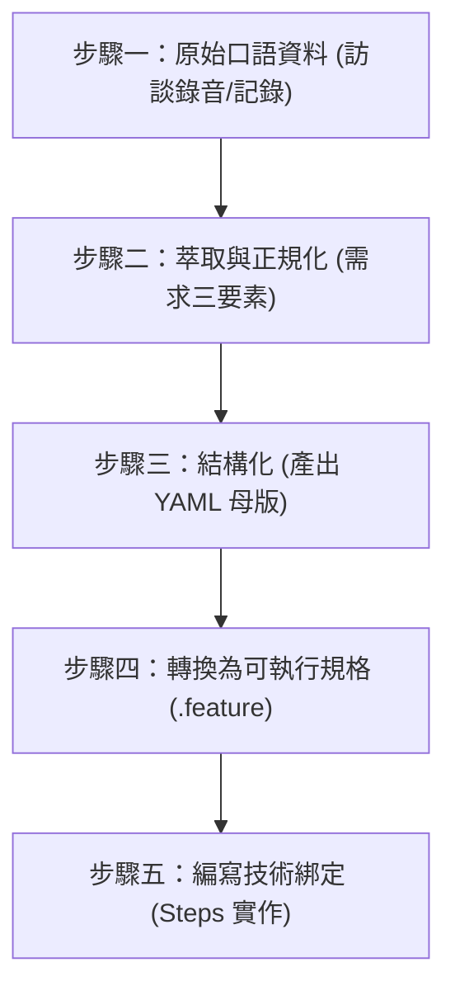
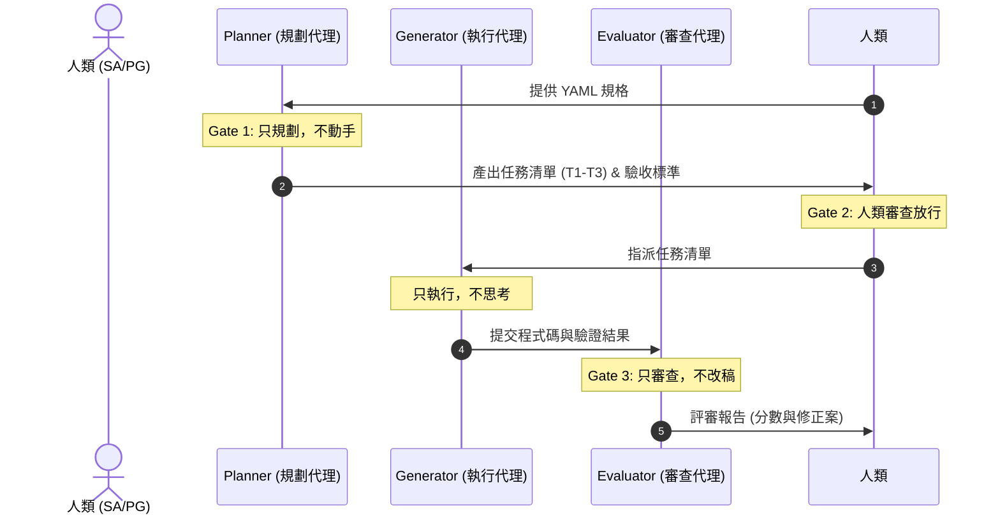
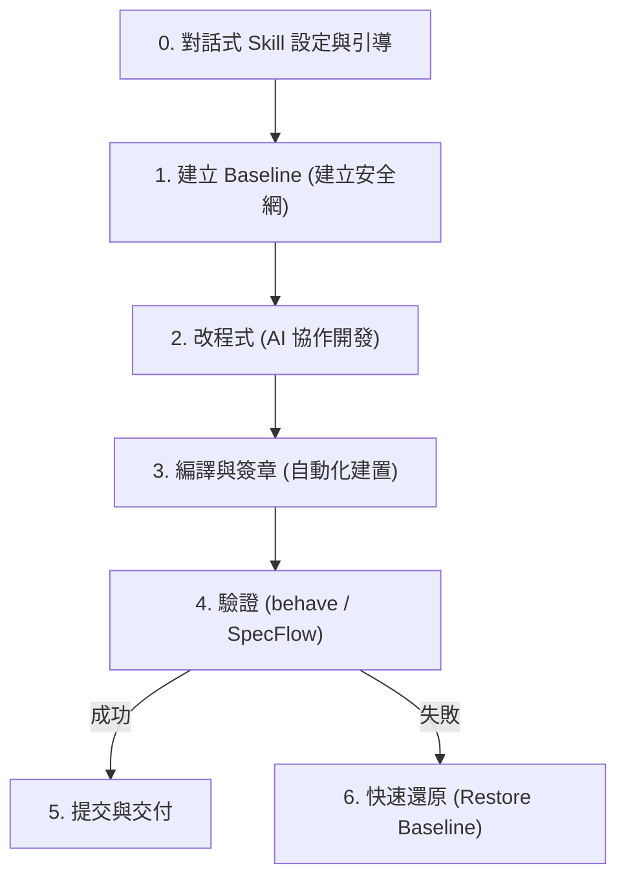




## 2026-07-11（Session 2）：SKILL.md 連結修復 + README 格式清理 + 架構對齊驗證

### 1. .agents/skills/ 各階段 SKILL.md 連結修復
- **問題**: 00_cross_phase 以外的 6 個階段（01~06）的 CORE_RULES.md 連結路徑錯誤
  - 00_cross_phase 正確：../../../docs/CORE_RULES.md（往上 3 層到根目錄再到 docs/）
  - 01~06 錯誤：../../docs/CORE_RULES.md（往上 2 層到 .agents/，再找不到 docs/）
- **處理**: 統一修正 01~06 的連結路徑為 ../../../docs/CORE_RULES.md，與 00 一致
- **連帶修復**: 連結文字從損壞的 
.md 恢復為 CORE_RULES.md（含內文引用「依 CORE_RULES.md 規範」）
- **影響檔案**: .agents/skills/01~06/SKILL.md 共 6 個

### 2. README.md 格式清理
- **Demo 專案區段雙重分隔線**: 「已完成 4 段 Baseline」和「資安防護基準」之間有兩行 --- 造成多餘空行，已刪除一行

### 3. 架構對齊驗證
- 執行 lign_framework.ps1 --incremental
- 結果：修復項目 0、警告項目 0
- 上方 5 條 WARN 為腳本已知侷限（dotfile 目錄未在 Tree 掃描範圍、指令表匹配邏輯差異），非實際缺失

### 影響範圍
- 修改檔案: 7 個 SKILL.md + README.md
- 尚未 commit（待使用者確認後統一提交）


## 2026-07-11：框架規範全面優化 + 待辦清單整頓 + @optimize 增量模式實作

### 1. GitHub 同步
- 從遠端拉取 v1.2.1、v1.2.2 標籤 + 2 筆新提交（Phase 01-04 完整實作 + 框架規則補強）
- Fast-forward 合併至 e990321

### 2. 架構對齊檢查（@optimize 完整流程）
- 執行 align_framework.ps1：修復項目 0、警告項目 0
- 11 大檢查組全部通過（CORE_RULES 防線、規章鏈、YAML SSOT、安全整合、超連結有效性等）
- 修復 6 個斷裂連結：`.agents/AGENTS.md`（4 個 `docs/` → `../docs/`）+ `TEMPLATE_SKILL.md`（2 個 `docs/` → 同目錄引用）
- 核心規則（框架歸框架、專案歸專案、反饋走待辦、目錄辨識）在三個檔案中全部到位

### 3. 待辦事項 #11 修正：Phase 產出報告缺少自動同步規則
- `.agents/AGENTS.md` 新增 3 處修正：
  - 2.2.5 Phase 04 測試報告自動同步規則
  - 檢查點 B 新增報告過期檢查
  - `@security-check` 新增第 9 項（強制覆寫 + 日期戳更新）+ 第 10 項（過期檢查）

### 4. 待辦事項 #12 確認：測試階段缺少 .bat
- 確認 `.agents/skills/04_testing/SKILL.md` 已有完整規範（L46、L69、L70）
- demo_project 下實際 .bat 檔案已存在

### 5. 待辦事項 #5 修正：Baseline 結構化 Diff 審查
- 新增 `@baseline-diff` 指令規範（§7.5）：比對兩個 Baseline 版本的四規格差異
- commands_reference.md + README.md 同步更新

### 6. 待辦事項 #9+#10 修正：Baseline/快照階段化管理 + 口語化參數
- `@snapshot` 新增 `--phase NN`、`--latest`、`--project` 參數
- `@baseline` 新增 `--phase NN`、`--project`、`--latest` 參數
- commands_reference.md + README.md 同步更新

### 7. 待辦事項 #5（新）角色權限控管 修正
- 新增 `@role` 指令（§8.5）：builder/developer 角色切換
- `@optimize`、`@unlock` 新增角色權限檢查（developer 被阻擋）
- `phase_gates.json` 新增 `current_role: "developer"` 欄位
- commands_reference.md + README.md 同步更新

### 8. 待辦事項 #3 修正：@optimize 增量檢查模式
- `@optimize` 新增 `--incremental`（Git diff 增量檢查）+ `--files`（指定檔案）參數
- 口語觸發更新為「執行增量架構對齊」「只對異動檔案做架構對齊」「增量檢查框架」
- commands_reference.md + README.md 同步更新

### 9. 四條核心規則寫入框架
- 框架歸框架、專案歸專案、反饋走待辦、目錄辨識
- 寫入 `.agents/AGENTS.md`（完整版）+ `commands_reference.md`（摘要）+ `README.md`（摘要）
- 目錄辨識改用 `docs/` 下框架專屬檔案判斷（避免 phase_gates.json 雙重存在問題）

### 10. @init 步驟補齊
- 第 4 步新增「使用者角色初始化」：自動寫入 `current_role: "developer"`
- 步驟編號自動遞增（原 4→5、5→6、6→7）

### 11. iteration_log.md 整頓
- 框架根目錄 `logs/iteration_log.md` 補上「自動產生說明」段落
- demo_project `logs/iteration_log.md` 新增空白模板
- 從 demo_project `memory.md` 回溯補齊 27 筆迭代紀錄（2026-06-29 初版 + 2026-07-10 重新分析）

### 12. 指令集排序與格式修正
- commands_reference.md 核心指令對照表依 A-Z 排序（37 筆）
- README.md 指令總覽表依 A-Z 排序（28 筆）
- 修復 SSDLC 階段代碼參照表格跑版（移除混入表格的附帶說明行 3 行）

### 13. 待辦清單整頓
- 已修正項目（#5、#9、#10、#11、#12）從待辦清單移至已處理記錄
- 重新編號：待辦清單 6 筆（#1~#6）+ 已處理記錄 6 筆

### 14. 檔案清理
- 刪除暫存檔：missing_in_demo.txt、extra_in_demo.txt、diff_result.txt（git rm --cached）
- 刪除 demo_project/ 下其他暫存檔（如有）

### 影響範圍
- 修改框架主體：.agents/AGENTS.md、docs/commands_reference.md、docs/TEMPLATE_SKILL.md、README.md、phase_gates.json、待辦事項.md
- 新增檔案：demo_project/logs/iteration_log.md
- 更新檔案：logs/iteration_log.md（補充說明段落）
- 不涉及 demo_project 內容修改（除 iteration_log.md 補齊外）

# AI 寫作自動化軟體作業流程 — 腦力激盪記錄

## 2026-07-08：Benson 敏感來源技能全面移除紀錄

### 移除背景
因 `external-resources/Benson-skill-main_FromBensonSupport/` 目錄下之技能檔案含有敏感性資料，依據使用者指示，已全面移除該來源之所有技能實體與文件引用，以確保專案安全性。

### 已移除之技能完整清單（共 28 個獨立 Skill + 1 個跨階段複製）

#### Phase 01 — 規劃與需求分析（12 個）
| # | 技能名稱 | 功能用途 | 原始路徑 |
|---|---------|---------|---------|
| 1 | `grill-me` | 需求釐清與拷問 | `skills/01_planning_and_analysis/grill-me` |
| 2 | `project-pulse` | 專案把脈與問答 | `skills/01_planning_and_analysis/project-pulse` |
| 3 | `rfp-builder` | 需求說明書與經費概算表產生器 | `skills/01_planning_and_analysis/rfp-builder` |
| 4 | `proposal-doc` | 服務建議書撰寫工具 | `skills/01_planning_and_analysis/proposal-doc` |
| 5 | `quote-builder` | 報價單產生器 | `skills/01_planning_and_analysis/quote-builder` |
| 6 | `workplan-doc` | 工作執行計畫書產生器 | `skills/01_planning_and_analysis/workplan-doc` |
| 7 | `meeting-record` | 會議記錄整理工具 | `skills/01_planning_and_analysis/meeting-record` |
| 8 | `work-review` | 工作整合報告 | `skills/01_planning_and_analysis/work-review` |
| 9 | `bcp-drill-doc` | BCP 演練紀錄表產生器 | `skills/01_planning_and_analysis/bcp-drill-doc` |
| 10 | `handover` | AI 工作記憶交班 | `skills/01_planning_and_analysis/handover` |
| 11 | `proposal-pptx` | 服務建議簡報一站式產出 | `skills/01_planning_and_analysis/proposal-pptx` |
| 12 | `file-organizer` | 專案文件整理器（亦複製至 Phase 00） | `skills/01_planning_and_analysis/file-organizer` |

#### Phase 02 — 系統設計（7 個）
| # | 技能名稱 | 功能用途 | 原始路徑 |
|---|---------|---------|---------|
| 13 | `bootstrap-ui` | Bootstrap 互動式原型設計 | `skills/02_system_design/bootstrap-ui` |
| 14 | `sa-design` | 系統分析設計（SA/SD） | `skills/02_system_design/sa-design` |
| 15 | `easymap` | GIS 圖台開發助理 | `skills/02_system_design/easymap` |
| 16 | `image-gen` | 通用圖片生成 | `skills/02_system_design/image-gen` |
| 17 | `proposal-narration` | 提案影音輔助產生器 | `skills/02_system_design/proposal-narration` |
| 18 | `ekb-note-tts` | 知識庫筆記配音 | `skills/02_system_design/ekb-note-tts` |
| 19 | `ai-news-video` | AI 新聞影音產出 | `skills/02_system_design/ai-news-video` |

#### Phase 03 — 開發與編碼（7 個）
| # | 技能名稱 | 功能用途 | 原始路徑 |
|---|---------|---------|---------|
| 20 | `project-dev-manager` | 專案開發管理 | `skills/03_implementation_and_coding/project-dev-manager` |
| 21 | `eip-item-builder` | EIP 工項自動建置 | `skills/03_implementation_and_coding/eip-item-builder` |
| 22 | `ekb-note` | EKB 知識庫讀寫工具 | `skills/03_implementation_and_coding/ekb-note` |
| 23 | `fortigate-api-spec` | FortiGate REST API 查詢 | `skills/03_implementation_and_coding/fortigate-api-spec` |
| 24 | `fortigate-qa` | FortiGate 設定檔自然語言問答 | `skills/03_implementation_and_coding/fortigate-qa` |
| 25 | `benson-skill-sync` | 技能同步與封裝工具 | `skills/03_implementation_and_coding/benson-skill-sync` |
| 26 | `project-dashboard` | 專案進度儀表板 | `skills/03_implementation_and_coding/project-dashboard` |

#### Phase 04 — 測試驗證（1 個）
| # | 技能名稱 | 功能用途 | 原始路徑 |
|---|---------|---------|---------|
| 27 | `service-sqa` | 自主系統與資安檢測 | `skills/04_testing/service-sqa` |

#### Phase 06 — 維護與營運（2 個）
| # | 技能名稱 | 功能用途 | 原始路徑 |
|---|---------|---------|---------|
| 28 | `isms-audit-prep` | 資安稽核準備助理 | `skills/06_maintenance/isms-audit-prep` |
| 29 | `eip-line-radar` | EIP LINE 訊號雷達 | `skills/06_maintenance/eip-line-radar` |

#### Phase 00 — 跨階段全域共用（1 個跨階段複製）
| # | 技能名稱 | 功能用途 | 原始路徑 |
|---|---------|---------|---------|
| 30 | `file-organizer` | 專案檔案歸納整理（Phase 01 之跨階段複製） | `skills/00_cross_phase/file-organizer` |

### 已同步更新之文件清單
| 檔案路徑 | 變更類型 | 說明 |
|---------|---------|------|
| `external-resources/Benson-skill-main_FromBensonSupport/` | **整目錄刪除** | 移除原始敏感來源 |
| `skills/SKILLS歸類.md` | 修改 | 移除 Benson 來源描述及 06 階段技能清單 |
| `skills/README.md` | 修改 | 移除所有「Benson 自建技能」段落，總數 95→67 |
| `README.md` | 修改 | 更新技能總數及來源統計 |
| `docs/Harness_Optimization_SKILL.md` | 修改 | 移除比對基準中的 Benson 參照 |
| `scripts/check-readme-sync.ps1` | 修改 | 移除 Benson 變數及比對邏輯 |
| `memory.md` | 修改 | 移除 Benson/Anthropic 混合引用 |
| `myPrj/01_planning_and_analysis/meeting-record/` | **整目錄刪除** | 移除專案中的技能副本 |
| `myPrj/02_system_design/bootstrap-ui/` | **整目錄刪除** | 移除專案中的技能副本 |
| `myPrj/02_system_design/sa-design/` | **整目錄刪除** | 移除專案中的技能副本 |
| `myPrj/02_system_design/SKILL.md` | 修改 | 移除 bootstrap-ui 及 sa-design 規範 |
| `myPrj/03_implementation_and_coding/project-dashboard/` | **整目錄刪除** | 移除專案中的技能副本 |
| `myPrj/03_implementation_and_coding/project-dev-manager/` | **整目錄刪除** | 移除專案中的技能副本 |
| `myPrj/03_implementation_and_coding/SKILL.md` | 修改 | 移除 project-dev-manager 規範 |

### 後續建議
> ⚠️ 若未來需重新引入上述技能，請務必從合法、公開之來源取得，並逐一進行資安檢核後再行匯入。原始 GitHub 倉庫為 `https://github.com/MMBenson/Benson-skill`，但引入前應先確認授權條款與敏感內容風險。

---

## 2026-06-29：員工基本資料管理系統 — 需求訪談彙整

### 訪談背景
- 訪談對象：人力資源部主管 (HRM)、人力資源部專員 (HR Specialist)
- 現行痛點：資料分散（Excel + 紙本 + 多系統）、手動核對法規更新耗時、缺乏統一生命週期視圖

### 核心功能需求 (7 項)
1. **員工主檔 CRUD** — 含身分證字號、出生日期、部門、職稱等 20+ 欄位
2. **生命週期管理** — 調職/升遷/調薪/離職異動軌跡，Append-Only 不可覆蓋
3. **學經歷與證照** — 多筆記錄 + 附件上傳（上限 5MB，限定 PDF/JPG）
4. **員工自助 (ESS)** — 自行修改非機密聯絡欄位
5. **RBAC 三層權控** — 一般員工 / HR 專員（無薪資權限）/ HR 主管（全欄位）
6. **人事報表** — 年資分佈、部門結構、壽星清單、離職率統計 + 圖表
7. **Excel 匯出** — 依角色權限自動遮蔽無權欄位

### 非功能需求 (8 項)
- 🔒 台灣個資法合規、AES-256 欄位加密、HTTPS 全站
- 🔒 不可竄改 Audit Trail（CRUD + 檢視全記錄）
- 🔗 Windows AD SSO 整合（LDAP）
- ⚡ 單筆查詢 ≤2s / 報表 ≤5s
- 📱 RWD 響應式（PC/平板/手機）
- 🔒 Session 30min 逾時、暴力破解鎖定
- 📋 離職資料保留 5 年政策

### 正規化文件
- 原始訪談紀錄：`myPrj/01_planning_and_analysis/inputs/user_requirement_raw.md`
- 正規化規格書：`myPrj/01_planning_and_analysis/outputs/formal_requirements.md`
- 需求追溯表：`myPrj/01_planning_and_analysis/reg/requirement_tracker.md`

### 待確認事項
- AD 網域參數（Base DN, Bind Account）
- 附件儲存方式（DB BLOB / NAS）
- 薪資系統是否需介接
- 高階主管界定標準
- 員工總數與成長率
- 排班系統介接需求

本文件用於記錄關於「AI 寫作自動化軟體作業流程」的討論與規劃。本流程旨在遵循軟體工程的規範與生命週期，建立一套具備可重用性、可測試性與高可靠性的自動化寫作系統。

---

## 一、 核心開發哲學：從「人好用」到「AI 好測」

本專案的核心哲學為**一源多用（Single Source of Truth, SSOT）**與**測試治具工程（Harness Engineering）**。系統設計不只為了人類操作（GUI 優先），更必須為了「AI 好測」（API/CLI 優先，支援 `--json` 與 `--dry-run`）上進行分離。

### 1. 核心願景與三層驗證對照 (Harness V-Model)
規格與測試（Spec = Test）需在不同層級上建立嚴格的對照機制：

| 階段與層級 | 傳統開發行為 | Harness 對應機制 (AI 代理) | 驗證工具/方法 |
| :--- | :--- | :--- | :--- |
| **需求層級** | 需求分析 / 驗收測試 | 系統功能規格書 (SSOT) / 甲方驗收 | `根目錄 ttraceability_matrix.md / system_specification.md` 追溯矩陣 |
| **系統層級** | 系統設計 / 系統測試 | 可 executable 規格 (YAML / Feature) | `behave` (Python) / `SpecFlow` (C#) |
| **單元層級** | 單元設計 / 單元測試 | 程式碼實作與驗證 (Generator / Evaluator) | `pytest` (Python) / `MSTest` (C#) |

---

## 二、 SA 前處理流水線與可執行規格轉換步驟

為防止 AI 在讀取模糊需求時產生幻覺，必須將「人類的混沌」翻譯為「AI 的秩序」。以下展示從**口語敘述**，一路轉換為 **YAML 規格**，最終生成 **可執行規格 (Executable Specification)** 的標準流水線。



### 實戰範例：以「WatchDog 異常通知系統」為例

#### 步驟一：原始口語資料 (Raw Input)
> 「有問題就通知我們。不同人值班通知不同人……不要半夜亂叫，除非真的很嚴重。」

---

#### 步驟二：需求萃取與正規化 (Extract & Normalize)
將口語轉化為可量化、無歧義的定義：
1.  **萃取三要素**：
    *   **功能需求（做什麼）**：系統異常時需發送通知。
    *   **業務規則（不違背什麼）**：非緊急事件不可於深夜發送通知、通知對象依值班表動態決定。
    *   **邊界條件（不做什麼）**：同一事件不可重複通知同一人。
2.  **正規化指標**：
    *   「不同人值班」 $\rightarrow$ 依據值班表 API 貼近查詢當前值班人員。
    *   「不要半夜亂叫，除非真的很嚴重」 $\rightarrow$ 在時段 `00:00-06:00` 之間，僅發送「等級 == 急迫」的通知；其餘等級暫緩至 `06:00` 後發送。

---

#### 步驟三：結構化 (產出 YAML 規格母版 - SSOT)
將正規化後的規則轉換為結構化 YAML 定義，此為 AI 讀取的唯一源頭：

```yaml
# specs/notifications.yaml
feature: 異常事件通知篩選與發送
  rules:
    - id: RULE_001
      description: 依據時段與事件等級篩選發送
      conditions:
        - time_range: "00:00-06:00"
          severity: "急迫"
          action: "立即發送通知給當前值班人員與備援人員"
        - time_range: "00:00-06:00"
          severity: "次要"
          action: "暫緩發送，於 06:00 後批次遞送"
        - time_range: "06:00-24:00"
          severity: "any"
          action: "立即發送通知給當前值班人員"
  validation:
    metrics:
      - name: 發送成功率
        threshold: "> 99%"
```

---

#### 步驟四：轉換為可執行規格 (Gherkin Feature 檔案)
由 YAML 規格自動或手動映射為人類易讀、機器可運行的 BDD 語句。此檔案即為**系統交付文件**：

```gherkin
# features/notifications.feature
# language: zh-TW
功能: 異常事件通知篩選與發送
  為了 避免半夜不必要的干擾並確保緊急事件即時處理
  作為 系統管理員
  我想要 系統根據時段與事件等級動態篩選並發送通知

  場景: 半夜發生急迫事件應立即通知
    假設 當前時間為半夜 "02:00"
    當 系統偵測到等級為 "急迫" 的異常事件時
    那麼 系統應立即發送通知給 "當前值班人員與備援人員"

  場景: 半夜發生次要事件應暫緩通知
    假設 當前時間為半夜 "03:00"
    當 系統偵測到等級為 "次要" 的異常事件時
    那麼 系統應將通知 "暫緩發送"

  場景: 白天發生任何事件應立即通知
    假設 當前時間為白天 "10:00"
    當 系統偵測到等級為 "次要" 的異常事件時
    那麼 系統應立即發送通知給 "當前值班人員"
```

---

#### 步驟五：編寫技術綁定 (Steps 實作與資料庫驗證)
將可執行規格中的中文步驟，透過測試治具（Harness）與實體系統（Code）與資料庫（MSSQL）進行綁定驗證：

```python
# features/steps/notification_steps.py
from behave import given, when, then
from datetime import datetime

# 模擬被測試系統
class NotificationService:
    def __init__(self):
        self.sent_notifications = []
        self.pending_notifications = []

    def process_event(self, time_str, severity):
        hour = int(time_str.split(":")[0])
        is_night = 0 <= hour < 6
        
        if is_night and severity != "急迫":
            self.pending_notifications.append({"severity": severity, "time": time_str})
            return "暫緩發送"
        else:
            self.sent_notifications.append({"severity": severity, "time": time_str})
            return "立即發送"

# ---- BDD 步驟綁定 ----

@given('當前時間為半夜 "{time_str}"')
def step_impl(context, time_str):
    context.current_time = time_str
    context.service = NotificationService()

@given('當前時間為白天 "{time_str}"')
def step_impl(context, time_str):
    context.current_time = time_str
    context.service = NotificationService()

@when('系統偵測到等級為 "{severity}" 的異常事件時')
def step_impl(context, severity):
    context.result = context.service.process_event(context.current_time, severity)

@then('系統應立即發送通知給 "{recipient}"')
def step_impl(context, recipient):
    assert context.result == "立即發送", f"預期立即發送，但實際為 {context.result}"

@then('系統應將通知 "{action}"')
def step_impl(context, action):
    assert context.result == "暫緩發送", f"預期暫緩發送，但實際為 {context.result}"
```

---

## 三、 三步驟循環與三道強制門檻

開發流程必須嚴格遵循 **Planner -> Generator -> Evaluator** 循環，並設有強制通過門檻，絕不可跳過。



### 1. Gate 1: Planner 先行（只規劃，不動手）
*   **職責**：將龐雜需求拆解為微小任務與驗收標準，只做規劃，不動手寫程式碼。
*   **禁止**：撰寫 any 業務邏輯程式碼或變更架構。

### 2. Gate 2: 人類確認
*   **職責**：人類 SA/PG 必須審查 Planner 產出的任務清單，確認無誤後手動放行，才可進入 Generator 實作階段。

### 3. Gate 3: Evaluator 把關（只審查，不改稿）
*   **職責**：客觀挑剔、逐條對照規格對 Generator 的產出進行評分。
    *   **評分權重**：規格符合度 40%、程式碼品質 25%、測試涵蓋率 20%、安全與錯誤處理 15%。
*   **禁止**：直接動手修改 Code。未達標前一律退回。

---

## 四、 測試治具日常循環 SOP

為維持開發安全網，團隊必須嚴格執行日常循環 SOP，確保出問題時可在 5 分鐘內完全還原。在每次迭代開始時，系統應主動與使用者進行引聯式對話，以確定測試類型與所使用的開發 Skill。



### 步驟零：對話式 Skill 設定與引導 (引導決策樹)
在啟動任務前，Harness 系統將主動與使用者對話。若使用者無特定想法或未回應，則自動載入系統預設技能。

```text
對話引導機制：
1. 確認測試的應用介面類型：
   - [ ] 網頁 UI 自動化
   - [ ] API 介面測試
   - [ ] 純演算法邏輯
   - [ ] 單機應用程式 (Desktop App)

2. 確認要載入的開發/AI Skill：
   - 詢問使用者是否要從網路載入已存在的第三方 AI 寫作或測試 Skill。
   - 若使用者同意，則動態拉取該 Skill 配置；若否，則採用預設綁定技能（C# SpecFlow / Python behave 預設治具）。
```

### 步驟一：建立 Baseline
在任何變更前，必須建立當前程式碼與資料庫結構的基準（Baseline）。
*   *C# 環境*：執行 `docs/專案基準建立與還原指令.md`，將備份儲存至 `docs/baseline`。
*   *Python 環境*：使用 Git Tag 或暫存機制備份資料庫（MSSQL 備份檔）與當前程式碼。

### 步驟二：改程式 (AI 協作開發)
由 Generator 依據 Planner 的任務清單進行開發。每次對話前，必須**強制重置上下文**，重新載入 `AGENTS.md`，以防範 AI 產生累積幻覺。

### 步驟三：自動化編譯與建置
*   *C# 環境*：執行 `docs/重新編譯(自動加入數位簽章).md` 進行自動化建置與數位簽章。
*   *Python 環境*：執行環境編譯檢查，確認無語法錯誤。

### 步驟四：驗證品質
依據步驟零所選定的應用介面類型與 Skill，執行對應的測試治具驗證：
*   **網頁 UI 自動化**：啟動 Selenium/Playwright 測試，點擊 DOM 元素，並驗證 MSSQL 資料寫入。
*   **API 介面測試**：執行 API 合約測試 (Contract Test)，驗證 JSON 的 Input/Output Schema。
*   **純演算法邏輯**：執行單元測試，比對純文字或計算結果的 Assert。
*   **單機應用程式**：執行 UI 自動化測試治具（如 Windows App Driver），模擬模擬器操作。
*   *執行指令*（以 Python 為例）：
    ```bash
    behave -f json -o docs/reports/test_report.json -f html -o docs/reports/test_report.html
    ```

### 步驟五：出問題還原
若步驟四驗證失敗，且無法在數分鐘內修正，必須在 5 分鐘內將程式碼與資料庫結構還原至步驟一建立的 Baseline 狀態，拒絕帶病累積。

---

## 五、 異常退回與抓蟲機制 (Bug Escalation Matrix)

當系統發生異常時，必須精準定位問題根源，並依據下表進行退回與修正，嚴禁盲目修改：

| 異常現象 | 問題根源 | 退回層級 | 預期修正時間 |
| :--- | :--- | :--- | :--- |
| **Code 寫錯** | Generator 沒照規格實作 | 退回 **Generator** | 分鐘級 |
| **YAML 規格寫錯** | SA 規格邏輯錯誤 | 退回 **Planner** | 小時級 |
| **未做例外處理** | Planner 漏定義例外狀況 | 退回 **Planner** | 小時級 |
| **需求理解錯誤** | 訪談失誤 / 漏接甲方需求 | 退回 **SA 前處理層** | 天級 |

---

## 六、 雙流向文件與測試報告自動化生成 (一源多用)

由單一來源的 YAML 規格檔，透過自動化指令，同步產出三種格式的文件與報告，確保實作與文件永不脫節：

### 1. 測試報告三格式
1.  **AI 版 (JSON)**：保留所有 `enum` 與型態定義，資訊最完整，直接作為下一次 Evaluator 迭代的輸入源。
2.  **人讀版 (Markdown / HTML)**：去蕪存菁，表格化呈現，供 SA/PM 內部 3 分鐘快速審查。
3.  **履約版 (Word/PDF)**：包含封面、目錄、訪談頁碼追溯，直接作為對外驗收的合約交付物。

### 2. CI/CD 自動化整合 (以 GitHub Actions 為例)
為確保每次 Commit 皆通過 Harness 驗證，需於專案中設定自動化流水線。

```yaml
# .github/workflows/harness-ci.yml
name: Harness Engineering CI
# (詳細 CI YAML 內容已記錄，請查閱 .github/workflows/)
```

---

## 七、 當前建置狀態與後續執行規劃

### 1. 當前建置狀態 (截至 2026-06-24 12:00)
專案的核心軟體工程基礎設施已全數建置完畢：
*   **SSDLC 六大階段目錄**：已建立 `01_planning_and_analysis` 至 `06_maintenance` 的資料夾結構，並包含對應的 `inputs/` 與 `outputs/` 目錄（附帶 `.gitkeep`）。
*   **自定義階段技能**：在各開發階段目錄下建立了專屬的 `SKILL.md`，定義了三步循環的執行細節。
*   **全局防線規章**：已建立 [.agents/AGENTS.md](ffile:///d:/00AI協作/SSDLC_Skill/.agents/AGENTS.md), 寫入全局連貫性大循環、組態管理與測試同步規範。
*   **根目錄控制文件**：已初始化 [根目錄 ttraceability_matrix.md / system_specification.md](ffile:///d:/00AI協作/SSDLC_Skill/根目錄 ttraceability_matrix.md / system_specification.md)（需求追溯矩陣）與 [根目錄 ttraceability_matrix.md / system_specification.md](ffile:///d:/00AI協作/SSDLC_Skill/根目錄 ttraceability_matrix.md / system_specification.md)（系統規格說明書）。
*   **IDE 串接**：已建立 [.vscode/tasks.json](ffile:///d:/00AI協作/SSDLC_Skill/.vscode/tasks.json), 可在 VS Code 中直接執行自動化備份、BDD 測試、RTM 稽核與還原。

### 2. 下一步執行計畫 (下午討論議題)
當重新開啟對話時，我們將接續執行以下任務：
1.  **新增第一個實體需求**：在 `01_planning_and_analysis/inputs/` 目錄下建立第一個 `REQ_*.md` 檔案，開始進行需求訪談與正規化處理。
2.  **執行大循環**：由 AI Planner 自動對此需求進行系統設計的轉譯（產出 ER Model、UML 圖表與 API 規格），落實交互驗證與追溯。

---

## 八、 引導式專案初始化與階段 Skill 配置之腦力激盪 (2026-06-25)

### 1. 討論主題與動機
為了降低使用者手動建立專案目錄的負擔，並提升 AI 協作時的 Skill 載入精準度，決定建立一套標準的引導式工作流程，讓專案初始化與階段 Skill 綁定能完全自動化。

### 2. 核心流程決定
*   **步驟一：目錄自動生成**
    *   AI 必須提示使用者當前工作目錄，並主動引導使用者輸入欲建立之專案子目錄名稱（相對路徑）。
    *   取得子目錄名稱後，AI 直接讀取 [TEMPLATE_SKILL.md](ffile:///d:/00AI協作/SSDLC_Skill/docs/TEMPLATE_SKILL.md) 中定義的目錄結構，自動在工作目錄之指定子路徑下建立完整的 SSDLC 各階段資料夾與檔案。
*   **步驟二：階段 Skill 複選配置與扁平化目錄**
    *   AI 必須依照 SSDLC 的 6 個開發階段，循序進行各階段的引導配置。
    *   在每一階段的引導中，AI 必須掃描並列出該階段下所有可用的 Skill，清晰呈現 Skill 名稱與用途，供使用者複選勾選。
    *   **扁平化目錄與動態合併**：當使用者勾選完成後，AI 必須將這些所勾選的 Skill 自動部署到目標專案的對應開發階段目錄（此目錄直接位於專案根目錄下，例如 `[專案根目錄]/01_planning_and_analysis/`），並將其規範與 instructions 動態合併，動態寫入至該階段目錄下的 `SKILL.md`（如 `[專案根目錄]/01_planning_and_analysis/SKILL.md`），以利後續互動直接載入使用。

### 3. 落地實作規範
此規範將被正式寫入 [.agents/AGENTS.md](ffile:///d:/00AI協作/SSDLC_Skill/.agents/AGENTS.md) 的「六、 引導式專案初始化與階段 Skill 配置規範」中，作為 AI 協作時的最高準則。同時，決定在專案根目錄下生成一個極簡之 `AGENTS.md` 引導檔，內嵌相對超連結指向實體規章 `.agents/AGENTS.md`，以確保所有類型的 AI 代理皆能正確識別並加載開發規範。

---

## 九、 參數化與動態喚起 Skill 之腦力激盪 (2026-06-26)

### 1. 討論主題與動機
原有的專案初始化流程中，各階段的 Skill 是在專案啟動時一次性預載入並合併的。然而，在實際開發過程中，隨著需求變更與工作推進，可能需要動態載入或切換特定的 Skill，若每次都重新初始化將降低開發效率。
今天進一步討論後，決定拋棄繁瑣的本機 Python 腳本方案，優化為「AI 原生對話指令協議」，由 AI 代理直接在對話視窗中偵測極簡指令，並代為操作本機檔案完成 Skill 載入，實現 100% 免安裝環境與免記冗長 CLI 指令之流程。
在此基礎上，為解決「清單缺乏用途資訊」與「多 Skill 載入效率低」的缺陷，進一步補強了「用途說明動態解析」與「加號 (+) 聯合參數載入與融合」機制。
此外，為防止拼寫錯誤造成聯合導入失敗，新增了「加號保留字防呆檢核與提示機制」，並建立了專屬的 `docs/commands_reference.md` 指令集參照表以利後續討論與查閱。
同時，為維持一站式初始化的便利性，規定了 `@init` 在初始化專案目錄後，會自動續接啟動 01 到 06 階段的 Skill 配置引導流，達成「初始引導一氣呵成，後續隨時動態載入」的雙軌彈性。
最後，為了方便使用者用語音或口語查詢，建立了「自然語言語意喚起機制」，允許使用者說出相近的口語表達時，由 AI 代理自動載入並呈現指令參照表。

### 2. 核心機制與指令設計 (全對話指令協議補強版)
*   **@stages**：查詢 SSDLC 各階段代碼與名稱對照表（例如 `01` 到 `06`）。
*   **@[階段雙位數代碼]** (例如 `@01`、`@02`)：掃描並列出該開發階段的所有可用 Skill。AI 代理必須自動讀取各 Skill 的 `SKILL.md`，動態解析其 Frontmatter 中的 `description`，併同名稱與導入指令輸出，使用戶一目了然。
*   **@[階段雙位數代碼]/[Skill_1]+[Skill_2]** (例如 `@02/sa-design+bootstrap-ui`)：聯合導入指令。AI 代理會一次性建立 Git tag Baseline，依次將多個 Skill 複製到對應階段，將各 instructions 分段追加合併至 `SKILL.md`，並在 `根目錄 ttraceability_matrix.md / system_specification.md` 中一次性登錄此批導入。
*   **加號 (+) 防呆提醒**：若 Skill 名稱中包含加號，AI 代理在拆分解析時若發現 any 一個 Skill 不存在，必須主動回報是哪一個 Skill 找不到，並提示加號聯合導入的正確範例語法，附上可用 Skill 清單，防止拼寫錯誤。
*   **@init [相對路徑]** (例如 `@init ./my_new_project`)：自動在指定路徑下建立完整的 SSDLC 目錄結構與基礎控制檔案。**目錄與檔案建立完畢後，AI 代理會自動啟動 01 到 06 階段的 Skill 配置引導流，引導使用者循序選取要載舉的 Skill 或選擇跳過。**
*   **自然語言語意喚起**：偵測到如「讀取指令集」、「有什麼指令可以用」、「叫出指令對照表」等口語語意時，自動讀取並顯示 [commands_reference.md](ffile:///d:/00AI協作/SSDLC_Skill/docs/commands_reference.md)。

### 3. 落地實作規範
此協議規範已正式追加寫入 [.agents/AGENTS.md](ffile:///d:/00AI協作/SSDLC_Skill/.agents/AGENTS.md) 的「六、 引導式專案初始化與階段 Skill 配置規範 (AI 代理對話指令協議)」中，作為未來 AI 代理在對話中處理指令與操作檔案的最高守則。同時，更新了對話指令參照表 [commands_reference.md](ffile:///d:/00AI協作/SSDLC_Skill/docs/commands_reference.md)。


### 4. 快捷編號與逗號分隔之指令精簡改版 (2026-06-26)
在實際使用語音及鍵盤操作對話指令時，發現手動輸入完整的 Skill 資料夾名稱（如 `@01/skill_categorizer`）過於冗長且容易拼錯。為進一步提升操作效率，決定將協議進行以下精簡優化：
*   **快捷編號機制 (Shortcut Numbering)**：在掃描列出 Skill 清單（`@[階段]`）時，AI 代理必須依字母順序自動為可用 Skill 分配雙位數快捷編號（如 `01`, `02` ...）。使用者在導入時只需輸入快捷編號（如 `@01/01`），AI 代理在內部自動將其還原為實體 Skill 名稱進行部署與 instructions 合併。
*   **逗號分隔聯合導入 (Comma Separator)**：將聯合導入多個 Skill 的連接符號由加號 `+` 改為逗號 `,`（例如 `@02/01,02`），使輸入更加符合口語化習慣。
*   **友好防呆提示**：若使用者誤輸入完整 Skill 名稱而非編號，AI 代理會友好提示正確的快捷編號語法；若輸入之快捷編號不存在，則中止並提示正確範例。
此優化已同步更新至 [.agents/AGENTS.md](ffile:///d:/00AI協作/SSDLC_Skill/.agents/AGENTS.md) 與 [commands_reference.md](ffile:///d:/00AI協作/SSDLC_Skill/docs/commands_reference.md)。

### 5. 雙層六階段 IIS/Windows 融合架構與 GitHub 高星 Skill 庫整合 (2026-06-26)
在進一步研析使用者提供的「Harness Engineering 雙層六階段規格書 V1.0 定稿版」與「Windows IIS 部署專版 V2.0 規格書」後，為了極大化系統在微軟 Windows + IIS 環境下的實戰可行性，決定對現行架構與 Skill 庫進行全局升級：
*   **架構深度融合**：在 [.agents/AGENTS.md](ffile:///.agents/AGENTS.md) 規章中，將 V1.0 的 PDCA 迴圈、A/B 類錯誤分類重試理論與 V2.0 的 Windows Server + IIS 部署環境特性完美融合。明確了外層全域 Agent 與內層 PDCA 迴圈的職責，在 Plan 階段加入路徑編碼與檔案鎖定前置檢核，Generator 階段執行 Windows 絕對路徑快照，Evaluator 階段補充 IIS/事件日誌雙軌驗證，並在防錯紀律中寫入 A 類（執行層）重試最多 3 次、B 類（規劃層）重試直接升級全域迭代（上限 2 輪）的分級重試規則，同時寫入 Docker/IIS 部署環境互斥檢核，避免環境衝突。
*   **清理規章中的簡體字**：主動重構並覆寫了全局規章，將其中混雜的簡體字（如 规划、规范 等）全數轉換為台灣繁體中文（規劃、規範），以嚴格符合排版與唯一語境規範。
*   **建立 GitHub 高星開源工具 Skill 庫**：為支援使用者與 AI 協作時能自由選用業界推薦的開源工具，在 `external-resources/github-skills/` 目錄下建立了涵蓋 6 個開發階段的 31 個熱門 GitHub 工具的 Skill 資料夾與 `SKILL.md` 指導書。
*   **更新 Skill 目錄索引表**：更新了 [skills/README.md](ffile:///d:/00AI協作/SSDLC_Skill/skills/README.md)，將 31 個開源工具 Skill 分門別類地登載進去，並在各階段中分配雙位數快捷編號（由 `01` 開始）並加註其本機外部資源目錄與 GitHub 原始倉庫的追溯超連結，使協作引導更清晰，讓使用者決定要選用哪些 Skill。

### 6. 可整體駕馭工程核心指導守則 CORE_RULES.md 之規劃與建立 (2026-06-26)
為了建立專案規範的最高指導框架原則，決定將先前研析歸納的 V1.0 定稿規格與 V2.0 規格進行全面提煉。
*   **通則化提煉**：排除所有具體開源工具 Skill 清單，並將所有與特定技術或特定作業平台（如 Windows、IIS、Docker 等）綁定的環境適配規則一併調整優化，去除平台相依性，抽象化為「通用進程駐留與守護」、「環境權限與檔案鎖定前置檢核」、「雙軌日誌審計追溯」與「互斥部署環境靜態檢核」等通則，將其彙整為 [CORE_RULES.md](ffile:///d:/00AI協作/SSDLC_Skill/docs/CORE_RULES.md) 並建立於專案根目錄，作為本專案的最高核心守則。
*   **全局索引整合**：更新了根目錄的 [AGENTS.md](ffile:///d:/00AI協作/SSDLC_Skill/AGENTS.md) 引導檔與專案規章 [.agents/AGENTS.md](ffile:///.agents/AGENTS.md)，在兩者的標題開頭醒目處新增指向核心守則 [CORE_RULES.md](ffile:///d:/00AI協作/SSDLC_Skill/docs/CORE_RULES.md) 的相對路徑超連結。明文規定本專案的所有子規章與內容發展，皆以此守則為最高框架原則，且絕對不得與其衝突。

### 7. 安全軟體開發生命週期六階段（通稱 SSDLC）名詞對正與統一正名 (2026-06-26)
為使本專案的規格體系與開發語彙完全一致，決定依據使用者的指示進行全局的名詞對齊與統一正名：
*   **統一正名**：將專案中所有舊的「六大固定階段」、「六大標準階段」、「軟體開發六階段」等稱呼，統一正名為「安全軟體開發生命週期六階段」，通稱「SSDLC」。
*   **階段名詞對齊**：將 6 個階段的名稱在全域規章、指導守則與索引表中，統一對正為： `01 : 規劃與需求分析`、`02 : 系統設計`、`03 : 開發與編碼`、`04 : 測試驗證`、`05 : 部署發布`、`06 : 維護與營運`。
*   **相關文件同步**：此正名變更已同步更新至docs 目錄下的 [CORE_RULES.md](ffile:///d:/00AI協作/SSDLC_Skill/docs/CORE_RULES.md)、專案規章 [.agents/AGENTS.md](ffile:///.agents/AGENTS.md) 以及技能目錄索引表 [skills/README.md](ffile:///d:/00AI協作/SSDLC_Skill/skills/README.md)。未來在對話中呼叫 `@stages` 時，AI 代理將會以此正名後的標準清單進行輸出與對照。
*   **檢核結果上傳與全局掌握補強**：在指導守則 [CORE_RULES.md](ffile:///d:/00AI協作/SSDLC_Skill/docs/CORE_RULES.md) 中，進一步補強了頂層與內層的資料流向規範。明文規定在 SSDLC 各階段應用 Plan、Generator、Evaluator 後，該階段之完整檢核結果必須自動上傳至上一層之全域主控 Agent，以利其隨時掌握與稽核全局狀態。
*   **核心用途與 Skill 屬性定義補強**：依據上傳之定稿與專版 PDF 內容，將 SSDLC 六個階段中各階段的「核心用途」以及該階段所採用的 Skill 所應具備之「特性、關鍵詞與重要屬性」以通則化（平台無關）形式補充寫入指導守則 [CORE_RULES.md](ffile:///d:/00AI協作/SSDLC_Skill/docs/CORE_RULES.md) 的第二節中，完善了本專案的軟體工程規格描述。
*   **階段標題標號優化**：在 [CORE_RULES.md](ffile:///d:/00AI協作/SSDLC_Skill/docs/CORE_RULES.md) 中，將內層六階段的條列標題優化為「第一階段：規劃與需求分析」、「第二階段：系統設計」等顯性標記，以求結構與指引邏輯更加明確清晰。
*   **測試驗證階段屬性補強**：在 [CORE_RULES.md](ffile:///d:/00AI協作/SSDLC_Skill/docs/CORE_RULES.md) 的第四階段（測試驗證）中，擴充了核心用途與所採用 Skill 的重要屬性，補齊了 API 與 Web 服務（Web Services）測試、以及傳統單機版應用程式（Desktop App）UI 自動化測試的描述，使其不偏限於 Web 測試，能全面涵蓋各類型軟體的驗證防線。
*   **技能歸類與索引實體對齊**：依據 [SKILLS歸類.md](ffile:///d:/00AI協作/SSDLC_Skill/skills/SKILLS歸類.md) 規章之規範，已將本機 `external-resources/github-skills/` 中 31 個推薦開源工具技能實體複製歸類至 `skills/` 下對應的開發階段子資料夾（包含六個開發階段，以及建立新分類 `skills/00_cross_phase/` 以存放跨階段全域共用技能）。同時重新編排 [skills/README.md](ffile:///d:/00AI協作/SSDLC_Skill/skills/README.md) 索引表，將所有技能名稱均轉化為指向本機 `skills/` 實體路徑之超連結，並補齊跨階段全域共用技能段落的追溯說明。
*   **歸類規章同步與優化**：為配合全域共用技能與正名變更，已同步修改並優化 [SKILLS歸類.md](ffile:///d:/00AI協作/SSDLC_Skill/skills/SKILLS歸類.md) 規章內容。在其「階段與共用分類定義」與「技能分類規則與映射表」中加入了 `00_cross_phase` 跨階段全域共用分類，並對齊了 SSDLC 六階段的標準名詞，同時將 31 個推薦開源工具 Skill 與 Anthropic 原生 Skill 併同寫入對應的映射清單中，以利後續歸類作業遵循。
*   **專案範本目錄結構對齊**：依據 [CORE_RULES.md](ffile:///d:/00AI協作/SSDLC_Skill/docs/CORE_RULES.md) 的基準防線與使用者偏好，更新了 [docs/TEMPLATE_SKILL.md](ffile:///d:/00AI協作/SSDLC_Skill/docs/TEMPLATE_SKILL.md) 的標準專案目錄結構。在其中加入了 `baseline/` 基準備份存放區，以及 `docs/` 資料夾下的 `bug/` 與 `reg/` 記錄子目錄，同時將 6 個 SSDLC 階段的名稱進行了標準名詞對正。

## 十、 專案結構範本註釋說明與對話執行協議優化 (2026-06-26)

### 1. 討論主題與動機
為了讓初始化生成的專案能完美繼承並遵循專案最高指導框架原則，需要補強專案目錄結構範本 `docs/TEMPLATE_SKILL.md`。前次更新中雖然建立了基本的結構，但目錄樹下方缺乏明確的引導關聯說明，且原本的「三、 AI 協作對話與執行協議」流於形式，缺乏核心 PDCA 流程、分級重試、指令協議的實體細節。

### 2. 核心優化決定
*   **目錄樹後方新增註釋**：在標準專案目錄結構後面，新增 `### 目錄結構組態說明與防線註釋` 小節。明確指明 `docs/CORE_RULES.md` 的最高守則地位，並說明 `.agents/AGENTS.md` 與根目錄 `AGENTS.md` 是如何強制與此指導守則建立引用與關聯防線。
*   **重構「AI 協作對話與執行協議」**：
    將 [docs/CORE_RULES.md](ffile:///d:/00AI協作/SSDLC_Skill/docs/CORE_RULES.md) 與 [.agents/AGENTS.md](ffile:///d:/00AI協作/SSDLC_Skill/.agents/AGENTS.md) 規章的核心協定整合為 5 大核心部分：
    1.  **需求收集與追溯協議**：規範 Entity 格式需求記錄點之建立與 `根目錄 ttraceability_matrix.md / system_specification.md` 追溯。
    2.  **階段 PDCA 執行與結果上傳協議**：明文要求 Plan -> Generator -> Evaluator 流程，以及將成果與快照自動上傳給頂層 Agent 的資料同步協議。
    3.  **錯誤二分類與分級重試協議**：寫入 A 類（執行層臨時）重試最多 3 次、B 類（規劃層根源）直接升級全域迭代（上限 2 輪）的分級重試規則。
    4.  **AI 代理對話指令協議**：詳細載入 `@stages`, `@[階段]`, `@init`, 快捷編號還原與逗號聯合導入的執行細節。
    5.  **自然語言與語音喚出協議**：規定口頭觸發讀取 `commands_reference.md` 的行為。

### 3. 落地實作規範
此變更已正式寫入 [docs/TEMPLATE_SKILL.md](ffile:///d:/00AI協作/SSDLC_Skill/docs/TEMPLATE_SKILL.md) 檔案，完成了範本規格書與本專案防線大原則的對齊。


## 十一、 專案目錄結構精簡化與跨階段全域對齊 (2026-06-27)

### 1. 討論主題與動機
前次討論完成 TEMPLATE_SKILL.md 的協定重構後，實際檢視目錄結構發現多處不一致：baseline/snapshots/logs 在六個階段中各重複一份、docs/ 下殘留 bug/reg/ 目錄、缺少跨階段全域共用分類目錄、commands_reference.md 缺少 Harness Optimization 指令。

### 2. 核心優化決定

*   **目錄結構精簡化**：
    *   將 `baseline/`、`snapshots/`、`logs/` 從六個階段各一份統一到專案根目錄各一份。
    *   將 `bug/` 從 `docs/bug/` 移至 `04_testing/bug/`（測試階段的缺陷歷程）。
    *   將 `reg/` 從 `docs/reg/` 移至 `01_planning_and_analysis/reg/`（規劃階段的需求歷程）。
    *   各階段目錄精簡為：`SKILL.md` + `inputs/` + `outputs/`（01 加 `reg/`、04 加 `bug/`）。

*   **跨階段全域對齊（00 代碼與 all → 00_cross_phase 更名）**：
    *   新增跨階段全域共用分類代碼 `00`，對應目錄 `00_cross_phase/`。
    *   將 `skills/all_cross_phase/` 與 `external-resources/github-skills/all_cross_phase/` 目錄更名為 `00_cross_phase/`。
    *   全專案 14 個 MD 檔案中的 `all_cross_phase` 路徑引用同步替換為 `00_cross_phase`。
    *   `docs/commands_reference.md` 新增 `### SSDLC 階段代碼參照` 對照表（00~06）。

*   **Harness Optimization 指令與技能更新**：
    *   `docs/commands_reference.md` 新增 `@optimize` 指令，觸發 Harness Optimization 地毯式全案關聯檢查。
    *   將語音喚出詞彙（「幫我執行駕馭工程框架優化檢查」、「Harness Optimization」、「執行架構優化」）整合至前言。
    *   `docs/Harness_Optimization_SKILL.md` 全面更新：檢查範圍從 4 組擴充至 6 組（10 組檔案與目錄），補上 memory.md、根目錄 ttraceability_matrix.md / system_specification.md、根目錄 ttraceability_matrix.md / system_specification.md、commands_reference.md、階段 SKILL.md 檢查。

*   **`.agents/skills/` 結構同步**：
    *   刪除過時的 `skill_categorizer/`。
    *   補建 `00_cross_phase/`（含 SKILL.md + inputs + outputs）。
    *   補建 `01_planning_and_analysis/reg/` 與 `04_testing/bug/`。
    *   實現 `.agents/skills/` = `skills/` = `TEMPLATE_SKILL.md` 三邊完全對齊。

*   **TEMPLATE_SKILL.md 持續優化**：
    *   補上 `## 一、 標準專案目錄結構` 章節標題，修正跳號。
    *   修復第 3 行亂碼斷句。
    *   刪除第 104-140 行重複汙染的目錄樹片段。
    *   目錄樹補上 `00_cross_phase/`。
    *   註釋從 6 條擴充至 9 條，涵蓋所有關鍵目錄。

### 3. 落地實作規範
上述變更已正式寫入所有對應檔案，並通過 `@optimize` Harness Optimization 地毯式關聯稽核，全數 PASS。
### 4. @optimize 全案優化 (2026-06-27)
*   **檢查範圍**：6 大檢查組、12 組核心檔案與目錄。
*   **發現與修復**：
    *   .agents/AGENTS.md Init Guard 仍引用根目錄  `traceability_matrix.md` / system_specification.md → 全數更新為 .agents/ 路徑（共 7 處）。
    *   根目錄 ttraceability_matrix.md / system_specification.md 與 根目錄 ttraceability_matrix.md / system_specification.md 清除 demo 假資料，改為乾淨佔位範本。
    *   demo_project 重建完成，Init Guard 驗證通過。
*   **狀態**：全案 6 組檢查 PASS。
### 5. 階段間交付物傳遞鏈補強 (2026-06-27)
*   補齊 demo_project 六個階段 inputs/ 與 outputs/ 的完整傳遞鏈（01→02→03→04→05→06）。
*   更新 docs/TEMPLATE_SKILL.md：各階段 inputs/ 註釋明確標示承接上游 outputs。
*   新增「階段間交付物傳遞鏈」規範（TEMPLATE_SKILL.md 註釋第 3 條）。
*   更新 docs/Harness_Optimization_SKILL.md：檢查範圍從 6 組擴充至 7 組（新增第 7 組：階段間交付物傳遞鏈防線）。
---

## 專案概覽

| 項目 | 內容 |
|:---|:---|
| **專案名稱** | AI 寫作自動化軟體作業流程 — SSDLC 開發框架 |
| **框架版本** | v0.3.0 |
| **建立日期** | 2026-06-27 |
| **開發階段** | 框架建造階段（7 階段 Skill 架構） |
| **技術棧** | Markdown / YAML / Mermaid / Python (Flask + SQLite) / PowerShell |
| **核心倉庫** | `D:\00AI協作\SSDLC_Skill\` |

---

## 關鍵決策紀錄

| 日期 | 決策 | 影響範圍 |
|:---|:---|:---|
| 2026-06-27 | ttraceability_matrix.md 與 system_specification.md 置於根目錄（非 .agents/） | 全專案 |
| 2026-06-27 | Bug 追蹤統一使用 bug_tracker.md 單一表格 | 04_testing |
| 2026-06-27 | 需求追蹤統一使用 requirement_tracker.md 單一表格 | 01_planning |
| 2026-06-27 | UML 圖表使用 Mermaid .md 格式（可直接瀏覽器渲染） | 02_system_design |
| 2026-06-27 | 02_system_design 標準產出為 7 項（含 3 UML + UI 雛型） | 02_system_design |
| 2026-06-27 | @optimize 限框架建造者使用，含警告提示 | 全專案 |
| 2026-06-27 | @baseline 指令：建立可獨立執行快照，保留最近 3 份 | 全專案 |
| 2026-06-27 | @help 指令：即時顯示指令集參照表 | 全專案 |
| 2026-06-27 | AGENTS.md 三層規章鏈：根 AGENTS.md → .agents/AGENTS.md → docs/CORE_RULES.md | 全專案 |
| 2026-06-27 | 雙軌測試：pytest (API) + Playwright (UI) | 04_testing |
| 2026-06-27 | 日誌統一輸出至全域 logs/ | 全專案 |
| 2026-06-27 | memory.md 必須包含五大區塊 | 全專案 |

---

## 當前狀態

| 階段 | 狀態 | 說明 |
|:---|:---|:---|
| 00_cross_phase | ✅ 完成 | 跨階段全域共用 Skill |
| 01_planning_and_analysis | ✅ 完成 | reg/ requirement_tracker.md 表格 |
| 02_system_design | ✅ 完成 | 7 項標準產出 + Mermaid UML |
| 03_implementation_and_coding | ✅ 完成 | Python Flask + SQLite + pytest |
| 04_testing | ✅ 完成 | pytest (14 tests) + Playwright (7 tests) |
| 05_deployment | ✅ 完成 | baseline/ 快照機制 |
| 06_maintenance | ✅ 完成 | logs/ 全域日誌 |
| demo_project | ✅ 完成 | 員工管理 CRUD 網頁應用 |
| 框架優化 | 🔄 進行中 | @optimize 全面架構對齊檢查 |

---

## Git 版本歷程

| Tag | 日期 | 說明 |
|:---|:---|:---|
| v0.1.0 | 2026-06-27 | 初始框架：6 階段 + 00_cross_phase 結構 |
| v0.2.0 | 2026-06-27 | 加入指令系統（@init、@stages、@[階段]/[快捷]） |
| v0.3.0 | 2026-06-27 | 加入 @baseline、@optimize、@help，完整 demo_project 驗證 |
---

## 對話歷程

以下為歷次對話 session 與重大事件之時間戳記錄：

---

## @optimize 執行記錄 — 2026-06-27

**觸發**：框架建造者口語指令「執行對其架構」

**檢查結果**：
- ✅ 檢查 1: CORE_RULES.md 六階段標記正確、平台中立
- ✅ 檢查 2: AGENTS 規章鏈完整、指令一致性
- ✅ 檢查 3: TEMPLATE_SKILL.md vs .agents/skills/ 目錄對齊
- ✅ 檢查 4: memory.md / traceability / SRS 格式正確
- ✅ 檢查 5: skills/README.md 與根 README 數字同步 (88: 17+28+41+2)
- ✅ 檢查 6: .agents/skills/ 7 階段 SKILL.md 齊全
- ✅ 檢查 7: 交付物傳遞鏈結構完整（框架層級 .gitkeep）
- ✅ 檢查 8: logs/ snapshots/ baseline/ 全域目錄存在
- ✅ 檢查 9: Baseline v1/v2/v3 可執行性驗證通過（HTTP 200、import OK、模板完整）

**修復行動**：
- 🔧 TEMPLATE_SKILL.md 補上 CORE_RULES 最高指導框架宣告
- 🔧 .agents/AGENTS.md 補上 @optimize 指令定義（原僅在 commands_reference.md）

**格式檢查**：繁體中文一致，無簡體字/大陸用語

**Baseline 驗證摘要**：
| 版本 | Python import | HTTP | 模板 | run.bat |
|------|:---:|:---:|:---:|:---:|
| baseline-v1 | ✅ | ✅ | base/form/index | chcp65001+taskkill |
| baseline-v2 | ✅ | ✅ | base/form/index | chcp65001+taskkill |
| baseline-v3 | ✅ | ✅ | base/form/index | chcp65001+taskkill |
---

## @restore 指令新增 — 2026-06-27

**觸發**：框架建造者確認快照回溯指令規劃後執行實作。

**新增內容**：
- `docs/commands_reference.md`：核心指令表新增 `@restore`（語音觸發 + 表格列）
- `.agents/AGENTS.md`：新增 Section 6 完整 `@restore` 執行規範（參數：latest/N/時間戳、警告提示、git stash + diff apply + SHA-256 驗證）
- `README.md`：指令系統表格新增 `@restore` 列

**口語觸發**：「回溯快照」「還原快照」「退回上一步」「載入快照」「復原工作目錄」---

## PDCA 全面標準化 — 2026-06-27

**觸發**：框架建造者要求所有階段嚴格遵循 CORE_RULES.md 的 PDCA 格式。

**標準化範圍**：.agents/skills/ 下全部 7 個階段 SKILL.md。

**各階段狀態**：
| 階段 | 狀態 | 說明 |
|:---|:---|:---|
| 00_cross_phase | ✅ PDCA | Planner + Generator鐵律 + Evaluator(30/25/25/20%) + A/B分類 |
| 01_planning_and_analysis | ✅ PDCA | Planner + Generator鐵律 + Evaluator(40/30/20/10%) + A/B分類 |
| 02_system_design | ✅ PDCA | Planner(7 deliverables) + Generator鐵律 + Evaluator + A/B分類 |
| 03_implementation_and_coding | ✅ PDCA | **本次補齊**：CORE_RULES參照 + Generator鐵律 + A/B分類 |
| 04_testing | ✅ PDCA | Planner(dual-track) + Generator鐵律 + Evaluator(35/30/20/15%) + A/B分類 |
| 05_deployment | ✅ PDCA | **本次補齊**：CORE_RULES參照 + Generator鐵律 + Evaluator百分比(30/30/20/20%) + A/B分類 |
| 06_maintenance | ✅ PDCA | **本次補齊**：CORE_RULES參照 + Generator鐵律 + Evaluator百分比(30/25/25/20%) + A/B分類 |

**統一的 PDCA 必備元素**（7 個 phase 全數具備）：
1. `> ⚠️ **最高指導框架原則**：本規範受 CORE_RULES.md 管轄...`
2. Planner：任務清單 + 驗收標準
3. Generator：**核心鐵律「只執行、不判斷、不檢查、不修改」** + 執行任務 + 快照儲存
4. Evaluator：百分比評分標準 + **A/B 錯誤分類 + 分級重試機制**

**demo_project/.agents/skills/**：維持輕量「Skill 配置」格式（專案層級 Skill 匯入註冊），不需完整 PDCA。

## 對話歷程

以下為歷次對話 session 與重大事件之時間戳記錄：

---

## @optimize 執行記錄 — 2026-06-27 (第二次：PDCA 標準化後全案複檢)

**觸發**：框架建造者口語指令「幫我重新比對對其架構」

**檢查範圍**：Harness_Optimization_SKILL.md 定義的 9 大檢查組

**各組結果**：
| # | 檢查組 | 結果 |
|:---|:---|:---|
| 1 | CORE_RULES 最高守則 | ✅ 階段標記正確、platform-neutral、規章鏈完整 |
| 2 | AGENTS 規章鏈（三層） | ✅ AGENTS.md → .agents/AGENTS.md → CORE_RULES.md 全鏈完整 |
| 3 | TEMPLATE_SKILL 目錄對齊 | ✅ 目錄結構一致（reg/、bug/、baseline/、snapshots/ 位置正確），.puml 殘留僅一行備註 |
| 3.5 | 02_system_design 產出完整性 | ⬚ 框架層級尚無 demo 產出（demo_project 內齊全） |
| 4 | memory / traceability / SRS | ✅ 格式正確，範本狀態 |
| 5 | skills/README ↔ README 數字同步 | ✅ **本次修復**：00_cross_phase (3→11) + 04_testing GitHub (8→9)。現 17+28+41+2=88 |
| 6 | .agents/skills/ 7 階段齊全 | ✅ 全數 PDCA 格式（上一輪標準化完成） |
| 7 | 交付物傳遞鏈 | ✅ .gitkeep 結構完整 |
| 8 | logs/ snapshots/ baseline/ | ✅ 全域目錄存在，snapshots/ 含 3 筆快照 |
| 9 | Baseline 可執行性驗證 | ✅ v3: run.bat 語法正確、Python import OK、templates 完整 |

**修復行動**：
- 🔧 `skills/README.md`：00_cross_phase 分類標題「GitHub 推薦開源工具技能 (3)」→「(11)」（實際列出 11 個）
- 🔧 `skills/README.md`：04_testing GitHub 分類標題「(8)」→「(9)」（實際列出 9 個）
- 🔧 `docs/Harness_Optimization_SKILL.md`：檢查 3.5 的 `.puml` 副檔名參照 → `.md`（Mermaid 格式為標準）

**各階段描述一致性**：CORE_RULES.md 的六階段核心用途與 .agents/skills/*/SKILL.md 的 description 欄位一致 ✅

**格式檢查**：繁體中文一致，無簡體字/大陸用語

## 外層全域主控 Agent 五大自動化機制補強 — 2026-06-27

**觸發**：框架建造者發現外層全域主控 Agent 五大核心職責僅有「宣告」而無「可執行機制」。

**補強範圍**：

### CORE_RULES.md 大改版（v2.0）
- **新增第三節**「外層全域主控 Agent 自動化機制與追溯同步規範」：五大職責逐一補強為可執行規範
  1. **追溯鏈自動化**：定義觸發時機（Evaluator 通過）、REQ 編號自動產生規則、ttraceability_matrix.md 八欄位自動填入規範、連貫性報告輸出
  2. **規格同步自動化**：定義 system_specification.md 各章節的自動同步時機與內容對照表、Gherkin 狀態寫回機制
  3. **日誌留存機制**：定義三類紀錄（iteration_log / conversation_* / ai_adjustment_*）、歸檔觸發規則、保留上限與清理策略
  4. **階段 Baseline**：新增階段級 Baseline（phase-{NN}_v{M}），與全域 @baseline 分離；全域 Baseline 須所有階段皆完成方可建立
  5. **關卡管控**：phase_gates.json + 階段切換檢核流程 + 強制解鎖 @unlock + 階段重建機制
- **Generator 強化**：完成後自動儲存快照 + 寫入 iteration_log.md
- **Evaluator 強化**：通過後自動觸發 Five-Point 全域同步作業，任一失敗則中止後續步驟
- **Five-Point Automation Checklist**：以流程圖定義五項作業的強制執行順序

### 新增檔案
- `phase_gates.json`：階段關卡管控檔案（6 階段 locked 初始狀態）
- `logs/iteration_log.md`：迭代日誌範本

### 連帶更新
- `.agents/AGENTS.md`：新增 `@unlock` 指令（Section 8）+ 口語觸發
- `commands_reference.md`：核心指令表加入 `@unlock` + 口語喚出詞彙
- `TEMPLATE_SKILL.md`：目錄結構補上 `phase_gates.json` + 更新 baseline/logs 註釋
- `README.md`：目錄結構補上 `phase_gates.json` + 更新 baseline/logs 註釋
- `Harness_Optimization_SKILL.md`：新增 4.5 階段關卡管控防線檢查（5 項檢查點）
- `CORE_RULES.md`：節次重編（一→五），原第三節改為第四節（快照管理），原第四節改為第五節（部署）

**CORE_RULES.md 節次對照**：
| 舊節次 | 新節次 | 標題 |
|:---|:---|:---|
| 一 | 一 | 整體雙層解耦架構 |
| 二 | 二 | 內層局部駕馭工程 \| 通用標準流程 |
| — | **三（新增）** | **外層全域主控 Agent 自動化機制與追溯同步規範** |
| 三 | 四 | 快照管理與日誌儲存規則 |
| 四 | 五 | 部署環境適配與進程守護通則 |

## 可執行規格（YAML SSOT）雙格式架構實作 — 2026-06-27

**觸發**：框架建造者確認 memory.md 中定義的「YAML 可執行規格」願景從未實作，要求補上。

**設計定位**：
- **YAML 母版** (`specs/executable_spec.yaml`) = 唯一資料源（SSOT），所有 6 階段 AI 代理讀寫此檔
- **system_specification.md** = 從 YAML 自動生成的人類閱讀版（永不手動編輯）
- **階段間資料傳遞** = 以 YAML 為唯一介面，禁止跨格式查詢

**新增檔案**：
- `specs/executable_spec.yaml`：完整 6 階段結構化 YAML 母版（含 project / phase_01~06 / traceability / change_log）
- `specs/README.md`：雙格式架構說明文件（含資料流圖、使用方式、格式優勢對照表）
- `specs/features/.gitkeep`：Gherkin .feature 目錄

**更新檔案**：
- `docs/CORE_RULES.md`：新增三-7「可執行規格母版（YAML SSOT）雙格式架構」，含 5 條子規範：
  - 7-1 架構定位（YAML → SRS + RTM + Gherkin）
  - 7-2 YAML 母版結構規範（9 大頂層區塊的讀寫權責表）
  - 7-3 階段間資料傳遞規則（以 YAML 為唯一介面、禁止跨格式查詢、容錯機制）
  - 7-4 自動生成規則（SRS、RTM、Gherkin 三向生成）
  - 7-5 YAML Schema 驗證（5 項自動檢查）
- `docs/TEMPLATE_SKILL.md`：目錄結構加入 `specs/` 區塊
- `README.md`：目錄結構加入 `specs/` 區塊

**與既有 SRS 的關係**：
| 特性 | 傳統 SRS (Markdown) | 可執行規格 (YAML SSOT) |
|:---|:---|:---|
| 主要讀者 | 人類（甲方） | AI 代理 |
| 編輯方式 | 自動生成（不可手動） | Planner/Generator/Evaluator 寫入 |
| Token 消耗 | 高（需解析全文） | 低（只讀取所需欄位） |
| 跨階段傳遞 | 間接（透過 YAML） | 直接（欄位對欄位） |
| 版本比對 | 逐行 diff | 欄位級結構化 diff |

## demo_project 依循雙格式規則重推 — 2026-06-27

**觸發**：框架建造者要求以新規則（YAML SSOT 為唯一資料源）重新推演 demo_project。

**新增檔案**：
- `demo_project/specs/executable_spec.yaml`：完整 6 階段 SSOT（10 REQ + 結構化 API 端點 + 資料表定義 + 測試結果 + change_log 六版）
- `demo_project/specs/features/requirements.feature`：Gherkin BDD（9 Scenario，含列表/新增/搜尋/重複/空白/修改/刪除/日誌）
- `demo_project/specs/README.md`：雙格式架構說明
- `demo_project/phase_gates.json`：全 6 階段 completed + evaluator_score

**修正檔案**：
- `demo_project/ttraceability_matrix.md`：REQ_008~010 的 `.puml` 參照 → `.md`（符合 Mermaid 標準）

**@optimize 同步強化**：
- `docs/Harness_Optimization_SKILL.md`：新增檢查 3.6「可執行規格 YAML SSOT 防線」（7 項檢查點）

## @optimize v4 — 2026-06-27（Baseline 語言無關化後全案複檢）

**觸發**：框架建造者發現 Baseline 驗證規則硬編碼 Python Flask，要求改為語言無關。

**修復內容**：
- `CORE_RULES.md` 三-4-3：從 4 項擴為 6 項通用驗證 + 5 語言適配對照表（Python/Node.js/Java/Go/C#）
- `commands_reference.md` 二-5：新增語言適配說明 + 通用驗證 5 項，Python Flask 降為特定範例
- `.agents/AGENTS.md`  Section 7：`@baseline` 檔案清單改為依技術棧自動判定

**@optimize 檢查結果**：
| # | 檢查組 | 結果 |
|:---|:---|:---|
| 1 | CORE_RULES.md 5 節次 | ✅ |
| 2 | 指令集雙檔同步 | ✅（6 指令一致；regex false alarm 已排除） |
| 3 | YAML SSOT | ✅（project + 6 phases + 10 traceability + 6 changelog） |
| 4 | 7 phase PDCA | ✅ |
| 5 | 關鍵檔案完整 | ✅（6/6） |
| 6 | Baseline 語言無關驗證 | ✅（CORE_RULES + commands_reference 皆有語言適配說明） |

---

## Security-Principles Skill 建立記錄 (2026-06-28)

### 背景
依據數位發展部資通安全署《資通系統防護基準驗證實務 v1.3》（115年6月）及臺北市政風處《資安稽核與個資防護手冊》，建立跨階段資安防護基準 Skill。

### 產出
- **Skill 路徑**：`external-resources/Security-Principles/`（18 個檔案）
- **涵蓋範圍**：7 大安全構面、27 類控制措施、80 項控制措施
- **三等級檢核表**：普級 (58項) / 中級 (70項) / 高級 (80項)
- **跨階段整合**：已寫入 `.agents/skills/00_cross_phase/SKILL.md` 第四節
- **@init 串接**：已寫入 `.agents/skills/01_planning_and_analysis/SKILL.md`

### 指令新增
- `@security-check <general|medium|high>`：階段中途資安檢核
- 口語觸發：「執行資安檢核」「資通安全稽核」

### Demo 驗證
- 已於 `demo_project` 以三等級完整跑過，產出 6 份報告
- 普級 8.6%、中級 7.1%、高級 6.3% 通過率
- 發現 TOP 5 共通高風險

---

## @optimize 對齊架構執行記錄 (2026-06-28 18:12:42)

### 執行摘要
- 檢查範圍：Group 1/2/3/3.5/3.6/5.5/10/11 全數通過
- Group 1 (CORE_RULES)：✅ 規章鏈完整
- Group 2 (規章鏈引導)：✅ 8 指令三點一致
- Group 3 (TEMPLATE_SKILL)：✅ 目錄結構定義完整
- Group 5.5 (README 格式)：✅ 指令表格/快速開始/倉庫結構全數修正
- Group 10 (CORE_RULES 規範)：✅ 安全防護關卡存在
- Group 11 (Security-Principles)：✅ 19 檔案齊全，README 安全章節完整

### 修正項目
1. README.md 倉庫結構：補齊 .vscode/ + .gitignore + system_specification.md + ttraceability_matrix.md（從 4 檔案 → 7 檔案）
2. README.md 快速開始：新增步驟 3「選擇資安防護等級」（4 步 → 5 步）
3. README.md 資安防護基準：新增完整專屬章節（8 構面 + 層次全景 + 三等級 + 雙軌 + 非軟體 + 來源文件）
4. Harness_Optimization_SKILL.md：Group 5.5.3 從硬編碼 4 檔案改為 Get-ChildItem 動態掃描（以實際結構為權威來源）
5. README.md 從 Git 恢復（commit 8e7b8a4），補回遺失的安全內容
---

## @optimize 對齊架構執行記錄 (2026-06-28 18:18:11) — 第二輪（補 outputs/ 目錄）

### 執行摘要
- 檢查範圍：Group 1/2/3/3.5/3.6/5.5/10/11 全數通過
- Group 5.5.3 倉庫結構：✅ 11 目錄 + 7 檔案 100% 對齊
- Group 11 Security-Principles：✅ 8 安全章節全數存在，三點指令一致
- Group 5.5.2 快速開始：✅ 5 步驟完整

### 修正項目
1. README.md 標準專案目錄結構：補入 outputs/（跨階段安全產出彙整區），與 demo_project 實際結構一致
2. 倉庫結構表格：修正解析邏輯（只掃描倉庫結構段落，避免指令表格誤判）
3. 確立雙層定位：
   - **框架根層級**：不含 outputs/（倉庫結構表格），outputs/ 為 @init 時建立
   - **專案層級**：含 outputs/（標準專案目錄結構樹），彙整 SBOM/檢核/掃描報告
## @optimize 對齊架構執行記錄 (2026-06-28 19:13:27) — 第三輪（memory.md 記錄規則補強）

### 執行摘要
- Group 4 規則補強：新增會話記錄完整性檢查 + 五大區塊檢查
- Group 4.2 修正：memory.md 補入「對話歷程」區塊標題（五大區塊 5/5）
- Group 5.5.3 倉庫結構：✅ 11 dirs + 7 files 100% aligned
- 其他 Group 全部通過

### 修正項目
1. docs/Harness_Optimization_SKILL.md Group 4：新增檢查點 4.1（會話記錄完整性）+ 4.2（五大區塊完整性）
2. docs/TEMPLATE_SKILL.md Section 5：新增「記錄粒度」與「@optimize 自動檢查」說明
3. memory.md：補入「## 對話歷程」區塊標題，滿足五大區塊格式要求
## demo_project/memory.md 補齊記錄 (2026-06-28 19:14:44)

### 補入內容
- Session 3：安全強化實作（登入驗證、帳戶鎖定、Security Headers、SQLi/XSS防禦、SAST、威脅模型）
- Session 4：完整安全驗證（SBOM、Secret掃描、DAST、Phase 3檢核90.5%、安全部署檢查清單、安全趨勢監控）
- Session 5：框架對齊與記憶補強（@optimize、outputs標準化、記錄規則補強）
- 安全產出總覽：12 項安全產出清單
- 最終安全評分：普90.5% / 中67.9% / 高54.3%
- 版本更新：baseline-v0.3.0 → baseline-v5 + 新增 v4/v5 說明
## @optimize 對齊架構執行記錄 (2026-06-28 19:35:47) — 第四輪（memory.md 規則補強後複檢）

### 結果：✅ 全部通過，0 項問題
- Group 1 (CORE_RULES)：✅
- Group 2 (規章鏈)：✅ 8 指令三點一致
- Group 4 (memory.md)：✅ Session 記錄存在（同日1.4h）+ 五大區塊 5/5
- Group 5.5.3 (倉庫結構)：✅ 11 dirs + 7 files 100% 對齊
- Group 10 (CORE_RULES 規範)：✅ 安全關卡 + min_security_score
- Group 11 (Security-Principles)：✅ 19 files + 8/8 安全章節
## @optimize 對齊架構執行記錄 (2026-06-28 19:41:41) — 第五輪（主動掃描引擎上線）

### 核心變革
- 新增 scripts/align_framework.ps1 主動掃描修復引擎
- 取代 Group 5.5 的硬編碼檢查清單，改為動態 Get-ChildItem 掃描 + 自動修復
- 覆蓋：倉庫結構 table ↔ 實際檔案系統、標準結構 tree ↔ table 交叉比對、必要章節完整性、code block 閉合

### 結果：✅ 全部通過
- G1~G11 全數通過
- align_framework.ps1 掃描：12 目錄 + 7 檔案，table 100% 對齊
- 往後任何新增的目錄/檔案都能被自動偵測，不再依賴人腦列清單
## @optimize 指令文件補強 (2026-06-28 19:43:06)

### 修正項目
- docs/commands_reference.md：@optimize 描述更新，納入 scripts/align_framework.ps1 前置自動掃描
- .agents/AGENTS.md Section 5：@optimize 執行流程更新，明確先跑動態掃描再跑 10 大檢查組

### 完整覆蓋清單
本次全部變更涉及的檔案：
- ✅ scripts/align_framework.ps1 — 新增
- ✅ docs/Harness_Optimization_SKILL.md — Group 5.5 更新
- ✅ docs/commands_reference.md — @optimize 描述更新
- ✅ .agents/AGENTS.md — @optimize 執行流程更新
- ✅ docs/TEMPLATE_SKILL.md — Section 5 記錄粒度
- ✅ README.md — 倉庫結構/outputs
- ✅ memory.md — @optimize 記錄
- ✅ demo_project/memory.md — 對話歷程補齊
- ✅ outputs/ — 框架根層級目錄建立
## baseline-v5 執行錯誤診斷與修復 (2026-06-28 19:48:54)

### 錯誤現象
執行 demo_project/baseline/baseline-v5/run.bat → HTTP 500 Internal Server Error

### 根因分析
pp.py 第 21 行的 template_folder 路徑錯誤：
`python
# 錯誤（原本）
app = Flask(__name__, template_folder=os.path.join(APP_DIR, "..", "templates"))
# APP_DIR = baseline-v5/ → ".." = baseline/ → baseline/templates/ ❌ 不存在

# 修正
app = Flask(__name__, template_folder=os.path.join(APP_DIR, "templates"))
# APP_DIR = baseline-v5/ → baseline-v5/templates/ ✅
`

同樣問題也發生在 LOG_DIR（"..", "..", "logs"），baseline 應為自包含路徑。

### 修正
- pp.py：template_folder 改為 APP_DIR/templates，LOG_DIR 改為 APP_DIR/logs
- 
un.bat：標題 v3 → v5
- 驗證：HTTP 200 ✅，登入表單 ✅，Security Headers ✅
## v1.1.0 ~ v1.1.1 規則補強與架構對齊 (2026-06-28 全日晚間)

### SSOT 完整性監控機制調整
- 從「🔒 強制封鎖」改為「🛡️ 自動提醒 + 使用者決策」互動模式
- 階段完成後 AI 自動執行 check_spec_integrity.py，異常時詢問使用者：退回修正 or 直接放行
- 涉及檔案：.agents/AGENTS.md、demo_project/.agents/AGENTS.md（PDCA 流程圖 + 階段切換規則 + 2.4 節）

### @CheckSpec 四規格完整性檢查指令
- 新增指令 `@CheckSpec`，檢查四種規格完整性與交叉一致性：
  - 結構化可執行規格（executable_spec.yaml）
  - 行為可執行規格（requirements.feature）
  - 系統規格書 SRS（system_specification.md）
  - 追溯矩陣 RTM（requirement_tracker.md）
- 支援口語觸發：「檢查規格」「CheckSpec」「規格完整性」「四規格檢查」
- 新增 check_spec_integrity.py：模式 A/B/C/D/S，支援中英文 Gherkin、SRS 參照、交叉一致性比對
- 涉及檔案：docs/commands_reference.md、.agents/AGENTS.md、README.md、scripts/check_spec_integrity.py

### 指令一致性自動檢查
- 新增 check_readme_commands.py：比對 README.md 指令系統表格 vs docs/commands_reference.md 核心指令表
- 整合至 align_framework.ps1 為 STEP 6，@optimize 時自動觸發
- 首次執行發現 README 缺漏 @CheckSpec、@optimize、@unlock 三指令，已補齊

### 階段性限制免責聲明規則
- @security-check 檢核報告強制包含「階段性限制說明」章節
- 非軟體因素（HTTPS 憑證、硬體安全等）導致未符合的項目，必須標註原因與階段性限制
- README.md Demo 段落補上 Phase 3 普級檢核 90.5% 中 2 項未符合（HTTPS/TLS）的階段性限制說明
- 涉及檔案：.agents/AGENTS.md、Security-Principles/SKILL.md、docs/commands_reference.md、README.md

### 專案規格 ↔ 框架模板同步規則 (2.3.5)
- 補上原本缺失的規則：專案層級 executable_spec.yaml 結構變更時，自動提示同步回根層級模板
- 確保 @init 新專案不會拿到過時模板

### Harness_Optimization_SKILL.md 盲點修正
- 5.5 指令系統檢查：硬編碼 9 指令列表 → 改為動態讀取 commands_reference.md（避免版本演進過時）
- 7 交付物傳遞鏈：從只檢查 brief → 擴增四規格檢查（YAML/Feature/SRS/RTM）+ spec_ref.md
- 10 範例符號統一：⬚（虛線框）→ ✅/➖，與專案資安檢核符號一致
- 步驟一：移除無法對應的虛浮數字（"13 大檢查組"→"各項檢查模組"、"35+ 組核心檔案"→"所有核心檔案"）

### README.md 全面對齊
- 指令系統：補齊 10 指令（@CheckSpec、@optimize、@unlock）、修正 @security-load 跑版
- 標準專案目錄結構 tree：Phase 目錄（00~06）從根層級正確歸入 demo_project/ 下
- 倉庫結構 table：更新 scripts 描述、依字母排序
- Demo 段落：補上 90.5% 檢核率說明與 2 項階段性限制原因

### GitHub 發布
- v1.1.0 commit：67 files changed, +3400/-830（d79450e）
- v1.1.1 tag + Release：中英雙語 release notes（規則補強、優化修正、新增腳本、Demo 專案）
- 全倉 git history 僅單一作者（Jeng-Feng Yang），GitHub 顯示 3 貢獻者為 UI 計算瑕疵

### 所有完成檔案清單
- .agents/AGENTS.md — 規則補強（2.3.5、2.4 互動模式、@CheckSpec、免責聲明）
- demo_project/.agents/AGENTS.md — 同步
- docs/commands_reference.md — @CheckSpec 指令 + @security-check 免責聲明
- docs/Harness_Optimization_SKILL.md — 5.5/7/10 盲點修正 + 步驟一數字
- README.md — 指令/結構/Demo 全面對齊
- external-resources/Security-Principles/SKILL.md — 免責聲明規範
- scripts/check_spec_integrity.py — 新增（5 模式）
- scripts/check_readme_commands.py — 新增（指令一致性檢查）
- scripts/align_framework.ps1 — 附加 STEP 6
- demo_project/0*_*/inputs/spec_ref.md — 7 階段完整建立
- memory.md — 本記錄

## 今日成果總結 (2026-06-28)

| 領域 | 完成事項 |
|:---|:---|
| **SSOT 監控** | 強制封鎖 → 互動決策（提醒後讓使用者選擇退回或放行） |
| **新指令** | `@CheckSpec` 四規格完整性 + 交叉一致性 |
| **新腳本** | `check_spec_integrity.py`（5 模式）、`check_readme_commands.py` |
| **新規則** | 2.3.5 模板同步、階段性免責聲明、align STEP 6 |
| **盲點修正** | Harness_Optimization 硬編碼→動態、四規格擴增、符號統一 |
| **架構對齊** | README 10 指令到位、tree 重組、Demo 說明 |
| **GitHub** | v1.1.0 commit + v1.1.1 Release（中英雙語） |
---

## 2026-07-01：SSDLC 雙層駕馭工程架構 — 優化腦力激盪

### 背景
針對現有 SSDLC 雙層解耦架構（外層全域 Agent + 內層六階段 PDCA 閉環）進行全面性架構審視，聚焦七大優化方向。下列為初步分析與建議，待與使用者逐一深入討論後定案。

### 當前架構回顧（已確認之亮點）
- **雙層解耦設計**：外層全域 Agent 管控追溯與階段切換，內層六階段獨立 PDCA 閉環，職責切割清晰
- **SSOT 完整防線**：四規格交叉檢查（YAML ↔ Gherkin ↔ SRS ↔ RTM）、雙檔同步強制規則（.agents/AGENTS.md ↔ docs/commands_reference.md）
- **快照/Baseline 管理**：自動化基線建立、版本遞增、保留最近 3 份 / 5 筆、可執行性驗證
- **資安整合**：Security-Principles 三等級 8 構面完整融合，@security-check / @security-load 雙指令
- **錯誤分類機制**：A 類重試 3 次、B 類升級全域迭代上限 2 輪
- **Harness Optimization**：20+ 檢查組地毯式關聯掃描（@optimize）

### 優化方向彙整（7 大建議）

#### 1. 階段間邊界IO 檔案（Inter-Phase Contract）
- **現況問題**：每個階段的 `inputs/` 與 `outputs/` 目錄存在，但依賴關係僅以 SKILL.md 內文字描述（如 Phase 03 Planner 手寫「讀取 Phase 02 產出的 api_spec.md」），缺乏機器可驗證的IO 檔案定義
- **現況實例**：
  - Phase 01 outputs: `formal_requirements.md`, `system_specification.md`, `executable_spec.yaml`, `requirements.feature`
  - Phase 02 隱含消費: `formal_requirements.md`, `requirement_tracker.md`, `executable_spec.yaml`, `requirements.feature`
  - Phase 02 outputs: `db_schema.sql`, `er_diagram.md`, `api_spec.md`, `ui_prototype.html`, `use_case_diagram.md`, `activity_diagram.md`, `sequence_diagram.md`（+ 條件式 3 份安全產出）
  - Phase 03 隱含消費: `api_spec.md`, `db_schema.sql`, `ui_prototype.html`
- **提案**：為每個階段新增 `io_files.yaml`，定義三層IO 檔案：
  1. **Promise（輸出IO 檔案）**：保證產出哪些檔案，含型別、必填驗證規則、錯誤等級
  2. **Expectation（輸入IO 檔案）**：需上游階段提供哪些交付物及其用途
  3. **Cross-Phase Validation（交叉驗證）**：跨階段一致性規則
- **效益**：斷鏈預警自動化、格式保證可程式化、回溯影響分析可反向查詢、平行化排程有基礎
- **子議題待討論**：IO 檔案放獨立檔案 or 嵌入 SKILL.md Frontmatter / 驗證時機（Generator 前 or Evaluator 時 or 兩者）/ @optimize 是否自動建立初始 io_files.yaml

#### 2. 平行化處理機制
- **現況問題**：嚴格線性串行（Phase 1→2→3→4→5→6），但實務上 Phase 3-4 或 Phase 5-6 可部分平行
- **提案**：在 `phase_gates.json` 中新增 `parallelism` 區塊，允許定義可平行階段群組與合併檢查點（synchronization point）

#### 3. Token 成本量化監控
- **現況問題**：提到「Token 控制依靠快照複用 + 錯誤分類 + 迭代次數上限」，但無量化記錄，無法判斷各階段 Token 消耗瓶頸
- **提案**：在 `phase_gates.json` 中加入 `token_budget` 區塊（estimated / actual / remaining），讓 @optimize 產出 Token 消耗分析報告

#### 4. Harness Optimization 增量檢查模式
- **現況問題**：@optimize 為全量地毯式檢查（20+ 檢查組），框架穩定後成本過高，缺少增量模式
- **提案**：新增 `@optimize --incremental`，透過 Git diff 與上次 @optimize 結果比對，僅檢查有異動的檔案關聯

#### 5. IIS/Windows 部署適配通則化
- **現況問題**：CORE_RULES.md 聲明「平台無關通則、無殘留 Windows 特定描述」，但 .agents/AGENTS.md 仍多次提及 Windows/IIS 特定內容（IIS 站台日誌、Windows 事件日誌雙軌驗證），存在平台通則 vs 實作細節界線模糊
- **提案**：將 Windows/IIS 特定實作細節下沉至 `05_deployment/SKILL.md` 與 `06_maintenance/SKILL.md`，CORE_RULES.md 與 .agents/AGENTS.md 僅保留「雙軌日誌審計追溯」的通則性原則

#### 6. 框架建置者 vs 專案開發者角色權限
- **現況問題**：僅指令層級警告提示（@optimize / @unlock 的「框架建造者專用」），無實際角色切換或阻擋機制
- **提案**：引入 `@role` 指令（builder / developer），phase_gates.json 記錄當前角色，依角色動態決定指令可用性

#### 7. Baseline 結構化 Diff 審查
- **現況問題**：@baseline 建立後自動驗證可執行性，但缺少 Baseline 之間的結構化差異審查（v1→v2 哪些規格異動？追溯鏈影響範圍？）
- **提案**：新增 `@baseline-diff v1 v2` 指令，自動比對兩份 Baseline 的四規格差異，產出結構化 diff 報告

### 後續行動
- [ ] 與使用者逐一討論七大方向優先級
- [ ] 選定首個優化方向進行深度設計
- [ ] 確認適用的 `.agents/AGENTS.md` 與 `docs/commands_reference.md` 雙檔同步範圍

### 2026-07-01：Contract 系統設計進度 — 指令命名定案

- **主指令定案**：`@io`（替代原本的 `@io`）
  - 語意：Input / Output 勾稽檢查
  - 理由：最短、最直覺，一看就懂是檢查各階段的輸入輸出對齊
  - 口語觸發：「幫我檢查 IO」、「執行 IO 勾稽」

### 設計方向確認（已定案）
| 項目 | 決策 |
|:-----|:-----|
| IO 檔案存放位置 | 獨立 `io_files.yaml` + `io_files.override.yaml`（支援覆蓋層） |
| 互動模式 | 清單式一次顯示全部 inputs/outputs 供勾選 |
| 自動觸發 | @io 手動 + @io set 修改時自動 + Evaluator 通過後自動（Mode E） |
| @optimize 是否納入 | 待討論 |

### Contract 子指令體系（4 指令）

| 指令 | 用途 | 一句話 |
|:-----|:-----|:------|
| `@io show [phase]` | 檢視階段IO 檔案 | 查看 Phase N 的 inputs/outputs 清單 |
| `@io set [phase]` | 定義/修改階段IO 檔案 | 互動式重定義該階段的輸入輸出要求 |
| `@io [phase]` | 跨階段 IO 勾稽檢查 | 以 Phase N 為中心，檢查上游輸出→下游輸入是否對齊 |
| `@io diff [A] [B]` | 兩階段IO 檔案差異比對 | 比對 Phase A vs Phase B 的IO 檔案差異 |

### @io 跨階段 IO 勾稽檢查 — 詳細說明

- **用途**：當你修改了某個階段的產出規格，想知道會不會影響下游
- **運作邏輯**：以指定階段為中心，雙向掃描：
  - 向上檢查：本階段的 inputs 在上游階段是否都有對應的 outputs
  - 向下檢查：本階段的 outputs 是否滿足所有下游階段的 inputs
- **使用時機**：
  - 修改了 Phase 02 的產出清單 → `@io 02` 看 Phase 03 會不會斷鏈
  - 跳過某階段手寫了交付物 → `@io 03` 確認輸入都到位
  - Phase N Evaluator 通過後自動觸發

### @io diff [A] [B] — 詳細說明

- **用途**：比對兩個階段的IO 檔案差異，用在：
  - 專案疊代時：v1 的 Phase 02 contract vs v2 的 Phase 02 contract 改了什麼？
  - 不同專案間：專案 A Phase 03 vs 專案 B Phase 03 的輸入要求有何不同？
  - 模板 vs 實作：框架模板 contract vs 實際專案 override 的差異
- **輸出格式**：

  ```
  === Phase 02 (v1) vs Phase 02 (v2) ===
  inputs:
    + deploy_config.md          (v2 新增)
    - ui_prototype.html         (v2 移除)
    ~ api_spec.md: required=true → required=false  (v2 放寬)
  outputs:
    + rbac_matrix.md            (v2 新增)
  ```

### Contract 系統實作完成 (2026-07-01)

#### 實作範圍

| # | 項目 | 狀態 |
|:--|:-----|:----|
| 1 | 7 份 `io_files.yaml`（Phase 00~06） | ✅ |
| 2 | `check_spec_integrity.py` Mode E | ✅ |
| 3 | `.agents/AGENTS.md` Section 12 | ✅ |
| 4 | `docs/commands_reference.md` Section 5 + 核心表 | ✅ |
| 5 | `00_cross_phase/SKILL.md` Section 6 | ✅ |

#### 新增/修改檔案清單

- `.agents/skills/00_cross_phase/io_files.yaml` — 新增
- `.agents/skills/01_planning_and_analysis/io_files.yaml` — 新增
- `.agents/skills/02_system_design/io_files.yaml` — 新增
- `.agents/skills/03_implementation_and_coding/io_files.yaml` — 新增
- `.agents/skills/04_testing/io_files.yaml` — 新增
- `.agents/skills/05_deployment/io_files.yaml` — 新增
- `.agents/skills/06_maintenance/io_files.yaml` — 新增
- `scripts/check_spec_integrity.py` — 修改（新增 Mode E）
- `.agents/AGENTS.md` — 修改（新增 Section 12）
- `docs/commands_reference.md` — 修改（新增 Section 5 + 核心表 + 歷史）
- `.agents/skills/00_cross_phase/SKILL.md` — 修改（新增 Section 6）

#### 設計決策記錄

- 指令名稱：`@io`（替代 `@io`），語意直覺
- IO 檔案格式：獨立 `io_files.yaml` + `io_files.override.yaml` 覆蓋層
- 互動模式：編號清單重新設定（非逐項微調）
- 快速語法：`@03 in: f1, f2?` / `@03 out: f1, f2`（`?` = 可選）
- 自動觸發：@io set 時自動 / Evaluator 後自動（Mode E）/ 手動 @io
- 勾稽方向：向上（上游輸出 → 本階段輸入）+ 向下（本階段輸出 → 下游輸入）

### @io list 指令新增 (2026-07-01)

- 新增 `@io list [phase]` 指令，列出各階段預設 IO 速查表
- 不帶參數：顯示全部 6 階段 IO（含必填/可選標記）
- 帶參數：只顯示指定階段
- Skill 選定後自動顯示當前階段預設 IO
- 更新檔案：commands_reference.md（核心表 + 速查表 + 使用說明）、.agents/AGENTS.md（12.7）、README.md

### 2026-07-01 最終盤點與對齊

#### 變更檔案清單（10 檔案）

| 檔案 | 異動類型 |
|:-----|:---------|
| `.agents/AGENTS.md` | 修改：Section 12 (@io)、Section 13 (架構回饋)、@init 流程 |
| `.agents/skills/00_cross_phase/SKILL.md` | 修改：Section 6 (契約管理)、@io 指令表 |
| `.agents/skills/06_maintenance/SKILL.md` | 修改：Phase 06 改名「維護與營運」 |
| `README.md` | 修改：指令表、倉庫結構、觸發詞彙、待辦事項用途 |
| `docs/CORE_RULES.md` | 修改：Phase 06 改名 |
| `docs/commands_reference.md` | 修改：核心表、Section 5 (@io)、速查表、快速語法 |
| `memory.md` | 修改：全程設計記錄 |
| `phase_gates.json` | 修改：新增 io_management 區塊 |
| `scripts/check_spec_integrity.py` | 修改：新增 Mode E |
| `待辦事項.md` | 新增：架構回饋待辦清單 |

#### 對齊檢查結果

- Mode E (`check_spec_integrity.py --mode E`)：14 pass / 0 fail
- `io_files.yaml` WARN 符合設計（不預先產生）
- 跨檔案 @io 指令覆蓋：全數到位
- 殘留舊名稱：已清除
- Phase 06 統一為「維護與營運」

### @snapshot 指令新增 + Baseline vs Snapshot 差異釐清 (2026-07-01)

- 新增 `@snapshot` 指令：手動建立即時快照（git diff patch + SHA-256 清單）
- 存放於 `snapshots/`，保留最近 5 筆
- 釐清 Baseline（基線）與 Snapshot（快照）差異：
  - Baseline = 完整專案存檔，階段里程碑，`baseline/`，保留 3 份
  - Snapshot = 輕量記錄點，修改前安全網，`snapshots/`，保留 5 筆
- 更新檔案：commands_reference.md（Section 6 + 核心表 + 前言）、.agents/AGENTS.md（Section 6.5）、README.md（指令表 + 差異說明）

### 2026-07-01 後續優化：AGENTS.md 缺漏修正 + 通用 Skill 體系 + G 前綴混搭

#### AGENTS.md 三項缺漏修正

- **12.7 @io list 位置修正**：從檔案開頭（第 8 行）移至 Section 12 內（第 570 行），與 @io 體系正確關聯
- **Section 12/13 順序互換**：Section 12 (@io) 移至 Section 13 (架構回饋) 之前，符合邏輯順序
- **12.3 指令表補列 @io list**：原表僅 show/set/check/diff，補上 @io list 條目；修正 @io diff 關鍵字誤觸導致的重複插入

#### 通用 Skill 跨階段複用體系

**5 個高優先 Skill 複製至 00_cross_phase**（原位保留不刪）：

| Skill | 用途 | 跨階段通用理由 |
|:---|:---|:---|
| `docx` | Word 文件處理 | 任何階段都要產報告/規格書/檢核表 |
| `pdf` | PDF 處理與 OCR | 任何階段正式交付物皆為 PDF |
| `xlsx` | Excel 試算表 | 檢核表/測試矩陣/SBOM 全階段需要 |
| `pptx` | 簡報製作 | 每階段審查簡報/結案彙報 |
| `file-organizer` | 檔案歸納 | 所有階段通用基礎需求 |

**skills/README.md 全面更新**：
- 標頭總數說明：新增「5 個具跨階段通用性，同時歸類於 Phase 01 與全域層」
- Phase 01 五項標記 🌐 通用
- 跨階段區塊新增「文件產製類通用 Skill」子區塊（編號 [[12]]–[[16]]）
- 文末新增「通用性評估指南」：三維度判斷表 + 歸類原則

#### G 前綴通用 Skill 混搭機制

**設計理念**：在任一階段查詢 @01~06 時，一併顯示 skills/00_cross_phase/ 的通用 Skill（G01, G02...），支援與階段專屬 Skill 以逗號混搭導入。

**使用語法**：
- 查詢：@02 → 顯示專屬 Skill + 🌐 通用 Skill（G01, G02...）
- 混搭：@02/01,03,G01,G04 → Phase 02 的 01,03 + 通用 git + TDD
- 單獨：@03/G01,G02 → 只將通用 Skill 引入 Phase 03

**實作範圍（3 檔案同步）**：

| 檔案 | 更新內容 |
|:---|:---|
| `.agents/AGENTS.md` | Section 2 新增 6.通用 Skill 一併顯示 + 7.導入提示；Section 3 新增 2.5 G 前綴混搭規則 |
| `docs/commands_reference.md` | 核心表新增語法列；前言新增口語觸發；防呆更新相容 G 前綴 |
| `README.md` | 指令表 @00~@06 說明更新、新增 G 前綴混搭列 |

#### 設計決策記錄

- **G 前綴**：單一字母區分通用 vs 階段專屬，不破壞現有逗號語法
- **不搬不移**：通用 Skill 複製到 00_cross_phase，原位保留，兩邊同時存在
- **通用性判斷**：>=3 階段有明確場景 + 不依賴特定階段上下文 + 文書產製屬性 → 列入通用
- **中優先 10 個暫緩**：明確決定先執行高優先 5 個，其餘後續視需要再評估
- **G 前綴防呆**：若 Gxx 不存在，提示「通用 Skill 中無編號 [Gxx]」並列出可用範圍

#### 檔案異動清單

| 檔案 | 異動 |
|:---|:---|
| `.agents/AGENTS.md` | 修改：Section 2 + Section 3 G 前綴規則；Section 12.3/12.7 修正 |
| `skills/00_cross_phase/` | 新增：docx/pdf/xlsx/pptx/file-organizer（5 目錄） |
| `skills/README.md` | 修改：標頭、Phase 01 標記、跨階段區塊、通用性評估指南 |
| `docs/commands_reference.md` | 修改：核心表、前言、防呆 |
| `README.md` | 修改：指令表 |

#### 已記錄待辦事項（6 項）

| # | 內容 |
|:--|:---|
| 1 | 平行化處理機制（Phase 3-4/5-6 部分平行） |
| 2 | Token 成本量化監控（phase_gates.json token_budget） |
| 3 | @optimize 增量檢查模式（--incremental） |
| 4 | IIS/Windows 部署通則化 |
| 5 | 角色權限控管（@role builder/developer） |
| 6 | Baseline 結構化 Diff 審查（@baseline-diff）


### 2026-07-02：AI 代理執行模式比較分析（四大模式）

> 背景：討論現有 SSDLC 框架的 P→G→E 執行模式是否需要加入動態路由彈性。

#### 業界四大模式總覽

| 模式 | 代表工具 | 做法 | 優點 | 缺點 |
|:---|:---|:---|:---|:---|
| **A. 單一代理自修正** | Claude Code、Cursor Agent、GitHub Copilot | 一個模型包辦規劃→實作→自我檢查，錯了就自己修 | 快、簡單、適合小任務 | 沒有制衡、幻覺風險高 |
| **B. 先規劃後執行** | Cline Plan/Act、Copilot Workspace | 先出計畫給人審，確認後才動手 | 人可控、不會暴衝 | 小事也強制兩段式，太慢 |
| **C. 多代理管線** | Devin（早期）、SSDLC 框架（現行） | Planner→Generator→Evaluator 固定三關 | 品質把關嚴謹、分工明確 | 小事也強制跑三關，僵化 |
| **D. 動態調度** | LangGraph、OpenAI Agents SDK | 一個調度者判斷任務大小，決定要叫誰、跳過誰 | 大小任務彈性適配、速度和品質兼顧 | 調度邏輯複雜 |

#### 業界演進趨勢

```
2023-2024              2024-2025              2025+
固定管線               先規劃後執行            動態調度
P→G→E 鐵三角           Plan→Act              Orchestrator
(Pattern C)            (Pattern B)           (Pattern D)
```

#### SSDLC 框架現況：Pattern C（最嚴謹版本）

- Planner → Generator → Evaluator 固定順序，不可跳過
- Generator「只執行不判斷不檢查不修改」鐵律
- Evaluator 不過就退回，A/B 類分級重試
- 6 階段依序，前一階段產 Baseline 才能進下一階段
- 外層全域主控 Global Agent 監控

#### 動態路由建議方案（待評估）

在現有 P/G/E 三角色之上加入任務路由器（Orchestrator）：

| 任務類型 | 路徑 | 觸發條件 |
|:---|:---|:---|
| 小修改（改變數名、修 typo） | G→E（跳 Planner） | 不影響規格、不影響架構 |
| 僅調整規格 | P（僅 Planner） | 只改文件不改程式碼 |
| 新功能 / 大重構 | P→G→E（完整三關） | 預設路徑 |
| 僅審查現有產出 | E（僅 Evaluator） | 事後稽核 |

#### 決策

- ✅ 現階段**保留 Pattern C**（現有嚴格管線設計）
- 📋 已列入待辦事項 #7，待系統穩定運行後再評估是否導入動態路由
- 📝 此分析已記錄於 memory.md 供後續快速查閱


## 2026-07-02：UI/UX Pro Max 外部技能導入與架構對齊強化

### 背景
使用者要求從 GitHub 導入 `nextlevelbuilder/ui-ux-pro-max-skill`（MIT v2.6.2），包含 7 個設計智慧子技能，並依 SSDLC 六階段分類整合。

### 執行內容

#### 1. 外部資源下載
- `external-resources/ui-ux-pro-max-skill/`：完整下載 7 子技能（ui-ux-pro-max / brand / design / design-system / ui-styling / slides / banner-design），含 Python 搜尋引擎 + 14 個 CSV 資料庫，清理 `.git` 目錄

#### 2. 技能分類部署（依 skills/SKILLS歸類.md 規則）
- `skills/00_cross_phase/`：ui-ux-pro-max、slides
- `skills/02_system_design/`：brand、design、design-system、ui-styling、banner-design
- `skills/03_implementation_and_coding/`：ui-styling（雙歸屬）

#### 3. 文件更新
- **根 README.md**：總數 88→95、GitHub 社群 41→48、上下文感知推薦表 +4 條、近期更新記錄新增、Banner 修正
- **skills/README.md**：開頭摘要更新（來源統計 + 雙歸屬 6 + 群組摘要）、各階段新增技能條目（含本機＋GitHub 雙來源追溯）
- **skills/SKILLS歸類.md**：Phase 00/02/03 清單更新；SOP 從 3 條簡略步驟重寫為 6 大步驟（前置掃描→關鍵字比對歸類→複製→skills/README→SKILLS歸類→根 README→最終驗證），含 1.1 關鍵字比對法、1.2 全域性判斷、1.3 雙歸屬判斷、1.4 相依性檢查
- **docs/Harness_Optimization_SKILL.md**：Check 5 擴充 4 條強制規則（skills/README 開頭統計、SKILLS歸類清單更新、推薦表評估、三檔交叉驗證）；新增角色定位說明（@optimize 為最後檢核關卡，非主要同步機制）

#### 4. IO 檔案管理強化（選擇性功能 opt-in）
- **Phase 00 Section 六**：新增 `### 0. 啟用條件`（三種啟用方式），Planner/Generator/Evaluator 各職責補上「未啟用則跳過」指示
- **Phase 01~06 各階段 SKILL.md**：在 `## 二、輸入與輸出規範` 結尾加入 IO 管理引用提醒（三種啟用方式 + 指向 Phase 00 Section 六）

#### 5. 安全性確認
- `.agents/skills/` 目錄經 git diff + SHA256 檢查，確認無污染殘留
- 多次執行 @optimize（Harness Optimization）全數通過
- `check_spec_integrity.py --mode B` 通過

### 關鍵設計決策
- 外部技能不直接放入 `.agents/skills/`，而是放在 `external-resources/` 作為唯一來源，`skills/` 下為分類部署的複本
- SKILLS歸類.md SOP 設計為 AI 代理可自主讀取執行，不需人類引導
- @optimize 定位為最終驗證關卡，主要同步工作應在 SOP 階段完成
- IO 檔案管理為選擇性功能（opt-in），預設不啟用，避免 AI 強制套用

### 變更檔案清單
| 檔案 | 變更類型 |
|:------|:------|
| external-resources/ui-ux-pro-max-skill/ | 新增 |
| skills/00_cross_phase/{ui-ux-pro-max,slides}/ | 新增 |
| skills/02_system_design/{brand,design,design-system,ui-styling,banner-design}/ | 新增 |
| skills/03_implementation_and_coding/ui-styling/ | 新增（雙歸屬） |
| README.md | 修改 |
| skills/README.md | 修改 |
| skills/SKILLS歸類.md | 修改 |
| docs/Harness_Optimization_SKILL.md | 修改 |
| .agents/skills/00_cross_phase/SKILL.md | 修改 |
| .agents/skills/01~06_*/SKILL.md | 修改（各階段加入 IO 引用） |


## 2026-07-08：框架文件一致性治理與記憶落實規則補強

### 調整背景
針對 AGENTS.md、.agents/AGENTS.md、docs/commands_reference.md、docs/CORE_RULES.md、docs/TEMPLATE_SKILL.md、docs/Harness_Optimization_SKILL.md、scripts/check_spec_integrity.py、skills/README.md、skills/SKILLS歸類.md、specs/README.md、backups/BACKUP_MANIFEST.md 進行跨檔比對與修正，處理名詞混用、路徑不一致、章節編號重複、規則衝突與流程銜接不足等問題。

### 調整方向
- 統一追溯矩陣檔名為  `traceability_matrix.md`
- 將 Windows 絕對路徑改為 repo 內相對路徑
- 統一 Baseline 命名、保留策略與技術棧描述
- 統一第六階段名稱為「維護與營運」
- 強化 Generator / Evaluator / SSOT failure handling 的規則界線
- 新增記憶落實條款，要求優化調整須回寫 memory.md 並補列 backups/BACKUP_MANIFEST.md

### 目標效益
- 降低後續 AI 代理解讀規則歧義
- 提高跨文件與備份歷程可追溯性
- 讓框架優化紀錄能在下次執行時立即被採納

### 影響範圍
AGENTS.md 已補入記憶落實條款；memory.md 新增本次調整紀錄；backups/BACKUP_MANIFEST.md 於本次同步檢視。

# AI 寫作自動化軟體作業流程 — 腦力激盪記錄

## 2026-07-08：外部資源管理體系建立與全案架構對齊

### 工作背景
本日工作涵蓋三大主軸：(1) 外部第三方資源管理體系的完整建立、(2) @security-check 檢查內容定義的補強、(3) 全案架構對齊與文件同步治理。

---

### 一、外部第三方資源管理體系

#### 1.1 AnySearch Skill 引入與移除
- 從 GitHub 下載 anysearch-ai/anysearch-skill (v2.1.0, Apache 2.0) 至 external-resources/anysearch-skill/
- 確認免費方案：1,000 次請求/天、20 QPS，API Key 免費申請
- 最終評估短時間無使用需求，已移除

#### 1.2 external-resources/README.md 建立
- 新增第三方資源聲明、指令操作說明、API Key 安全聲明、引用警語模板、安裝指引
- 引用警語模板供他人 fork 時直接複製使用

#### 1.3 external-resources/SKILL.md 建立（v1.1.0）
- 定義 @external-resource 指令體系的完整操作規範
- 三個子指令：add（引入）、remove（移除）、list（查詢）
- 引入 6 步驟流程（分析→下載→更新 README→更新 gitignore→更新警語→驗證）
- 移除流程（確認→刪除目錄→清理 README→清理 gitignore→報告）
- 目錄結構規範與 Git 追蹤規則

#### 1.4 .gitignore negation 規則
- 排除第三方原始碼但保留 url.txt 索引
- 使用 external-resources/* + !external-resources/*/url.txt 格式
- Benson 和 anysearch 已清理乾淨

#### 1.5 指令集三檔同步
@external-resource 指令同步更新至：
- docs/commands_reference.md：核心指令表 3 列 + 口語觸發 3 條 + 更新記錄
- .agents/AGENTS.md：第 14 節：指令總覽 + AI 執行規範 + 安全合規
- 根目錄 README.md：指令表 3 列 + 自然語言觸發清單

---

### 二、@security-check 檢查內容定義補強

#### 2.1 新增檔案
- Security-Principles/references/check_scope_per_domain.md：7 個構面的比對範圍定義（比對對象、比對方式、判定基準、具體檢查項目）
- Security-Principles/assets/security_check_report_template.md：標準報告模板（檢核摘要、8 構面逐項表格、階段性限制說明、重點風險、改善建議）

#### 2.2 構面 8 處理規則
- 構面 8（組織、實體與供應鏈安全）在軟體開發專案中預設標記為不適用
- 僅當專案涉及外部服務商整合時才檢查「供應鏈管理」子類別
- 檢核報告中構面 8 獨立成章

#### 2.3 更新檔案
- Security-Principles/SKILL.md：執行步驟加入比對範圍引用、報告模板引用、構面 8 規則
- .agents/AGENTS.md：@security-check 段落加入三項引用 + 構面 8 規則
- docs/commands_reference.md：核心指令表 @security-check 列補入比對範圍與報告模板
- Security-Principles/README.md：目錄結構 +2 檔案、檔案說明表格 +2 列、事後稽核說明更新

---

### 三、全案架構對齊

#### 3.1 指令集三檔同步強制規則升級
- docs/CORE_RULES.md 第 1-6 節：「雙檔同步」升級為「三檔同步」
- 三軌文件：.agents/AGENTS.md + docs/commands_reference.md + 根目錄 README.md
- 紅框問題修正：三軌文件定義完整列出 3 個檔案

#### 3.2 README + SKILL 目錄同步檢查通則（新增）
- docs/CORE_RULES.md 新增第 6 條強制同步規則
- .agents/AGENTS.md @optimize 新增第 5 步檢查
- 掃描範圍：全專案所有目錄（排除 .agents/skills/ 階段模板）
- 比對三項：(a) 章節主題結構對照 (b) 引用一致性 (c) 異動同步

#### 3.3 殘留清理
- Benson 殘留：external-resources/README.md、.gitignore、SKILL.md、commands_reference.md 全面清除
- AnySearch 殘留：SKILL.md 範例替換為 ui-ux-pro-max-skill、commands_reference.md 同步
- <skill-name> 角括號：.agents/AGENTS.md 改為 [skill-name] 避免視覺混淆
- eferences/08_organizational.md：Security-Principles/SKILL.md 反引號斷裂修正

#### 3.4 Git 同步
- 遠端有 1 個新 commit（chore: 移除 Benson 敏感來源技能），已 pull 同步
- 多次 commit + push 至 origin/main

---

### 影響範圍
- 新增檔案：3（SKILL.md、check_scope_per_domain.md、report_template.md）
- 修改框架規章：4（CORE_RULES.md、.agents/AGENTS.md、commands_reference.md、README.md）
- 修改外部資源文件：3（external-resources/README.md、Security-Principles/SKILL.md、Security-Principles/README.md）
- 清理殘留：5（Benson 目錄、anysearch 引用、角括號、反引號斷裂、gitignore）

### 目標效益
- 建立完整的外部第三方資源管理生命週期（引入→使用→移除）
- @security-check 從「知道要跑」升級為「知道要查什麼、怎麼查、報告長什麼樣」
- 框架級文件同步從「雙檔」升級為「三檔」+「目錄級 README+SKILL 同步」
- 全案殘留清理完畢，三方一致性驗證通過


> **歷史紀錄說明**：本文件部分早期紀錄仍保留 file:/// 絕對路徑寫法，僅供還原當時調整脈絡；現行規則已統一採 repo 內相對路徑，實際執行與審查請以現行檔案連結為準。


---

## 2026-07-09: skills/README.md 全域流水號統一、commands_reference.md 重排、check_spec_integrity 五項優化、文件清理與對齊

### 1. skills/README.md 全域流水號統一
- **問題**: 各批 Skill (Anthropic/GitHub/UI-UX Pro Max) 各自獨立計數, 導致編號跳號 (如 13->18->19)
- **處理**: 將所有 72 筆 Skill 條目重新編為 [[01]]~[[72]] 連續流水號
- **同步修復**: markitdown 追溯來源縮排錯誤 (4空格->2空格), slides 追溯來源錯位
- **影響**: skills/README.md, 不影響指令系統 (指令快捷編號是 AI 代理每次動態掃描分配的)

### 2. docs/commands_reference.md 重排

#### 2.1 口語指令區: 依功能分為 7 組
- Star 指令集查詢與框架優化 (讀取指令集, Harness Optimization)
- Rocket 專案初始化與階段管理 (CheckSpec, 強制解鎖)
- 建築 基線與快照管理 (建立基線, 建立快照, 回溯快照)
- Wrench Skill 查詢與導入 (通用 Skill, import-skill 三指令)
- 文件夾 IO 檔案管理 (檢查/設定/查看/比對/列出 IO)
- 資安防護 (資安構面載入, 資安檢核)
- 大洋洲 外部資源管理 (external-resource add/remove/list)

#### 2.2 核心指令對照表: 27 行 A-Z 排序
- @io 系列群組化 (01-05)
- @external-resource 系列群組化 (06-08)
- @import-skill 系列群組化 (09-11), 含新增的 3 行
- @security 系列群組化 (12-13)
- 其餘 @ 指令按字母排序
- @[階段] 系列放最後 (模板型指令)

#### 2.3 @CheckSpec 增量檢查補充
- 口語指令區新增: 「檢查 REQ-003」「確認 REQ-005 有沒有對齊」
- 核心對照表語法欄位更新為 @CheckSpec [--req REQ-NNN]
- 使用說明新增 --req 範例

### 3. check_spec_integrity.py 五項優化
- **動態需求數量**: 新增 _get_yaml_req_count() + _get_req_ids(), 取代硬編碼 6
- **修復建議**: 新增 fix_hints 佇列, 每個 FAIL 附帶具體修復提示
- **Scenario 結構檢查**: 計算 Given/When/Then 步驟數, 不足則警告
- **標題關鍵字比對**: 從 YAML 需求標題提取關鍵字, 比對 Feature 是否有相符
- **增量檢查**: 新增 --req REQ-003 參數, 只針對特定需求做四向交叉比對

### 4. README.md 修正
- Skill 總數: 96 -> 68 (L21, L360 兩處修正)
- scripts/ 描述: 從「輔助腳本」更新為「框架核心工具腳本」+ 安全工具鏈
- 倉庫結構表 skills/ 數量同步為 68

### 5. specs/README.md 新增「規格異動時機」章節
- executable_spec.yaml 異動時機表 (5 種場景)
- requirements.feature 異動時機表 (3 種場景)
- 異動連鎖關係圖 (SSOT -> SRS/Gherkin/RTM 自動生成鏈)
- 勿手動編輯警告
- 清除底部殘留標題

### 6. 目錄清理
- 已刪除: export/ (30 個臨時 patch 腳本), .tmp_markitdown/ (重複的 markitdown repo 副本)
- 確認保留: scripts/ (框架核心工具, 不宜移動)

### 7. 對齊架構檢查結果
- 執行 align_framework.ps1 -VerboseOutput
- 修復項目: 0
- Skill 數量三處交叉驗證一致: README 68 / skills/README.md 68 / 實際 72 筆索引 (含雙歸屬)

### 影響範圍
- 修改文件: 5 (skills/README.md, docs/commands_reference.md, README.md, specs/README.md, memory.md)
- 修改腳本: 1 (scripts/check_spec_integrity.py)
- 刪除目錄: 2 (export/, .tmp_markitdown/)
- 新增章節: 1 (specs/README.md 規格異動時機)
