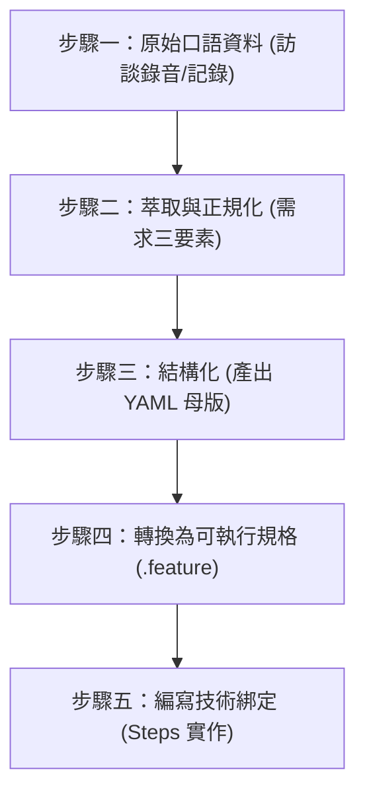
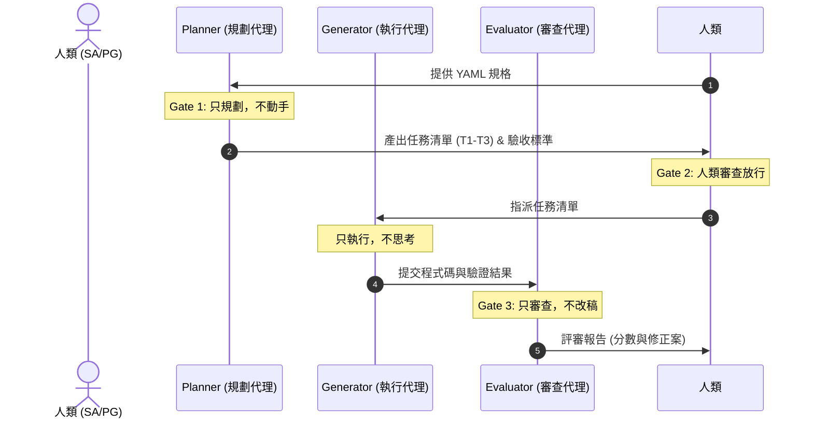
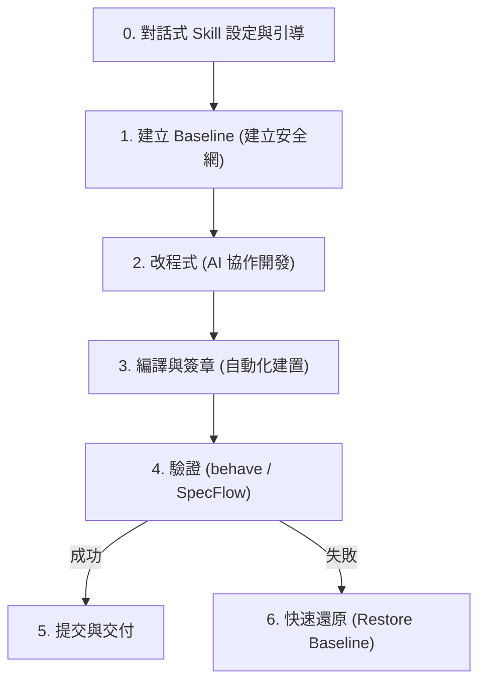

# AI 寫作自動化軟體作業流程 — 腦力激盪記錄

本文件用於記錄關於「AI 寫作自動化軟體作業流程」的討論與規劃。本流程旨在遵循軟體工程的規範與生命週期，建立一套具備可重用性、可測試性與高可靠性的自動化寫作系統。

---

## 一、 核心開發哲學：從「人好用」到「AI 好測」

本專案的核心哲學為**一源多用（Single Source of Truth, SSOT）**與**測試治具工程（Harness Engineering）**。系統設計不只為了人類操作（GUI 優先），更必須為了「AI 好測」（API/CLI 優先，支援 `--json` 與 `--dry-run`）而進行分離。

### 1. 核心願景與三層驗證對照 (Harness V-Model)
規格與測試（Spec = Test）需在不同層級上建立嚴格的對照機制：

| 階段與層級 | 傳統開發行為 | Harness 對應機制 (AI 代理) | 驗證工具/方法 |
| :--- | :--- | :--- | :--- |
| **需求層級** | 需求分析 / 驗收測試 | 系統功能規格書 (SSOT) / 甲方驗收 | `traceability_matrix.md` 追溯矩陣 |
| **系統層級** | 系統設計 / 系統測試 | 可執行規格 (YAML / Feature) | `behave` (Python) / `SpecFlow` (C#) |
| **單元層級** | 單元設計 / 單元測試 | 程式碼實作與驗證 (Generator / Evaluator) | `pytest` (Python) / `MSTest` (C#) |

---

## 二、 SA 前處理流水線與可執行規格轉換步驟

為防止 AI 在讀取模糊需求時產生幻覺，必須將「人類的混沌」翻譯為「AI 的秩序」。以下展示從**口語敘述**，一路轉換為 **YAML 規格**，最終生成 **可執行規格 (Executable Specification)** 的標準流水線。



### 實戰範例：以「WatchDog 異常通知系統」為例

#### 步驟一：原始口語資料 (Raw Input)
> 「有問題就通知我們。不同人值班通知不同人……不要半夜亂叫，除非真的很嚴重。」

---

#### 步驟二：需求萃取與正規化 (Extract & Normalize)
將口語轉化為可量化、無歧義的定義：
1.  **萃取三要素**：
    *   **功能需求（做什麼）**：系統異常時需發送通知。
    *   **業務規則（不違背什麼）**：非緊急事件不可於深夜發送通知、通知對象依值班表動態決定。
    *   **邊界條件（不做什麼）**：同一事件不可重複通知同一人。
2.  **正規化指標**：
    *   「不同人值班」 $\rightarrow$ 依據值班表 API 動態查詢當前值班人員。
    *   「不要半夜亂叫，除非真的很嚴重」 $\rightarrow$ 在時段 `00:00-06:00` 之間，僅發送「等級 == 急迫」的通知；其餘等級暫緩至 `06:00` 後發送。

---

#### 步驟三：結構化 (產出 YAML 規格母版 - SSOT)
將正規化後的規則轉換為結構化 YAML 定義，此為 AI 讀取的唯一源頭：

```yaml
# specs/notifications.yaml
feature: 異常事件通知篩選與發送
  rules:
    - id: RULE_001
      description: 依據時段與事件等級篩選發送
      conditions:
        - time_range: "00:00-06:00"
          severity: "急迫"
          action: "立即發送通知給當前值班人員與備援人員"
        - time_range: "00:00-06:00"
          severity: "次要"
          action: "暫緩發送，於 06:00 後批次遞送"
        - time_range: "06:00-24:00"
          severity: "any"
          action: "立即發送通知給當前值班人員"
  validation:
    metrics:
      - name: 發送成功率
        threshold: "> 99%"
```

---

#### 步驟四：轉換為可執行規格 (Gherkin Feature 檔案)
由 YAML 規格自動或手動映射為人類易讀、機器可運行的 BDD 語句。此檔案即為**系統交付文件**：

```gherkin
# features/notifications.feature
# language: zh-TW
功能: 異常事件通知篩選與發送
  為了 避免半夜不必要的干擾並確保緊急事件即時處理
  作為 系統管理員
  我想要 系統根據時段與事件等級動態篩選並發送通知

  場景: 半夜發生急迫事件應立即通知
    假設 當前時間為半夜 "02:00"
    當 系統偵測到等級為 "急迫" 的異常事件時
    那麼 系統應立即發送通知給 "當前值班人員與備援人員"

  場景: 半夜發生次要事件應暫緩通知
    假設 當前時間為半夜 "03:00"
    當 系統偵測到等級為 "次要" 的異常事件時
    那麼 系統應將通知 "暫緩發送"

  場景: 白天發生任何事件應立即通知
    假設 當前時間為白天 "10:00"
    當 系統偵測到等級為 "次要" 的異常事件時
    那麼 系統應立即發送通知給 "當前值班人員"
```

---

#### 步驟五：編寫技術綁定 (Steps 實作與資料庫驗證)
將可執行規格中的中文步驟，透過測試治具（Harness）與實體系統（Code）與資料庫（MSSQL）進行綁定驗證：

```python
# features/steps/notification_steps.py
from behave import given, when, then
from datetime import datetime

# 模擬被測試系統
class NotificationService:
    def __init__(self):
        self.sent_notifications = []
        self.pending_notifications = []

    def process_event(self, time_str, severity):
        hour = int(time_str.split(":")[0])
        is_night = 0 <= hour < 6
        
        if is_night and severity != "急迫":
            self.pending_notifications.append({"severity": severity, "time": time_str})
            return "暫緩發送"
        else:
            self.sent_notifications.append({"severity": severity, "time": time_str})
            return "立即發送"

# ---- BDD 步驟綁定 ----

@given('當前時間為半夜 "{time_str}"')
def step_impl(context, time_str):
    context.current_time = time_str
    context.service = NotificationService()

@given('當前時間為白天 "{time_str}"')
def step_impl(context, time_str):
    context.current_time = time_str
    context.service = NotificationService()

@when('系統偵測到等級為 "{severity}" 的異常事件時')
def step_impl(context, severity):
    context.result = context.service.process_event(context.current_time, severity)

@then('系統應立即發送通知給 "{recipient}"')
def step_impl(context, recipient):
    assert context.result == "立即發送", f"預期立即發送，但實際為 {context.result}"

@then('系統應將通知 "{action}"')
def step_impl(context, action):
    assert context.result == "暫緩發送", f"預期暫緩發送，但實際為 {context.result}"
```

---

## 三、 三步驟循環與三道強制門檻

開發流程必須嚴格遵循 **Planner -> Generator -> Evaluator** 循環，並設有強制通過門檻，絕不可跳過。



### 1. Gate 1: Planner 先行（只規劃，不動手）
*   **職責**：將龐雜需求拆解為微小任務與驗收標準，只做規劃，不動手寫程式碼。
*   **禁止**：撰寫任何業務邏輯程式碼或變更架構。

### 2. Gate 2: 人類確認
*   **職責**：人類 SA/PG 必須審查 Planner 產出的任務清單，確認無誤後手動放行，才可進入 Generator 實作階段。

### 3. Gate 3: Evaluator 把關（只審查，不改稿）
*   **職責**：客觀挑剔、逐條對照規格對 Generator 的產出進行評分。
    *   **評分權重**：規格符合度 40%、程式碼品質 25%、測試涵蓋率 20%、安全與錯誤處理 15%。
*   **禁止**：直接動手修改 Code。未達標前一律退回。

---

## 四、 測試治具日常循環 SOP

為維持開發安全網，團隊必須嚴格執行日常循環 SOP，確保出問題時可在 5 分鐘內完全還原。在每次迭代開始時，系統應主動與使用者進行引導式對話，以確定測試類型與所使用的開發 Skill。



### 步驟零：對話式 Skill 設定與引導 (引導決策樹)
在啟動任務前，Harness 系統將主動與使用者對話。若使用者無特定想法或未回應，則自動載入系統預設技能。

```text
對話引導機制：
1. 確認測試的應用介面類型：
   - [ ] 網頁 UI 自動化
   - [ ] API 介面測試
   - [ ] 純演算法邏輯
   - [ ] 單機應用程式 (Desktop App)

2. 確認要載入的開發/AI Skill：
   - 詢問使用者是否要從網路載入已存在的第三方 AI 寫作或測試 Skill。
   - 若使用者同意，則動態拉取該 Skill 配置；若否，則採用預設綁定技能（C# SpecFlow / Python behave 預設治具）。
```

### 步驟一：建立 Baseline
在任何變更前，必須建立當前程式碼與資料庫結構的基準（Baseline）。
*   *C# 環境*：執行 `docs/專案基準建立與還原指令.md`，將備份儲存至 `docs/baseline`。
*   *Python 環境*：使用 Git Tag 或暫存機制備份資料庫（MSSQL 備份檔）與當前程式碼。

### 步驟二：改程式 (AI 協作開發)
由 Generator 依據 Planner 的任務清單進行開發。每次對話前，必須**強制重置上下文**，重新載入 `AGENTS.md`，以防範 AI 產生累積幻覺。

### 步驟三：自動化編譯與建置
*   *C# 環境*：執行 `docs/重新編譯(自動加入數位簽章).md` 進行自動化建置與數位簽章。
*   *Python 環境*：執行環境編譯檢查，確認無語法錯誤。

### 步驟四：驗證品質
依據步驟零所選定的應用介面類型與 Skill，執行對應的測試治具驗證：
*   **網頁 UI 自動化**：啟動 Selenium/Playwright 測試，點擊 DOM 元素，並驗證 MSSQL 資料寫入。
*   **API 介面測試**：執行 API 合約測試 (Contract Test)，驗證 JSON 的 Input/Output Schema。
*   **純演算法邏輯**：執行單元測試，比對純文字或計算結果的 Assert。
*   **單機應用程式**：執行 UI 自動化測試治具（如 Windows App Driver），模擬模擬器操作。
*   *執行指令*（以 Python 為例）：
    ```bash
    behave -f json -o docs/reports/test_report.json -f html -o docs/reports/test_report.html
    ```

### 步驟五：出問題還原
若步驟四驗證失敗，且無法在數分鐘內修正，必須在 5 分鐘內將程式碼與資料庫結構還原至步驟一建立的 Baseline 狀態，拒絕帶病累積。

---

## 五、 異常退回與抓蟲機制 (Bug Escalation Matrix)

當系統發生異常時，必須精準定位問題根源，並依據下表進行退回與修正，嚴禁盲目修改：

| 異常現象 | 問題根源 | 退回層級 | 預期修正時間 |
| :--- | :--- | :--- | :--- |
| **Code 寫錯** | Generator 沒照規格實作 | 退回 **Generator** | 分鐘級 |
| **YAML 規格寫錯** | SA 規格邏輯錯誤 | 退回 **Planner** | 小時級 |
| **未做例外處理** | Planner 漏定義例外狀況 | 退回 **Planner** | 小時級 |
| **需求理解錯誤** | 訪談失誤 / 漏接甲方需求 | 退回 **SA 前處理層** | 天級 |

---

## 六、 雙流向文件與測試報告自動化生成 (一源多用)

由單一來源的 YAML 規格檔，透過自動化指令，同步產出三種格式的文件與報告，確保實作與文件永不脫節：

### 1. 測試報告三格式
1.  **AI 版 (JSON)**：保留所有 `enum` 與型態定義，資訊最完整，直接作為下一次 Evaluator 迭代的輸入源。
2.  **人讀版 (Markdown / HTML)**：去蕪存菁，表格化呈現，供 SA/PM 內部 3 分鐘快速審查。
3.  **履約版 (Word/PDF)**：包含封面、目錄、訪談頁碼追溯，直接作為對外驗收的合約交付物。

### 2. CI/CD 自動化整合 (以 GitHub Actions 為例)
為確保每次 Commit 皆通過 Harness 驗證，需於專案中設定自動化流水線。

```yaml
# .github/workflows/harness-ci.yml
name: Harness Engineering CI
# (詳細 CI YAML 內容已記錄，請查閱 .github/workflows/)
```

---

## 七、 當前建置狀態與後續執行規劃

### 1. 當前建置狀態 (截至 2026-06-24 12:00)
專案的核心軟體工程基礎設施已全數建置完畢：
*   **SSDLC 六大階段目錄**：已建立 `01_planning_and_analysis` 至 `06_maintenance` 的資料夾結構，並包含對應的 `inputs/` 與 `outputs/` 目錄（附帶 `.gitkeep`）。
*   **自定義階段技能**：在各開發階段目錄下建立了專屬的 `SKILL.md`，定義了三步循環的執行細節。
*   **全局防線規章**：已建立 [.agents/AGENTS.md](file:///d:/00AI協作/SSDLC_Skill/.agents/AGENTS.md)，寫入全局連貫性大循環、組態管理與測試同步規範。
*   **根目錄控制文件**：已初始化 [traceability_matrix.md](file:///d:/00AI協作/SSDLC_Skill/traceability_matrix.md)（需求追溯矩陣）與 [system_specification.md](file:///d:/00AI協作/SSDLC_Skill/system_specification.md)（系統規格說明書）。
*   **IDE 串接**：已建立 [.vscode/tasks.json](file:///d:/00AI協作/SSDLC_Skill/.vscode/tasks.json)，可在 VS Code 中直接執行自動化備份、BDD 測試、RTM 稽核與還原。

### 2. 下一步執行計畫 (下午討論議題)
當重新開啟對話時，我們將接續執行以下任務：
1.  **新增第一個實體需求**：在 `01_planning_and_analysis/inputs/` 目錄下建立第一個 `REQ_*.md` 檔案，開始進行需求訪談與正規化處理。
2.  **執行大循環**：由 AI Planner 自動對此需求進行系統設計的轉譯（產出 ER Model、UML 圖表與 API 規格），落實交互驗證與追溯。

---

## 八、 引導式專案初始化與階段 Skill 配置之腦力激盪 (2026-06-25)

### 1. 討論主題與動機
為了降低使用者手動建立專案目錄的負擔，並提升 AI 協作時的 Skill 載入精準度，決定建立一套標準的引導式工作流程，讓專案初始化與階段 Skill 綁定能完全自動化。

### 2. 核心流程決定
*   **步驟一：目錄自動生成**
    *   AI 必須提示使用者當前工作目錄，並主動引導使用者輸入欲建立之專案子目錄名稱（相對路徑）。
    *   取得子目錄名稱後，AI 直接讀取 [template_skill.md](file:///d:/00AI協作/SSDLC_Skill/template_skill.md) 中定義的目錄結構，自動在工作目錄之指定子路徑下建立完整的 SSDLC 各階段資料夾與基礎檔案（例如：`traceability_matrix.md` 與 `system_specification.md`）。
*   **步驟二：階段 Skill 複選配置與扁平化目錄**
    *   AI 必須依照 SSDLC 的 6 個開發階段，循序進行各階段的引導配置。
    *   在每一階段的引導中，AI 必須掃描並列出該階段下所有可用的 Skill，清晰呈現 Skill 名稱與用途，供使用者複選勾選。
    *   **扁平化目錄與動態合併**：當使用者勾選完成後，AI 必須將這些所勾選的 Skill 自動部署到目標專案的對應開發階段目錄（此目錄直接位於專案根目錄下，例如 `[專案根目錄]/01_planning_and_analysis/`），並將其規範與 instructions 動態合併，動態寫入至該階段目錄下的 `SKILL.md`（如 `[專案根目錄]/01_planning_and_analysis/SKILL.md`），以利後續互動直接載入使用。

### 3. 落地實作規範
此規範將被正式寫入 [.agents/AGENTS.md](file:///d:/00AI協作/SSDLC_Skill/.agents/AGENTS.md) 的「六、 引導式專案初始化與階段 Skill 配置規範」中，作為 AI 協作時的最高準則。同時，決定在專案根目錄下生成一個極簡之 `AGENTS.md` 引導檔，內嵌相對超連結指向實體規章 `.agents/AGENTS.md`，以確保所有類型的 AI 代理皆能正確識別並加載開發規範。

