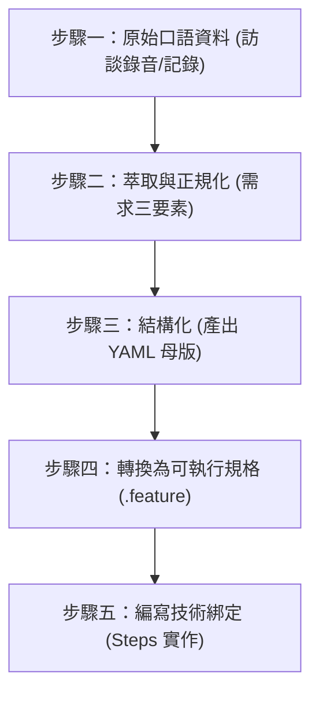
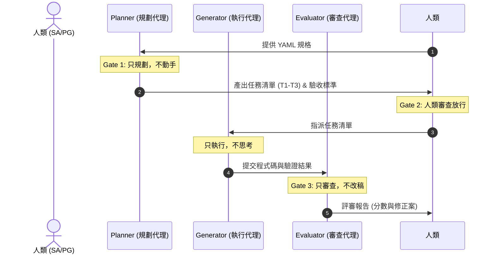
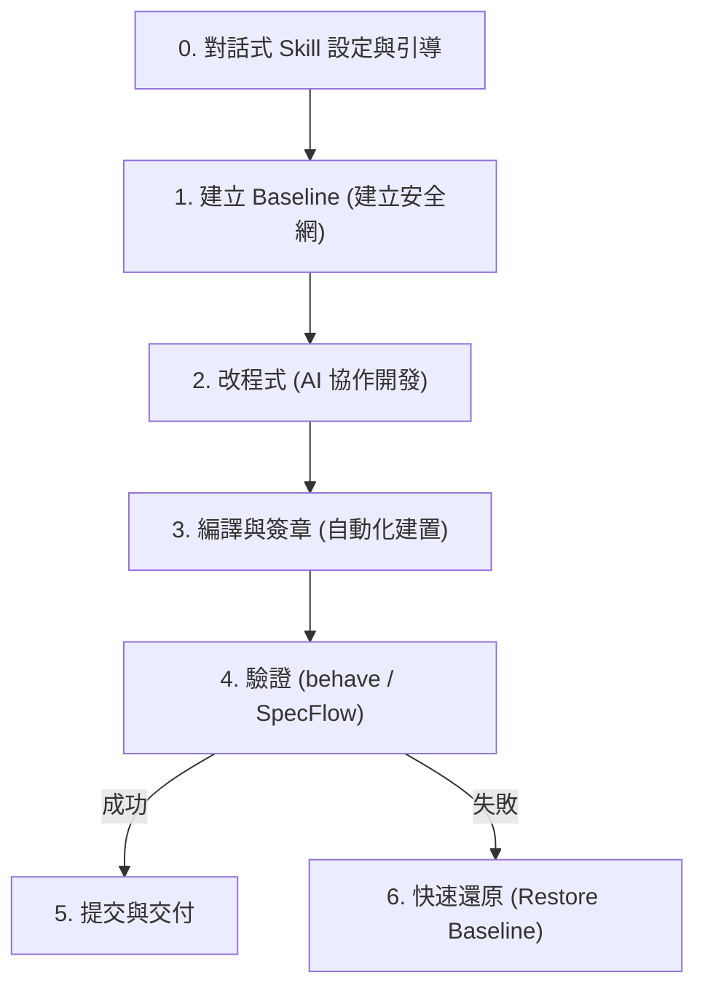

# AI 寫作自動化軟體作業流程 — 腦力激盪記錄

本文件用於記錄關於「AI 寫作自動化軟體作業流程」的討論與規劃。本流程旨在遵循軟體工程的規範與生命週期，建立一套具備可重用性、可測試性與高可靠性的自動化寫作系統。

---

## 一、 核心開發哲學：從「人好用」到「AI 好測」

本專案的核心哲學為**一源多用（Single Source of Truth, SSOT）**與**測試治具工程（Harness Engineering）**。系統設計不只為了人類操作（GUI 優先），更必須為了「AI 好測」（API/CLI 優先，支援 `--json` 與 `--dry-run`）上進行分離。

### 1. 核心願景與三層驗證對照 (Harness V-Model)
規格與測試（Spec = Test）需在不同層級上建立嚴格的對照機制：

| 階段與層級 | 傳統開發行為 | Harness 對應機制 (AI 代理) | 驗證工具/方法 |
| :--- | :--- | :--- | :--- |
| **需求層級** | 需求分析 / 驗收測試 | 系統功能規格書 (SSOT) / 甲方驗收 | `.agents/traceability_matrix.md` 追溯矩陣 |
| **系統層級** | 系統設計 / 系統測試 | 可 executable 規格 (YAML / Feature) | `behave` (Python) / `SpecFlow` (C#) |
| **單元層級** | 單元設計 / 單元測試 | 程式碼實作與驗證 (Generator / Evaluator) | `pytest` (Python) / `MSTest` (C#) |

---

## 二、 SA 前處理流水線與可執行規格轉換步驟

為防止 AI 在讀取模糊需求時產生幻覺，必須將「人類的混沌」翻譯為「AI 的秩序」。以下展示從**口語敘述**，一路轉換為 **YAML 規格**，最終生成 **可執行規格 (Executable Specification)** 的標準流水線。



### 實戰範例：以「WatchDog 異常通知系統」為例

#### 步驟一：原始口語資料 (Raw Input)
> 「有問題就通知我們。不同人值班通知不同人……不要半夜亂叫，除非真的很嚴重。」

---

#### 步驟二：需求萃取與正規化 (Extract & Normalize)
將口語轉化為可量化、無歧義的定義：
1.  **萃取三要素**：
    *   **功能需求（做什麼）**：系統異常時需發送通知。
    *   **業務規則（不違背什麼）**：非緊急事件不可於深夜發送通知、通知對象依值班表動態決定。
    *   **邊界條件（不做什麼）**：同一事件不可重複通知同一人。
2.  **正規化指標**：
    *   「不同人值班」 $\rightarrow$ 依據值班表 API 貼近查詢當前值班人員。
    *   「不要半夜亂叫，除非真的很嚴重」 $\rightarrow$ 在時段 `00:00-06:00` 之間，僅發送「等級 == 急迫」的通知；其餘等級暫緩至 `06:00` 後發送。

---

#### 步驟三：結構化 (產出 YAML 規格母版 - SSOT)
將正規化後的規則轉換為結構化 YAML 定義，此為 AI 讀取的唯一源頭：

```yaml
# specs/notifications.yaml
feature: 異常事件通知篩選與發送
  rules:
    - id: RULE_001
      description: 依據時段與事件等級篩選發送
      conditions:
        - time_range: "00:00-06:00"
          severity: "急迫"
          action: "立即發送通知給當前值班人員與備援人員"
        - time_range: "00:00-06:00"
          severity: "次要"
          action: "暫緩發送，於 06:00 後批次遞送"
        - time_range: "06:00-24:00"
          severity: "any"
          action: "立即發送通知給當前值班人員"
  validation:
    metrics:
      - name: 發送成功率
        threshold: "> 99%"
```

---

#### 步驟四：轉換為可執行規格 (Gherkin Feature 檔案)
由 YAML 規格自動或手動映射為人類易讀、機器可運行的 BDD 語句。此檔案即為**系統交付文件**：

```gherkin
# features/notifications.feature
# language: zh-TW
功能: 異常事件通知篩選與發送
  為了 避免半夜不必要的干擾並確保緊急事件即時處理
  作為 系統管理員
  我想要 系統根據時段與事件等級動態篩選並發送通知

  場景: 半夜發生急迫事件應立即通知
    假設 當前時間為半夜 "02:00"
    當 系統偵測到等級為 "急迫" 的異常事件時
    那麼 系統應立即發送通知給 "當前值班人員與備援人員"

  場景: 半夜發生次要事件應暫緩通知
    假設 當前時間為半夜 "03:00"
    當 系統偵測到等級為 "次要" 的異常事件時
    那麼 系統應將通知 "暫緩發送"

  場景: 白天發生任何事件應立即通知
    假設 當前時間為白天 "10:00"
    當 系統偵測到等級為 "次要" 的異常事件時
    那麼 系統應立即發送通知給 "當前值班人員"
```

---

#### 步驟五：編寫技術綁定 (Steps 實作與資料庫驗證)
將可執行規格中的中文步驟，透過測試治具（Harness）與實體系統（Code）與資料庫（MSSQL）進行綁定驗證：

```python
# features/steps/notification_steps.py
from behave import given, when, then
from datetime import datetime

# 模擬被測試系統
class NotificationService:
    def __init__(self):
        self.sent_notifications = []
        self.pending_notifications = []

    def process_event(self, time_str, severity):
        hour = int(time_str.split(":")[0])
        is_night = 0 <= hour < 6
        
        if is_night and severity != "急迫":
            self.pending_notifications.append({"severity": severity, "time": time_str})
            return "暫緩發送"
        else:
            self.sent_notifications.append({"severity": severity, "time": time_str})
            return "立即發送"

# ---- BDD 步驟綁定 ----

@given('當前時間為半夜 "{time_str}"')
def step_impl(context, time_str):
    context.current_time = time_str
    context.service = NotificationService()

@given('當前時間為白天 "{time_str}"')
def step_impl(context, time_str):
    context.current_time = time_str
    context.service = NotificationService()

@when('系統偵測到等級為 "{severity}" 的異常事件時')
def step_impl(context, severity):
    context.result = context.service.process_event(context.current_time, severity)

@then('系統應立即發送通知給 "{recipient}"')
def step_impl(context, recipient):
    assert context.result == "立即發送", f"預期立即發送，但實際為 {context.result}"

@then('系統應將通知 "{action}"')
def step_impl(context, action):
    assert context.result == "暫緩發送", f"預期暫緩發送，但實際為 {context.result}"
```

---

## 三、 三步驟循環與三道強制門檻

開發流程必須嚴格遵循 **Planner -> Generator -> Evaluator** 循環，並設有強制通過門檻，絕不可跳過。



### 1. Gate 1: Planner 先行（只規劃，不動手）
*   **職責**：將龐雜需求拆解為微小任務與驗收標準，只做規劃，不動手寫程式碼。
*   **禁止**：撰寫 any 業務邏輯程式碼或變更架構。

### 2. Gate 2: 人類確認
*   **職責**：人類 SA/PG 必須審查 Planner 產出的任務清單，確認無誤後手動放行，才可進入 Generator 實作階段。

### 3. Gate 3: Evaluator 把關（只審查，不改稿）
*   **職責**：客觀挑剔、逐條對照規格對 Generator 的產出進行評分。
    *   **評分權重**：規格符合度 40%、程式碼品質 25%、測試涵蓋率 20%、安全與錯誤處理 15%。
*   **禁止**：直接動手修改 Code。未達標前一律退回。

---

## 四、 測試治具日常循環 SOP

為維持開發安全網，團隊必須嚴格執行日常循環 SOP，確保出問題時可在 5 分鐘內完全還原。在每次迭代開始時，系統應主動與使用者進行引聯式對話，以確定測試類型與所使用的開發 Skill。



### 步驟零：對話式 Skill 設定與引導 (引導決策樹)
在啟動任務前，Harness 系統將主動與使用者對話。若使用者無特定想法或未回應，則自動載入系統預設技能。

```text
對話引導機制：
1. 確認測試的應用介面類型：
   - [ ] 網頁 UI 自動化
   - [ ] API 介面測試
   - [ ] 純演算法邏輯
   - [ ] 單機應用程式 (Desktop App)

2. 確認要載入的開發/AI Skill：
   - 詢問使用者是否要從網路載入已存在的第三方 AI 寫作或測試 Skill。
   - 若使用者同意，則動態拉取該 Skill 配置；若否，則採用預設綁定技能（C# SpecFlow / Python behave 預設治具）。
```

### 步驟一：建立 Baseline
在任何變更前，必須建立當前程式碼與資料庫結構的基準（Baseline）。
*   *C# 環境*：執行 `docs/專案基準建立與還原指令.md`，將備份儲存至 `docs/baseline`。
*   *Python 環境*：使用 Git Tag 或暫存機制備份資料庫（MSSQL 備份檔）與當前程式碼。

### 步驟二：改程式 (AI 協作開發)
由 Generator 依據 Planner 的任務清單進行開發。每次對話前，必須**強制重置上下文**，重新載入 `AGENTS.md`，以防範 AI 產生累積幻覺。

### 步驟三：自動化編譯與建置
*   *C# 環境*：執行 `docs/重新編譯(自動加入數位簽章).md` 進行自動化建置與數位簽章。
*   *Python 環境*：執行環境編譯檢查，確認無語法錯誤。

### 步驟四：驗證品質
依據步驟零所選定的應用介面類型與 Skill，執行對應的測試治具驗證：
*   **網頁 UI 自動化**：啟動 Selenium/Playwright 測試，點擊 DOM 元素，並驗證 MSSQL 資料寫入。
*   **API 介面測試**：執行 API 合約測試 (Contract Test)，驗證 JSON 的 Input/Output Schema。
*   **純演算法邏輯**：執行單元測試，比對純文字或計算結果的 Assert。
*   **單機應用程式**：執行 UI 自動化測試治具（如 Windows App Driver），模擬模擬器操作。
*   *執行指令*（以 Python 為例）：
    ```bash
    behave -f json -o docs/reports/test_report.json -f html -o docs/reports/test_report.html
    ```

### 步驟五：出問題還原
若步驟四驗證失敗，且無法在數分鐘內修正，必須在 5 分鐘內將程式碼與資料庫結構還原至步驟一建立的 Baseline 狀態，拒絕帶病累積。

---

## 五、 異常退回與抓蟲機制 (Bug Escalation Matrix)

當系統發生異常時，必須精準定位問題根源，並依據下表進行退回與修正，嚴禁盲目修改：

| 異常現象 | 問題根源 | 退回層級 | 預期修正時間 |
| :--- | :--- | :--- | :--- |
| **Code 寫錯** | Generator 沒照規格實作 | 退回 **Generator** | 分鐘級 |
| **YAML 規格寫錯** | SA 規格邏輯錯誤 | 退回 **Planner** | 小時級 |
| **未做例外處理** | Planner 漏定義例外狀況 | 退回 **Planner** | 小時級 |
| **需求理解錯誤** | 訪談失誤 / 漏接甲方需求 | 退回 **SA 前處理層** | 天級 |

---

## 六、 雙流向文件與測試報告自動化生成 (一源多用)

由單一來源的 YAML 規格檔，透過自動化指令，同步產出三種格式的文件與報告，確保實作與文件永不脫節：

### 1. 測試報告三格式
1.  **AI 版 (JSON)**：保留所有 `enum` 與型態定義，資訊最完整，直接作為下一次 Evaluator 迭代的輸入源。
2.  **人讀版 (Markdown / HTML)**：去蕪存菁，表格化呈現，供 SA/PM 內部 3 分鐘快速審查。
3.  **履約版 (Word/PDF)**：包含封面、目錄、訪談頁碼追溯，直接作為對外驗收的合約交付物。

### 2. CI/CD 自動化整合 (以 GitHub Actions 為例)
為確保每次 Commit 皆通過 Harness 驗證，需於專案中設定自動化流水線。

```yaml
# .github/workflows/harness-ci.yml
name: Harness Engineering CI
# (詳細 CI YAML 內容已記錄，請查閱 .github/workflows/)
```

---

## 七、 當前建置狀態與後續執行規劃

### 1. 當前建置狀態 (截至 2026-06-24 12:00)
專案的核心軟體工程基礎設施已全數建置完畢：
*   **SSDLC 六大階段目錄**：已建立 `01_planning_and_analysis` 至 `06_maintenance` 的資料夾結構，並包含對應的 `inputs/` 與 `outputs/` 目錄（附帶 `.gitkeep`）。
*   **自定義階段技能**：在各開發階段目錄下建立了專屬的 `SKILL.md`，定義了三步循環的執行細節。
*   **全局防線規章**：已建立 [.agents/AGENTS.md](file:///d:/00AI協作/SSDLC_Skill/.agents/AGENTS.md), 寫入全局連貫性大循環、組態管理與測試同步規範。
*   **根目錄控制文件**：已初始化 [.agents/traceability_matrix.md](file:///d:/00AI協作/SSDLC_Skill/.agents/traceability_matrix.md)（需求追溯矩陣）與 [.agents/system_specification.md](file:///d:/00AI協作/SSDLC_Skill/.agents/system_specification.md)（系統規格說明書）。
*   **IDE 串接**：已建立 [.vscode/tasks.json](file:///d:/00AI協作/SSDLC_Skill/.vscode/tasks.json), 可在 VS Code 中直接執行自動化備份、BDD 測試、RTM 稽核與還原。

### 2. 下一步執行計畫 (下午討論議題)
當重新開啟對話時，我們將接續執行以下任務：
1.  **新增第一個實體需求**：在 `01_planning_and_analysis/inputs/` 目錄下建立第一個 `REQ_*.md` 檔案，開始進行需求訪談與正規化處理。
2.  **執行大循環**：由 AI Planner 自動對此需求進行系統設計的轉譯（產出 ER Model、UML 圖表與 API 規格），落實交互驗證與追溯。

---

## 八、 引導式專案初始化與階段 Skill 配置之腦力激盪 (2026-06-25)

### 1. 討論主題與動機
為了降低使用者手動建立專案目錄的負擔，並提升 AI 協作時的 Skill 載入精準度，決定建立一套標準的引導式工作流程，讓專案初始化與階段 Skill 綁定能完全自動化。

### 2. 核心流程決定
*   **步驟一：目錄自動生成**
    *   AI 必須提示使用者當前工作目錄，並主動引導使用者輸入欲建立之專案子目錄名稱（相對路徑）。
    *   取得子目錄名稱後，AI 直接讀取 [TEMPLATE_SKILL.md](file:///d:/00AI協作/SSDLC_Skill/docs/TEMPLATE_SKILL.md) 中定義的目錄結構，自動在工作目錄之指定子路徑下建立完整的 SSDLC 各階段資料夾與檔案。
*   **步驟二：階段 Skill 複選配置與扁平化目錄**
    *   AI 必須依照 SSDLC 的 6 個開發階段，循序進行各階段的引導配置。
    *   在每一階段的引導中，AI 必須掃描並列出該階段下所有可用的 Skill，清晰呈現 Skill 名稱與用途，供使用者複選勾選。
    *   **扁平化目錄與動態合併**：當使用者勾選完成後，AI 必須將這些所勾選的 Skill 自動部署到目標專案的對應開發階段目錄（此目錄直接位於專案根目錄下，例如 `[專案根目錄]/01_planning_and_analysis/`），並將其規範與 instructions 動態合併，動態寫入至該階段目錄下的 `SKILL.md`（如 `[專案根目錄]/01_planning_and_analysis/SKILL.md`），以利後續互動直接載入使用。

### 3. 落地實作規範
此規範將被正式寫入 [.agents/AGENTS.md](file:///d:/00AI協作/SSDLC_Skill/.agents/AGENTS.md) 的「六、 引導式專案初始化與階段 Skill 配置規範」中，作為 AI 協作時的最高準則。同時，決定在專案根目錄下生成一個極簡之 `AGENTS.md` 引導檔，內嵌相對超連結指向實體規章 `.agents/AGENTS.md`，以確保所有類型的 AI 代理皆能正確識別並加載開發規範。

---

## 九、 參數化與動態喚起 Skill 之腦力激盪 (2026-06-26)

### 1. 討論主題與動機
原有的專案初始化流程中，各階段的 Skill 是在專案啟動時一次性預載入並合併的。然而，在實際開發過程中，隨著需求變更與工作推進，可能需要動態載入或切換特定的 Skill，若每次都重新初始化將降低開發效率。
今天進一步討論後，決定拋棄繁瑣的本機 Python 腳本方案，優化為「AI 原生對話指令協議」，由 AI 代理直接在對話視窗中偵測極簡指令，並代為操作本機檔案完成 Skill 載入，實現 100% 免安裝環境與免記冗長 CLI 指令之流程。
在此基礎上，為解決「清單缺乏用途資訊」與「多 Skill 載入效率低」的缺陷，進一步補強了「用途說明動態解析」與「加號 (+) 聯合參數載入與融合」機制。
此外，為防止拼寫錯誤造成聯合導入失敗，新增了「加號保留字防呆檢核與提示機制」，並建立了專屬的 `docs/commands_reference.md` 指令集參照表以利後續討論與查閱。
同時，為維持一站式初始化的便利性，規定了 `@init` 在初始化專案目錄後，會自動續接啟動 01 到 06 階段的 Skill 配置引導流，達成「初始引導一氣呵成，後續隨時動態載入」的雙軌彈性。
最後，為了方便使用者用語音或口語查詢，建立了「自然語言語意喚起機制」，允許使用者說出相近的口語表達時，由 AI 代理自動載入並呈現指令參照表。

### 2. 核心機制與指令設計 (全對話指令協議補強版)
*   **@stages**：查詢 SSDLC 各階段代碼與名稱對照表（例如 `01` 到 `06`）。
*   **@[階段雙位數代碼]** (例如 `@01`、`@02`)：掃描並列出該開發階段的所有可用 Skill。AI 代理必須自動讀取各 Skill 的 `SKILL.md`，動態解析其 Frontmatter 中的 `description`，併同名稱與導入指令輸出，使用戶一目了然。
*   **@[階段雙位數代碼]/[Skill_1]+[Skill_2]** (例如 `@02/sa-design+bootstrap-ui`)：聯合導入指令。AI 代理會一次性建立 Git tag Baseline，依次將多個 Skill 複製到對應階段，將各 instructions 分段追加合併至 `SKILL.md`，並在 `.agents/traceability_matrix.md` 中一次性登錄此批導入。
*   **加號 (+) 防呆提醒**：若 Skill 名稱中包含加號，AI 代理在拆分解析時若發現 any 一個 Skill 不存在，必須主動回報是哪一個 Skill 找不到，並提示加號聯合導入的正確範例語法，附上可用 Skill 清單，防止拼寫錯誤。
*   **@init [相對路徑]** (例如 `@init ./my_new_project`)：自動在指定路徑下建立完整的 SSDLC 目錄結構與基礎控制檔案。**目錄與檔案建立完畢後，AI 代理會自動啟動 01 到 06 階段的 Skill 配置引導流，引導使用者循序選取要載舉的 Skill 或選擇跳過。**
*   **自然語言語意喚起**：偵測到如「讀取指令集」、「有什麼指令可以用」、「叫出指令對照表」等口語語意時，自動讀取並顯示 [commands_reference.md](file:///d:/00AI協作/SSDLC_Skill/docs/commands_reference.md)。

### 3. 落地實作規範
此協議規範已正式追加寫入 [.agents/AGENTS.md](file:///d:/00AI協作/SSDLC_Skill/.agents/AGENTS.md) 的「六、 引導式專案初始化與階段 Skill 配置規範 (AI 代理對話指令協議)」中，作為未來 AI 代理在對話中處理指令與操作檔案的最高守則。同時，更新了對話指令參照表 [commands_reference.md](file:///d:/00AI協作/SSDLC_Skill/docs/commands_reference.md)。


### 4. 快捷編號與逗號分隔之指令精簡改版 (2026-06-26)
在實際使用語音及鍵盤操作對話指令時，發現手動輸入完整的 Skill 資料夾名稱（如 `@01/skill_categorizer`）過於冗長且容易拼錯。為進一步提升操作效率，決定將協議進行以下精簡優化：
*   **快捷編號機制 (Shortcut Numbering)**：在掃描列出 Skill 清單（`@[階段]`）時，AI 代理必須依字母順序自動為可用 Skill 分配雙位數快捷編號（如 `01`, `02` ...）。使用者在導入時只需輸入快捷編號（如 `@01/01`），AI 代理在內部自動將其還原為實體 Skill 名稱進行部署與 instructions 合併。
*   **逗號分隔聯合導入 (Comma Separator)**：將聯合導入多個 Skill 的連接符號由加號 `+` 改為逗號 `,`（例如 `@02/01,02`），使輸入更加符合口語化習慣。
*   **友好防呆提示**：若使用者誤輸入完整 Skill 名稱而非編號，AI 代理會友好提示正確的快捷編號語法；若輸入之快捷編號不存在，則中止並提示正確範例。
此優化已同步更新至 [.agents/AGENTS.md](file:///d:/00AI協作/SSDLC_Skill/.agents/AGENTS.md) 與 [commands_reference.md](file:///d:/00AI協作/SSDLC_Skill/docs/commands_reference.md)。

### 5. 雙層六階段 IIS/Windows 融合架構與 GitHub 高星 Skill 庫整合 (2026-06-26)
在進一步研析使用者提供的「Harness Engineering 雙層六階段規格書 V1.0 定稿版」與「Windows IIS 部署專版 V2.0 規格書」後，為了極大化系統在微軟 Windows + IIS 環境下的實戰可行性，決定對現行架構與 Skill 庫進行全局升級：
*   **架構深度融合**：在 [.agents/AGENTS.md](file:///.agents/AGENTS.md) 規章中，將 V1.0 的 PDCA 迴圈、A/B 類錯誤分類重試理論與 V2.0 的 Windows Server + IIS 部署環境特性完美融合。明確了外層全域 Agent 與內層 PDCA 迴圈的職責，在 Plan 階段加入路徑編碼與檔案鎖定前置檢核，Generator 階段執行 Windows 絕對路徑快照，Evaluator 階段補充 IIS/事件日誌雙軌驗證，並在防錯紀律中寫入 A 類（執行層）重試最多 3 次、B 類（規劃層）重試直接升級全域迭代（上限 2 輪）的分級重試規則，同時寫入 Docker/IIS 部署環境互斥檢核，避免環境衝突。
*   **清理規章中的簡體字**：主動重構並覆寫了全局規章，將其中混雜的簡體字（如 规划、规范 等）全數轉換為台灣繁體中文（規劃、規範），以嚴格符合排版與唯一語境規範。
*   **建立 GitHub 高星開源工具 Skill 庫**：為支援使用者與 AI 協作時能自由選用業界推薦的開源工具，在 `external-resources/github-skills/` 目錄下建立了涵蓋 6 個開發階段的 31 個熱門 GitHub 工具的 Skill 資料夾與 `SKILL.md` 指導書。
*   **更新 Skill 目錄索引表**：更新了 [skills/README.md](file:///d:/00AI協作/SSDLC_Skill/skills/README.md)，將 31 個開源工具 Skill 分門別類地登載進去，並在各階段中分配雙位數快捷編號（由 `01` 開始）並加註其本機外部資源目錄與 GitHub 原始倉庫的追溯超連結，使協作引導更清晰，讓使用者決定要選用哪些 Skill。

### 6. 可整體駕馭工程核心指導守則 CORE_RULES.md 之規劃與建立 (2026-06-26)
為了建立專案規範的最高指導框架原則，決定將先前研析歸納的 V1.0 定稿規格與 V2.0 規格進行全面提煉。
*   **通則化提煉**：排除所有具體開源工具 Skill 清單，並將所有與特定技術或特定作業平台（如 Windows、IIS、Docker 等）綁定的環境適配規則一併調整優化，去除平台相依性，抽象化為「通用進程駐留與守護」、「環境權限與檔案鎖定前置檢核」、「雙軌日誌審計追溯」與「互斥部署環境靜態檢核」等通則，將其彙整為 [CORE_RULES.md](file:///d:/00AI協作/SSDLC_Skill/docs/CORE_RULES.md) 並建立於專案根目錄，作為本專案的最高核心守則。
*   **全局索引整合**：更新了根目錄的 [AGENTS.md](file:///d:/00AI協作/SSDLC_Skill/AGENTS.md) 引導檔與專案規章 [.agents/AGENTS.md](file:///.agents/AGENTS.md)，在兩者的標題開頭醒目處新增指向核心守則 [CORE_RULES.md](file:///d:/00AI協作/SSDLC_Skill/docs/CORE_RULES.md) 的相對路徑超連結。明文規定本專案的所有子規章與內容發展，皆以此守則為最高框架原則，且絕對不得與其衝突。

### 7. 安全軟體開發生命週期六階段（通稱 SSDLC）名詞對正與統一正名 (2026-06-26)
為使本專案的規格體系與開發語彙完全一致，決定依據使用者的指示進行全局的名詞對齊與統一正名：
*   **統一正名**：將專案中所有舊的「六大固定階段」、「六大標準階段」、「軟體開發六階段」等稱呼，統一正名為「安全軟體開發生命週期六階段」，通稱「SSDLC」。
*   **階段名詞對齊**：將 6 個階段的名稱在全域規章、指導守則與索引表中，統一對正為： `01 : 規劃與需求分析`、`02 : 系統設計`、`03 : 開發與編碼`、`04 : 測試驗證`、`05 : 部署發布`、`06 : 維護監控`。
*   **相關文件同步**：此正名變更已同步更新至docs 目錄下的 [CORE_RULES.md](file:///d:/00AI協作/SSDLC_Skill/docs/CORE_RULES.md)、專案規章 [.agents/AGENTS.md](file:///.agents/AGENTS.md) 以及技能目錄索引表 [skills/README.md](file:///d:/00AI協作/SSDLC_Skill/skills/README.md)。未來在對話中呼叫 `@stages` 時，AI 代理將會以此正名後的標準清單進行輸出與對照。
*   **檢核結果上傳與全局掌握補強**：在指導守則 [CORE_RULES.md](file:///d:/00AI協作/SSDLC_Skill/docs/CORE_RULES.md) 中，進一步補強了頂層與內層的資料流向規範。明文規定在 SSDLC 各階段應用 Plan、Generator、Evaluator 後，該階段之完整檢核結果必須自動上傳至上一層之全域主控 Agent，以利其隨時掌握與稽核全局狀態。
*   **核心用途與 Skill 屬性定義補強**：依據上傳之定稿與專版 PDF 內容，將 SSDLC 六個階段中各階段的「核心用途」以及該階段所採用的 Skill 所應具備之「特性、關鍵詞與重要屬性」以通則化（平台無關）形式補充寫入指導守則 [CORE_RULES.md](file:///d:/00AI協作/SSDLC_Skill/docs/CORE_RULES.md) 的第二節中，完善了本專案的軟體工程規格描述。
*   **階段標題標號優化**：在 [CORE_RULES.md](file:///d:/00AI協作/SSDLC_Skill/docs/CORE_RULES.md) 中，將內層六階段的條列標題優化為「第一階段：規劃與需求分析」、「第二階段：系統設計」等顯性標記，以求結構與指引邏輯更加明確清晰。
*   **測試驗證階段屬性補強**：在 [CORE_RULES.md](file:///d:/00AI協作/SSDLC_Skill/docs/CORE_RULES.md) 的第四階段（測試驗證）中，擴充了核心用途與所採用 Skill 的重要屬性，補齊了 API 與 Web 服務（Web Services）測試、以及傳統單機版應用程式（Desktop App）UI 自動化測試的描述，使其不偏限於 Web 測試，能全面涵蓋各類型軟體的驗證防線。
*   **技能歸類與索引實體對齊**：依據 [SKILLS歸類.md](file:///d:/00AI協作/SSDLC_Skill/skills/SKILLS歸類.md) 規章之規範，已將本機 `external-resources/github-skills/` 中 31 個推薦開源工具技能實體複製歸類至 `skills/` 下對應的開發階段子資料夾（包含六個開發階段，以及建立新分類 `skills/00_cross_phase/` 以存放跨階段全域共用技能）。同時重新編排 [skills/README.md](file:///d:/00AI協作/SSDLC_Skill/skills/README.md) 索引表，將所有技能名稱均轉化為指向本機 `skills/` 實體路徑之超連結，並補齊跨階段全域共用技能段落的追溯說明。
*   **歸類規章同步與優化**：為配合全域共用技能與正名變更，已同步修改並優化 [SKILLS歸類.md](file:///d:/00AI協作/SSDLC_Skill/skills/SKILLS歸類.md) 規章內容。在其「階段與共用分類定義」與「技能分類規則與映射表」中加入了 `00_cross_phase` 跨階段全域共用分類，並對齊了 SSDLC 六階段的標準名詞，同時將 31 個推薦開源工具 Skill 與 Benson/Anthropic 原生 Skill 併同寫入對應的映射清單中，以利後續歸類作業遵循。
*   **專案範本目錄結構對齊**：依據 [CORE_RULES.md](file:///d:/00AI協作/SSDLC_Skill/docs/CORE_RULES.md) 的基準防線與使用者偏好，更新了 [docs/TEMPLATE_SKILL.md](file:///d:/00AI協作/SSDLC_Skill/docs/TEMPLATE_SKILL.md) 的標準專案目錄結構。在其中加入了 `baseline/` 基準備份存放區，以及 `docs/` 資料夾下的 `bug/` 與 `reg/` 記錄子目錄，同時將 6 個 SSDLC 階段的名稱進行了標準名詞對正。

## 十、 專案結構範本註釋說明與對話執行協議優化 (2026-06-26)

### 1. 討論主題與動機
為了讓初始化生成的專案能完美繼承並遵循專案最高指導框架原則，需要補強專案目錄結構範本 `docs/TEMPLATE_SKILL.md`。前次更新中雖然建立了基本的結構，但目錄樹下方缺乏明確的引導關聯說明，且原本的「三、 AI 協作對話與執行協議」流於形式，缺乏核心 PDCA 流程、分級重試、指令協議的實體細節。

### 2. 核心優化決定
*   **目錄樹後方新增註釋**：在標準專案目錄結構後面，新增 `### 目錄結構組態說明與防線註釋` 小節。明確指明 `docs/CORE_RULES.md` 的最高守則地位，並說明 `.agents/AGENTS.md` 與根目錄 `AGENTS.md` 是如何強制與此指導守則建立引用與關聯防線。
*   **重構「AI 協作對話與執行協議」**：
    將 [docs/CORE_RULES.md](file:///d:/00AI協作/SSDLC_Skill/docs/CORE_RULES.md) 與 [.agents/AGENTS.md](file:///d:/00AI協作/SSDLC_Skill/.agents/AGENTS.md) 規章的核心協定整合為 5 大核心部分：
    1.  **需求收集與追溯協議**：規範 Entity 格式需求記錄點之建立與 `.agents/traceability_matrix.md` 追溯。
    2.  **階段 PDCA 執行與結果上傳協議**：明文要求 Plan -> Generator -> Evaluator 流程，以及將成果與快照自動上傳給頂層 Agent 的資料同步協議。
    3.  **錯誤二分類與分級重試協議**：寫入 A 類（執行層臨時）重試最多 3 次、B 類（規劃層根源）直接升級全域迭代（上限 2 輪）的分級重試規則。
    4.  **AI 代理對話指令協議**：詳細載入 `@stages`, `@[階段]`, `@init`, 快捷編號還原與逗號聯合導入的執行細節。
    5.  **自然語言與語音喚出協議**：規定口頭觸發讀取 `commands_reference.md` 的行為。

### 3. 落地實作規範
此變更已正式寫入 [docs/TEMPLATE_SKILL.md](file:///d:/00AI協作/SSDLC_Skill/docs/TEMPLATE_SKILL.md) 檔案，完成了範本規格書與本專案防線大原則的對齊。


## 十一、 專案目錄結構精簡化與跨階段全域對齊 (2026-06-27)

### 1. 討論主題與動機
前次討論完成 TEMPLATE_SKILL.md 的協定重構後，實際檢視目錄結構發現多處不一致：baseline/snapshots/logs 在六個階段中各重複一份、docs/ 下殘留 bug/reg/ 目錄、缺少跨階段全域共用分類目錄、commands_reference.md 缺少 Harness Optimization 指令。

### 2. 核心優化決定

*   **目錄結構精簡化**：
    *   將 `baseline/`、`snapshots/`、`logs/` 從六個階段各一份統一到專案根目錄各一份。
    *   將 `bug/` 從 `docs/bug/` 移至 `04_testing/bug/`（測試階段的缺陷歷程）。
    *   將 `reg/` 從 `docs/reg/` 移至 `01_planning_and_analysis/reg/`（規劃階段的需求歷程）。
    *   各階段目錄精簡為：`SKILL.md` + `inputs/` + `outputs/`（01 加 `reg/`、04 加 `bug/`）。

*   **跨階段全域對齊（00 代碼與 all → 00_cross_phase 更名）**：
    *   新增跨階段全域共用分類代碼 `00`，對應目錄 `00_cross_phase/`。
    *   將 `skills/all_cross_phase/` 與 `external-resources/github-skills/all_cross_phase/` 目錄更名為 `00_cross_phase/`。
    *   全專案 14 個 MD 檔案中的 `all_cross_phase` 路徑引用同步替換為 `00_cross_phase`。
    *   `docs/commands_reference.md` 新增 `### SSDLC 階段代碼參照` 對照表（00~06）。

*   **Harness Optimization 指令與技能更新**：
    *   `docs/commands_reference.md` 新增 `@optimize` 指令，觸發 Harness Optimization 地毯式全案關聯檢查。
    *   將語音喚出詞彙（「幫我執行駕馭工程框架優化檢查」、「Harness Optimization」、「執行架構優化」）整合至前言。
    *   `docs/Harness_Optimization_SKILL.md` 全面更新：檢查範圍從 4 組擴充至 6 組（10 組檔案與目錄），補上 memory.md、.agents/traceability_matrix.md、.agents/system_specification.md、commands_reference.md、階段 SKILL.md 檢查。

*   **`.agents/skills/` 結構同步**：
    *   刪除過時的 `skill_categorizer/`。
    *   補建 `00_cross_phase/`（含 SKILL.md + inputs + outputs）。
    *   補建 `01_planning_and_analysis/reg/` 與 `04_testing/bug/`。
    *   實現 `.agents/skills/` = `skills/` = `TEMPLATE_SKILL.md` 三邊完全對齊。

*   **TEMPLATE_SKILL.md 持續優化**：
    *   補上 `## 一、 標準專案目錄結構` 章節標題，修正跳號。
    *   修復第 3 行亂碼斷句。
    *   刪除第 104-140 行重複汙染的目錄樹片段。
    *   目錄樹補上 `00_cross_phase/`。
    *   註釋從 6 條擴充至 9 條，涵蓋所有關鍵目錄。

### 3. 落地實作規範
上述變更已正式寫入所有對應檔案，並通過 `@optimize` Harness Optimization 地毯式關聯稽核，全數 PASS。
### 4. @optimize 全案優化 (2026-06-27)
*   **檢查範圍**：6 大檢查組、12 組核心檔案與目錄。
*   **發現與修復**：
    *   .agents/AGENTS.md Init Guard 仍引用根目錄 	raceability_matrix.md / system_specification.md → 全數更新為 .agents/ 路徑（共 7 處）。
    *   .agents/system_specification.md 與 .agents/traceability_matrix.md 清除 demo 假資料，改為乾淨佔位範本。
    *   demo_project 重建完成，Init Guard 驗證通過。
*   **狀態**：全案 6 組檢查 PASS。
### 5. 階段間交付物傳遞鏈補強 (2026-06-27)
*   補齊 demo_project 六個階段 inputs/ 與 outputs/ 的完整傳遞鏈（01→02→03→04→05→06）。
*   更新 docs/TEMPLATE_SKILL.md：各階段 inputs/ 註釋明確標示承接上游 outputs。
*   新增「階段間交付物傳遞鏈」規範（TEMPLATE_SKILL.md 註釋第 3 條）。
*   更新 docs/Harness_Optimization_SKILL.md：檢查範圍從 6 組擴充至 7 組（新增第 7 組：階段間交付物傳遞鏈防線）。