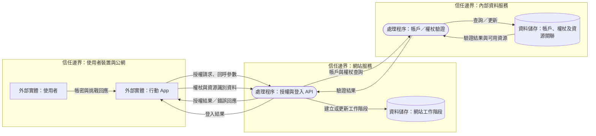

# 資料流程圖

```mermaid
flowchart LR
  App[外部實體：行動 App]
  User[外部實體：使用者]
  subgraph TB1[信任邊界：使用者裝置與公網]
    App
    User
  end
  subgraph TB2[信任邊界：網站服務]
    API([處理程序：授權與登入 API])
    Session[("資料儲存：網站工作階段")]
  end
  subgraph TB3[信任邊界：內部資料服務]
    Identity([處理程序：帳戶／權杖驗證])
    Store[("資料儲存：帳戶、權杖及資源關聯")]
  end
  User -->|帳密與挑戰回應| App
  App -->|授權請求、回呼參數| API
  API -->|帳戶與權杖查詢| Identity
  Identity -->|查詢／更新| Store
  Store -->|驗證結果與可用資源| Identity
  Identity -->|驗證結果| API
  API -->|授權結果／錯誤回應| App
  App -->|權杖與資源識別資料| API
  API -->|建立或更新工作階段| Session
  API -->|登入結果| App
```

## 圖例與敏感資料

- 方框：外部實體；圓角方框：處理程序；圓柱：資料儲存。
- 箭頭標示資料方向與大類型，沒有代表已確認的傳輸協定或部署連線。
- 敏感資料包含帳密、授權／存取權杖、回呼參數、帳戶識別及資源識別資料。
- TB1、TB2、TB3 是建模邊界，不代表實際網路分段或防火牆規則。
